# Sentiment Analysis using Deep Learning in Keras

### Importing Required Libraries


```python
import re
import pandas as pd
import numpy as np
import seaborn as sns
from sklearn.model_selection import train_test_split
from keras.preprocessing.text import Tokenizer
from numpy import array, asarray, zeros
from keras.models import Sequential
from keras.preprocessing.sequence import pad_sequences
from keras.layers import Flatten, GlobalMaxPooling1D
from keras.layers.core import Activation, Dropout, Dense
from keras.layers.embeddings import Embedding
import matplotlib.pyplot as plt
from keras.layers import Conv1D
from keras.layers import LSTM
```

### Importing Dataset

Dataset 1 link: https://www.kaggle.com/lakshmi25npathi/imdb-dataset-of-50k-movie-reviews

Dataset 2 link: https://github.com/vineetdhanawat/twitter-sentiment-analysis/blob/master/datasets/Sentiment%20Analysis%20Dataset%20100000.csv


```python
df = []
df.append(pd.read_csv('data/IMDB Dataset.csv', nrows = 10000))
df.append(pd.read_csv('data/Sentiment Analysis Dataset 100000.csv', encoding = 'latin-1', nrows = 10000))
df[1].drop(['ItemID'], axis = 'columns', inplace = True)
```


```python
df[0].head(5)
```


<div>
<style scoped>
    .dataframe tbody tr th:only-of-type {
        vertical-align: middle;
    }

    .dataframe tbody tr th {
        vertical-align: top;
    }

    .dataframe thead th {
        text-align: right;
    }
</style>
<table border="1" class="dataframe">
  <thead>
    <tr style="text-align: right;">
      <th></th>
      <th>text</th>
      <th>sentiment</th>
    </tr>
  </thead>
  <tbody>
    <tr>
      <th>0</th>
      <td>One of the other reviewers has mentioned that ...</td>
      <td>positive</td>
    </tr>
    <tr>
      <th>1</th>
      <td>A wonderful little production. &lt;br /&gt;&lt;br /&gt;The...</td>
      <td>positive</td>
    </tr>
    <tr>
      <th>2</th>
      <td>I thought this was a wonderful way to spend ti...</td>
      <td>positive</td>
    </tr>
    <tr>
      <th>3</th>
      <td>Basically there's a family where a little boy ...</td>
      <td>negative</td>
    </tr>
    <tr>
      <th>4</th>
      <td>Petter Mattei's "Love in the Time of Money" is...</td>
      <td>positive</td>
    </tr>
  </tbody>
</table>
</div>


```python
df[1].head(5)
```


<div>
<style scoped>
    .dataframe tbody tr th:only-of-type {
        vertical-align: middle;
    }

    .dataframe tbody tr th {
        vertical-align: top;
    }

    .dataframe thead th {
        text-align: right;
    }
</style>
<table border="1" class="dataframe">
  <thead>
    <tr style="text-align: right;">
      <th></th>
      <th>sentiment</th>
      <th>text</th>
    </tr>
  </thead>
  <tbody>
    <tr>
      <th>0</th>
      <td>0</td>
      <td>is so sad for my APL frie...</td>
    </tr>
    <tr>
      <th>1</th>
      <td>0</td>
      <td>I missed the New Moon trail...</td>
    </tr>
    <tr>
      <th>2</th>
      <td>1</td>
      <td>omg its already 7:30 :O</td>
    </tr>
    <tr>
      <th>3</th>
      <td>0</td>
      <td>.. Omgaga. Im sooo  im gunna CRy. I'...</td>
    </tr>
    <tr>
      <th>4</th>
      <td>0</td>
      <td>i think mi bf is cheating on me!!!   ...</td>
    </tr>
  </tbody>
</table>
</div>


```python
df[0]['text'][0]
```


    "One of the other reviewers has mentioned that after watching just 1 Oz episode you'll be hooked. They are right, as this is exactly what happened with me.<br /><br />The first thing that struck me about Oz was its brutality and unflinching scenes of violence, which set in right from the word GO. Trust me, this is not a show for the faint hearted or timid. This show pulls no punches with regards to drugs, sex or violence. Its is hardcore, in the classic use of the word.<br /><br />It is called OZ as that is the nickname given to the Oswald Maximum Security State Penitentary. It focuses mainly on Emerald City, an experimental section of the prison where all the cells have glass fronts and face inwards, so privacy is not high on the agenda. Em City is home to many..Aryans, Muslims, gangstas, Latinos, Christians, Italians, Irish and more....so scuffles, death stares, dodgy dealings and shady agreements are never far away.<br /><br />I would say the main appeal of the show is due to the fact that it goes where other shows wouldn't dare. Forget pretty pictures painted for mainstream audiences, forget charm, forget romance...OZ doesn't mess around. The first episode I ever saw struck me as so nasty it was surreal, I couldn't say I was ready for it, but as I watched more, I developed a taste for Oz, and got accustomed to the high levels of graphic violence. Not just violence, but injustice (crooked guards who'll be sold out for a nickel, inmates who'll kill on order and get away with it, well mannered, middle class inmates being turned into prison bitches due to their lack of street skills or prison experience) Watching Oz, you may become comfortable with what is uncomfortable viewing....thats if you can get in touch with your darker side."


```python
df[1]['text'][0]
```


    '                     is so sad for my APL friend.............'


```python
for i in df:
    print(i.isnull().values.any())
```

    False
    False


```python
sns.countplot(x = 'sentiment', data = df[0])
```


    <AxesSubplot:xlabel='sentiment', ylabel='count'>


    

    


```python
sns.countplot(x = 'sentiment', data = df[1])
```


    <AxesSubplot:xlabel='sentiment', ylabel='count'>


    

    


## Data Processing

#### Dataset 1 Cleaning


```python
TAG_RE = re.compile(r'<[^>]+>')

def remove_html_tags(sen):
    return TAG_RE.sub('', sen)
```


```python
def data_processing_1(sen):
    sen = remove_html_tags(sen) # remove html tag
    sen = sen.replace('n\'t', ' not') # convert n't to not
    sen = re.sub(r"\s+[a-zA-Z]\s+", ' ', sen) # remove single letter
    sen = re.sub(r'\s+', ' ', sen) # remove multiple spaces
    sen = re.sub(r'[.]+', '.', sen) # remove multiple dots
    sen = sen.replace('\\\'', ' ') # remove \
    return sen
```


```python
X = [["0"]*10000]*3
```


```python
sentences = list(df[0]['text'])
i = 0

for sen in sentences:
    X[0][i] = data_processing_1(sen)
    i = i + 1

X[0] = np.array(list(X[0]))
```


```python
for i in range(0, 3):
    print(X[0][i], end = '\n\n')
```

    One of the other reviewers has mentioned that after watching just 1 Oz episode you'll be hooked. They are right, as this is exactly what happened with me.The first thing that struck me about Oz was its brutality and unflinching scenes of violence, which set in right from the word GO. Trust me, this is not show for the faint hearted or timid. This show pulls no punches with regards to drugs, sex or violence. Its is hardcore, in the classic use of the word.It is called OZ as that is the nickname given to the Oswald Maximum Security State Penitentary. It focuses mainly on Emerald City, an experimental section of the prison where all the cells have glass fronts and face inwards, so privacy is not high on the agenda. Em City is home to many.Aryans, Muslims, gangstas, Latinos, Christians, Italians, Irish and more.so scuffles, death stares, dodgy dealings and shady agreements are never far away.I would say the main appeal of the show is due to the fact that it goes where other shows would not dare. Forget pretty pictures painted for mainstream audiences, forget charm, forget romance.OZ does not mess around. The first episode ever saw struck me as so nasty it was surreal, could not say was ready for it, but as watched more, developed taste for Oz, and got accustomed to the high levels of graphic violence. Not just violence, but injustice (crooked guards who'll be sold out for nickel, inmates who'll kill on order and get away with it, well mannered, middle class inmates being turned into prison bitches due to their lack of street skills or prison experience) Watching Oz, you may become comfortable with what is uncomfortable viewing.thats if you can get in touch with your darker side.
    
    A wonderful little production. The filming technique is very unassuming- very old-time-BBC fashion and gives comforting, and sometimes discomforting, sense of realism to the entire piece. The actors are extremely well chosen- Michael Sheen not only "has got all the polari" but he has all the voices down pat too! You can truly see the seamless editing guided by the references to Williams' diary entries, not only is it well worth the watching but it is terrificly written and performed piece. masterful production about one of the great master's of comedy and his life. The realism really comes home with the little things: the fantasy of the guard which, rather than use the traditional 'dream' techniques remains solid then disappears. It plays on our knowledge and our senses, particularly with the scenes concerning Orton and Halliwell and the sets (particularly of their flat with Halliwell's murals decorating every surface) are terribly well done.
    
    I thought this was wonderful way to spend time on too hot summer weekend, sitting in the air conditioned theater and watching light-hearted comedy. The plot is simplistic, but the dialogue is witty and the characters are likable (even the well bread suspected serial killer). While some may be disappointed when they realize this is not Match Point 2: Risk Addiction, thought it was proof that Woody Allen is still fully in control of the style many of us have grown to love.This was the most I'd laughed at one of Woody's comedies in years (dare say decade?). While I've never been impressed with Scarlet Johanson, in this she managed to tone down her "sexy" image and jumped right into average, but spirited young woman.This may not be the crown jewel of his career, but it was wittier than "Devil Wears Prada" and more interesting than "Superman" great comedy to go see with friends.
    


```python
y = [[0]*10000]*3
y[0] = df[0]['sentiment']
y[0] = np.array(list(map(lambda x: 1 if x == "positive" else 0, y[0])))
```


```python
for i in range(0, 5):
    print(y[0][i], end = ', ')
```

    1, 1, 1, 0, 1, 


```python
print(np.shape(X[0]))
print(np.shape(y[0]))
```

    (10000,)
    (10000,)


#### Dataset 2 Cleaning


```python
def data_processing_2(sen):
    sen = sen.replace('&quot;3', '')
    sen = sen.replace('&quot;', '')
    sen = sen.replace('&lt;3', '')
    sen = sen.replace('&lt;', '')
    sen = sen.replace('&gt;', '')
    sen = re.sub('http[s]?://\S+', '', sen)
    sen = re.sub('[a-zA-Z0-9]*@[a-zA-Z0-9]*', '', sen)
    sen = sen.replace('an\'t', 'an not')
    sen = sen.replace('n\'t', ' not')
    sen = re.sub(r"\s+[A-Z]\s+", ' ', sen)
    sen = re.sub(r'[.]+', '.', sen)
    sen = re.sub(r'\s+', ' ', sen)
    sen = re.sub(r'[-]+', ' ', sen)
    return sen
```


```python
sentences = list(df[1]['text'])
i = 0

for sen in sentences:
    X[1][i] = data_processing_2(sen)
    i = i + 1
    
X[1] = np.array(list(X[1]))
```


```python
y[1] = np.array(list(df[1]['sentiment']))
```


```python
for i in range(0, 10):
    print(y[1][i], end = ',')
```

    0,0,1,0,0,0,1,0,1,1,


```python
print(np.shape(X[1]))
print(np.shape(y[1]))
```

    (10000,)
    (10000,)


#### Combine Dataset


```python
for i in range(0, 5000):
    X[2][i] = X[0][i]
    y[2][i] = y[0][i]
for i in range(5000, 10000):
    X[2][i] = X[1][i]
    y[2][i] = y[1][i]
    
X[2] = np.array(X[2])
y[2] = np.array(y[2])
```


```python
print(np.shape(X[2]))
print(np.shape(y[2]))
```

    (10000,)
    (10000,)


```python
for sen in range(0, 3):
    print(y[2][sen], X[2][sen], end = '\n\n')
for sen in range(5000, 5003):
    print(y[2][sen], X[2][sen], end = '\n\n')
```

    1 One of the other reviewers has mentioned that after watching just 1 Oz episode you'll be hooked. They are right, as this is exactly what happened with me.The first thing that struck me about Oz was its brutality and unflinching scenes of violence, which set in right from the word GO. Trust me, this is not show for the faint hearted or timid. This show pulls no punches with regards to drugs, sex or violence. Its is hardcore, in the classic use of the word.It is called OZ as that is the nickname given to the Oswald Maximum Security State Penitentary. It focuses mainly on Emerald City, an experimental section of the prison where all the cells have glass fronts and face inwards, so privacy is not high on the agenda. Em City is home to many.Aryans, Muslims, gangstas, Latinos, Christians, Italians, Irish and more.so scuffles, death stares, dodgy dealings and shady agreements are never far away.I would say the main appeal of the show is due to the fact that it goes where other shows would not dare. Forget pretty pictures painted for mainstream audiences, forget charm, forget romance.OZ does not mess around. The first episode ever saw struck me as so nasty it was surreal, could not say was ready for it, but as watched more, developed taste for Oz, and got accustomed to the high levels of graphic violence. Not just violence, but injustice (crooked guards who'll be sold out for nickel, inmates who'll kill on order and get away with it, well mannered, middle class inmates being turned into prison bitches due to their lack of street skills or prison experience) Watching Oz, you may become comfortable with what is uncomfortable viewing.thats if you can get in touch with your darker side.
    
    1 A wonderful little production. The filming technique is very unassuming- very old-time-BBC fashion and gives comforting, and sometimes discomforting, sense of realism to the entire piece. The actors are extremely well chosen- Michael Sheen not only "has got all the polari" but he has all the voices down pat too! You can truly see the seamless editing guided by the references to Williams' diary entries, not only is it well worth the watching but it is terrificly written and performed piece. masterful production about one of the great master's of comedy and his life. The realism really comes home with the little things: the fantasy of the guard which, rather than use the traditional 'dream' techniques remains solid then disappears. It plays on our knowledge and our senses, particularly with the scenes concerning Orton and Halliwell and the sets (particularly of their flat with Halliwell's murals decorating every surface) are terribly well done.
    
    1 I thought this was wonderful way to spend time on too hot summer weekend, sitting in the air conditioned theater and watching light-hearted comedy. The plot is simplistic, but the dialogue is witty and the characters are likable (even the well bread suspected serial killer). While some may be disappointed when they realize this is not Match Point 2: Risk Addiction, thought it was proof that Woody Allen is still fully in control of the style many of us have grown to love.This was the most I'd laughed at one of Woody's comedies in years (dare say decade?). While I've never been impressed with Scarlet Johanson, in this she managed to tone down her "sexy" image and jumped right into average, but spirited young woman.This may not be the crown jewel of his career, but it was wittier than "Devil Wears Prada" and more interesting than "Superman" great comedy to go see with friends.
    
    1  very very very happy and slightly skinny xx
    
    0  waaaaahhh. ohyeah i had something to do eeee. haha
    
    1  Wade.Grad.Hot.Bald. Your not gonna shave your head! Uh. Yeah.I hot.get babes Hahahaha man love Wade!
    


#### Dataset splitting to train and test


```python
X_train = [[]] * 3
X_test = [[]] * 3
y_train = [[]] * 3
y_test = [[]] * 3
```


```python
for i in range(0, 3):
    print('dataset ', i+1, ': ', np.shape(X[i]), ', ', np.shape(y[i]), end = '\n')
```

    dataset  1 :  (10000,) ,  (10000,)
    dataset  2 :  (10000,) ,  (10000,)
    dataset  3 :  (10000,) ,  (10000,)


```python
for i in range(0, 3):
    X_train[i], X_test[i], y_train[i], y_test[i] = train_test_split(
        X[i], y[i], test_size = 0.25,
        random_state = 42
    )
```


```python
for i in range(0, 10):
    print(i, ': ', y_test[1][i], ' --> ', X_train[1][i])
```

    0 :  0  -->  #f1 Rubens knows he has lost any chance of the world championship
    1 :  0  -->  #3turnoffwords   Isit in yet
    2 :  1  -->  #FollowFriday is a ferociously gifted writer whose books &amp; Tweets are magical must reads. Follow &amp; you'll LOVE her too
    3 :  0  -->  My heart sings when think of youuu haha that's all keep singing today. I'm craving cheeto puffs unhealthy!
    4 :  0  -->   guys are pricks. gonna have an early night and cry til i fall asleep. fuck you all.
    5 :  1  -->  #faviphoneapp Black Book. But since only have a Touch it's not as fun. But it's still a great junt organizer
    6 :  0  -->  #musicmonday Crossfire   On Fire
    7 :  1  -->  #3wordsaftersex 'I broke it?!?!' lol
    8 :  0  -->  ! .sooo, any hope for a match up with Liz Cheney and Mikas Daddy? thx!! Ratings Gold I'm sure!! 
    9 :  0  -->   u guys knw whyy


### Preparing Embedding Layer


```python
tokenizer = Tokenizer(num_words = 50000)

for i in range(3):
    tokenizer.fit_on_texts(X_train[i])
```


```python
for i in range(3):
    X_train[i] = tokenizer.texts_to_sequences(X_train[i])
```


```python
for i in range(3):
    X_test[i] = tokenizer.texts_to_sequences(X_test[i])
```


```python
maxlen = 100
vocab_size = len(tokenizer.word_index) + 1
print(vocab_size)
```

    57961


```python
for i in range(3):
    X_train[i] = pad_sequences(
        X_train[i],
        padding = 'post',
        maxlen = maxlen
    )
```


```python
for i in range(3):
    X_test[i] = pad_sequences(
        X_test[i],
        padding = 'post',
        maxlen = maxlen
    )
```

#### glove.6B.100d.txt Dataset for GloVe Embedding

dataset link: https://www.kaggle.com/danielwillgeorge/glove6b100dtxt


```python
embed_dictionary = dict()
glv_file = open('data/glove.6B.100d.txt', encoding='utf8')
```


```python
for line in glv_file:
    records = line.split()
    word = records[0]
    vector_dim = asarray(records[1:], dtype='float32')
    embed_dictionary[word] = vector_dim
glv_file.close()
```


```python
embed_matrix = zeros((vocab_size, 100))
```


```python
for word, index in tokenizer.word_index.items():
    embed_vector = embed_dictionary.get(word)
    if embed_vector is not None:
        embed_matrix[index] = embed_vector
```


```python
embed_matrix[1]
```


    array([-0.038194  , -0.24487001,  0.72812003, -0.39961001,  0.083172  ,
            0.043953  , -0.39140999,  0.3344    , -0.57545   ,  0.087459  ,
            0.28786999, -0.06731   ,  0.30906001, -0.26383999, -0.13231   ,
           -0.20757   ,  0.33395001, -0.33848   , -0.31742999, -0.48335999,
            0.1464    , -0.37303999,  0.34577   ,  0.052041  ,  0.44946   ,
           -0.46970999,  0.02628   , -0.54154998, -0.15518001, -0.14106999,
           -0.039722  ,  0.28277001,  0.14393   ,  0.23464   , -0.31020999,
            0.086173  ,  0.20397   ,  0.52623999,  0.17163999, -0.082378  ,
           -0.71787   , -0.41531   ,  0.20334999, -0.12763   ,  0.41367   ,
            0.55186999,  0.57907999, -0.33476999, -0.36559001, -0.54856998,
           -0.062892  ,  0.26583999,  0.30204999,  0.99774998, -0.80480999,
           -3.0243001 ,  0.01254   , -0.36941999,  2.21670008,  0.72201002,
           -0.24978   ,  0.92136002,  0.034514  ,  0.46744999,  1.10790002,
           -0.19358   , -0.074575  ,  0.23353   , -0.052062  , -0.22044   ,
            0.057162  , -0.15806   , -0.30798   , -0.41624999,  0.37972   ,
            0.15006   , -0.53211999, -0.20550001, -1.25259995,  0.071624  ,
            0.70564997,  0.49744001, -0.42063001,  0.26148   , -1.53799999,
           -0.30223   , -0.073438  , -0.28312001,  0.37103999, -0.25217   ,
            0.016215  , -0.017099  , -0.38984001,  0.87423998, -0.72569001,
           -0.51058   , -0.52028   , -0.1459    ,  0.82779998,  0.27061999])


## Text Classification with Simple Neural Network


```python
model = Sequential()
embed_layer = Embedding(
    vocab_size, 100,
    weights = [embed_matrix],
    input_length = maxlen,
    trainable = False
)
model.add(embed_layer)
model.add(Flatten())
```


```python
model.add(
    Dense(
        1,
        activation = 'sigmoid'
    )
)
```


```python
model.compile(
    optimizer = 'adam',
    loss = 'binary_crossentropy',
    metrics = ['acc']
)
```


```python
model.summary()
```

    Model: "sequential"
    _________________________________________________________________
    Layer (type)                 Output Shape              Param #   
    =================================================================
    embedding (Embedding)        (None, 100, 100)          5796100   
    _________________________________________________________________
    flatten (Flatten)            (None, 10000)             0         
    _________________________________________________________________
    dense (Dense)                (None, 1)                 10001     
    =================================================================
    Total params: 5,806,101
    Trainable params: 10,001
    Non-trainable params: 5,796,100
    _________________________________________________________________


```python
hist = [[]] * 3

for i in range(3):
    hist[i] = model.fit(
        X_train[i], y_train[i],
        batch_size = 128,
        epochs = 6,
        verbose = 1,
        validation_split = 0.2
    )
```

    Epoch 1/6
    47/47 [==============================] - 0s 6ms/step - loss: 0.6938 - acc: 0.5818 - val_loss: 0.6435 - val_acc: 0.6333
    Epoch 2/6
    47/47 [==============================] - 0s 4ms/step - loss: 0.5236 - acc: 0.7537 - val_loss: 0.5967 - val_acc: 0.6820
    Epoch 3/6
    47/47 [==============================] - 0s 4ms/step - loss: 0.4504 - acc: 0.8085 - val_loss: 0.5743 - val_acc: 0.7060
    Epoch 4/6
    47/47 [==============================] - 0s 5ms/step - loss: 0.3907 - acc: 0.8575 - val_loss: 0.5697 - val_acc: 0.6987
    Epoch 5/6
    47/47 [==============================] - 0s 5ms/step - loss: 0.3537 - acc: 0.8760 - val_loss: 0.5735 - val_acc: 0.6993
    Epoch 6/6
    47/47 [==============================] - 0s 5ms/step - loss: 0.3168 - acc: 0.9072 - val_loss: 0.5812 - val_acc: 0.6953
    Epoch 1/6
    47/47 [==============================] - 0s 6ms/step - loss: 0.6431 - acc: 0.6310 - val_loss: 0.6221 - val_acc: 0.6533
    Epoch 2/6
    47/47 [==============================] - 0s 4ms/step - loss: 0.5974 - acc: 0.6843 - val_loss: 0.6072 - val_acc: 0.6733
    Epoch 3/6
    47/47 [==============================] - 0s 5ms/step - loss: 0.5740 - acc: 0.7113 - val_loss: 0.5993 - val_acc: 0.6800
    Epoch 4/6
    47/47 [==============================] - 0s 4ms/step - loss: 0.5577 - acc: 0.7273 - val_loss: 0.5951 - val_acc: 0.6827
    Epoch 5/6
    47/47 [==============================] - 0s 4ms/step - loss: 0.5440 - acc: 0.7390 - val_loss: 0.5925 - val_acc: 0.6860
    Epoch 6/6
    47/47 [==============================] - 0s 5ms/step - loss: 0.5328 - acc: 0.7498 - val_loss: 0.5954 - val_acc: 0.6867
    Epoch 1/6
    47/47 [==============================] - 0s 5ms/step - loss: 0.4661 - acc: 0.7800 - val_loss: 0.6247 - val_acc: 0.6873
    Epoch 2/6
    47/47 [==============================] - 0s 5ms/step - loss: 0.4019 - acc: 0.8380 - val_loss: 0.6538 - val_acc: 0.6633
    Epoch 3/6
    47/47 [==============================] - 0s 5ms/step - loss: 0.3794 - acc: 0.8552 - val_loss: 0.6268 - val_acc: 0.6787
    Epoch 4/6
    47/47 [==============================] - 0s 5ms/step - loss: 0.3602 - acc: 0.8708 - val_loss: 0.6345 - val_acc: 0.6767
    Epoch 5/6
    47/47 [==============================] - 0s 5ms/step - loss: 0.3446 - acc: 0.8792 - val_loss: 0.6483 - val_acc: 0.6693
    Epoch 6/6
    47/47 [==============================] - 0s 5ms/step - loss: 0.3328 - acc: 0.8840 - val_loss: 0.6507 - val_acc: 0.6693


```python
loss = [[]] * 3
acc = [[]] * 3

for i in range(3):
    loss[i], acc[i] = model.evaluate(
        X_train[i], y_train[i],
        verbose = 1
    )

for i in range(3):
    print('\ndataset {}: loss - {}, acc - {}'.format(i+1, loss[i], acc[i]))
```

    235/235 [==============================] - 0s 2ms/step - loss: 0.3684 - acc: 0.8505
    235/235 [==============================] - 0s 1ms/step - loss: 0.5719 - acc: 0.7091
    235/235 [==============================] - 0s 1ms/step - loss: 0.3882 - acc: 0.8460
    
    dataset 1: loss - 0.36839982867240906, acc - 0.8505333065986633
    
    dataset 2: loss - 0.571892499923706, acc - 0.7090666890144348
    
    dataset 3: loss - 0.3881690502166748, acc - 0.8460000157356262


```python
loss = [[]] * 3
acc = [[]] * 3

for i in range(3):
    loss[i], acc[i] = model.evaluate(
        X_test[i], y_test[i],
        verbose = 1
    )
    
for i in range(3):
    print('\ndataset {}: loss - {}, acc - {}'.format(i+1, loss[i], acc[i]))
```

    79/79 [==============================] - 0s 2ms/step - loss: 0.6785 - acc: 0.6876
    79/79 [==============================] - 0s 1ms/step - loss: 0.6465 - acc: 0.6384
    79/79 [==============================] - 0s 1ms/step - loss: 0.6688 - acc: 0.6648
    
    dataset 1: loss - 0.6785476803779602, acc - 0.6876000165939331
    
    dataset 2: loss - 0.6465015411376953, acc - 0.6384000182151794
    
    dataset 3: loss - 0.6688228845596313, acc - 0.6647999882698059


```python
for i in range(3):
    plt.figure(figsize=(12, 8))
    plt.subplot(3, 3, i+1)
    plt.title('model accuracy')
    plt.xlabel('epoch')
    plt.ylabel('accuracy')
    plt.legend(['train', 'test'], loc = 'upper left')
    plt.plot(hist[i].history['acc'])
    plt.plot(hist[i].history['val_acc'])
    plt.tight_layout(pad=1.0)

plt.show()
```


    
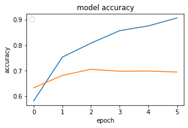
    


    

    


    

    


```python
for i in range(3):
    plt.figure(figsize=(12, 8))
    plt.subplot(3, 3, i+1)
    plt.title('model loss')
    plt.xlabel('epoch')
    plt.ylabel('loss')
    plt.legend(['train', 'test'], loc = 'upper right')
    plt.plot(hist[i].history['loss'])
    plt.plot(hist[i].history['val_loss'])
    plt.tight_layout(pad=1.0)

plt.show()
```


    
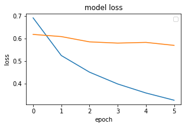
    


    
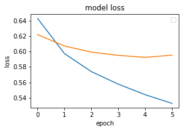
    


    
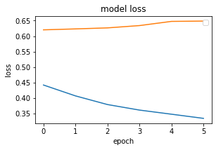
    


## Text Classification with CNN


```python
model = Sequential()

embed_layer = Embedding(
    vocab_size, 100,
    weights = [embed_matrix],
    input_length = maxlen,
    trainable = False
)
model.add(embed_layer)
```


```python
model.add(
    Conv1D(128, 5,
        activation = 'relu'
    )
)
model.add(GlobalMaxPooling1D())
model.add(
    Dense(1,
          activation = 'sigmoid'
    )
)
```


```python
model.compile(
    optimizer = 'adam',
    loss = 'binary_crossentropy',
    metrics = ['accuracy']
)
```


```python
model.summary()
```

    Model: "sequential_1"
    _________________________________________________________________
    Layer (type)                 Output Shape              Param #   
    =================================================================
    embedding_1 (Embedding)      (None, 100, 100)          5796100   
    _________________________________________________________________
    conv1d (Conv1D)              (None, 96, 128)           64128     
    _________________________________________________________________
    global_max_pooling1d (Global (None, 128)               0         
    _________________________________________________________________
    dense_1 (Dense)              (None, 1)                 129       
    =================================================================
    Total params: 5,860,357
    Trainable params: 64,257
    Non-trainable params: 5,796,100
    _________________________________________________________________


```python
hist = [[]] * 3

for i in range(3):
    hist[i] = model.fit(
        X_train[i], y_train[i],
        batch_size = 128,
        epochs = 6,
        verbose = 1,
        validation_split = 0.2
    )
```

    Epoch 1/6
    47/47 [==============================] - 2s 50ms/step - loss: 0.6295 - accuracy: 0.6555 - val_loss: 0.5551 - val_accuracy: 0.7247
    Epoch 2/6
    47/47 [==============================] - 2s 44ms/step - loss: 0.4819 - accuracy: 0.8013 - val_loss: 0.4765 - val_accuracy: 0.7867
    Epoch 3/6
    47/47 [==============================] - 2s 38ms/step - loss: 0.3992 - accuracy: 0.8467 - val_loss: 0.4518 - val_accuracy: 0.7900
    Epoch 4/6
    47/47 [==============================] - 2s 39ms/step - loss: 0.3452 - accuracy: 0.8705 - val_loss: 0.4122 - val_accuracy: 0.8167
    Epoch 5/6
    47/47 [==============================] - 2s 44ms/step - loss: 0.2936 - accuracy: 0.9038 - val_loss: 0.4108 - val_accuracy: 0.8100
    Epoch 6/6
    47/47 [==============================] - 2s 43ms/step - loss: 0.2557 - accuracy: 0.9235 - val_loss: 0.3912 - val_accuracy: 0.8160
    Epoch 1/6
    47/47 [==============================] - 2s 44ms/step - loss: 0.6197 - accuracy: 0.6850 - val_loss: 0.5731 - val_accuracy: 0.7147
    Epoch 2/6
    47/47 [==============================] - 2s 36ms/step - loss: 0.4856 - accuracy: 0.7777 - val_loss: 0.5514 - val_accuracy: 0.7260
    Epoch 3/6
    47/47 [==============================] - 2s 36ms/step - loss: 0.4329 - accuracy: 0.8090 - val_loss: 0.5479 - val_accuracy: 0.7413
    Epoch 4/6
    47/47 [==============================] - 2s 38ms/step - loss: 0.3850 - accuracy: 0.8517 - val_loss: 0.5412 - val_accuracy: 0.7373
    Epoch 5/6
    47/47 [==============================] - 3s 62ms/step - loss: 0.3442 - accuracy: 0.8783 - val_loss: 0.5387 - val_accuracy: 0.7413
    Epoch 6/6
    47/47 [==============================] - 3s 67ms/step - loss: 0.3068 - accuracy: 0.9037 - val_loss: 0.5392 - val_accuracy: 0.7393
    Epoch 1/6
    47/47 [==============================] - 3s 71ms/step - loss: 0.2960 - accuracy: 0.8990 - val_loss: 0.5663 - val_accuracy: 0.7260
    Epoch 2/6
    47/47 [==============================] - 3s 73ms/step - loss: 0.2426 - accuracy: 0.9353 - val_loss: 0.5114 - val_accuracy: 0.7480
    Epoch 3/6
    47/47 [==============================] - 3s 70ms/step - loss: 0.1975 - accuracy: 0.9625 - val_loss: 0.5164 - val_accuracy: 0.7547
    Epoch 4/6
    47/47 [==============================] - 3s 72ms/step - loss: 0.1726 - accuracy: 0.9743 - val_loss: 0.5240 - val_accuracy: 0.7573
    Epoch 5/6
    47/47 [==============================] - 3s 66ms/step - loss: 0.1441 - accuracy: 0.9847 - val_loss: 0.5353 - val_accuracy: 0.7507
    Epoch 6/6
    47/47 [==============================] - 2s 50ms/step - loss: 0.1287 - accuracy: 0.9873 - val_loss: 0.5307 - val_accuracy: 0.7467


```python
loss = [[]] * 3
acc = [[]] * 3

for i in range(3):
    loss[i], acc[i] = model.evaluate(
        X_train[i], y_train[i],
        verbose = 1
    )

for i in range(3):
    print('\ndataset {}: loss - {}, acc - {}'.format(i+1, loss[i], acc[i]))
```

    235/235 [==============================] - 1s 6ms/step - loss: 0.2263 - accuracy: 0.9153
    235/235 [==============================] - 2s 7ms/step - loss: 0.3170 - accuracy: 0.8788
    235/235 [==============================] - 1s 4ms/step - loss: 0.1920 - accuracy: 0.9449
    
    dataset 1: loss - 0.22627300024032593, acc - 0.9153333306312561
    
    dataset 2: loss - 0.3170439600944519, acc - 0.8787999749183655
    
    dataset 3: loss - 0.19201935827732086, acc - 0.9449333548545837


```python
loss = [[]] * 3
acc = [[]] * 3

for i in range(3):
    loss[i], acc[i] = model.evaluate(
        X_test[i], y_test[i],
        verbose = 1
    )
    
for i in range(3):
    print('\ndataset {}: loss - {}, acc - {}'.format(i+1, loss[i], acc[i]))
```

    79/79 [==============================] - 0s 4ms/step - loss: 0.4486 - accuracy: 0.7912
    79/79 [==============================] - 0s 4ms/step - loss: 0.6153 - accuracy: 0.7036
    79/79 [==============================] - 0s 4ms/step - loss: 0.5275 - accuracy: 0.7492
    
    dataset 1: loss - 0.44862401485443115, acc - 0.7911999821662903
    
    dataset 2: loss - 0.6153467297554016, acc - 0.7035999894142151
    
    dataset 3: loss - 0.5274851322174072, acc - 0.7491999864578247


```python
for i in range(3):
    plt.figure(figsize=(12, 8))
    plt.subplot(3, 3, i+1)
    plt.title('model accuracy')
    plt.xlabel('epoch')
    plt.ylabel('accuracy')
    plt.legend(['train', 'test'], loc = 'upper left')
    plt.plot(hist[i].history['accuracy'])
    plt.plot(hist[i].history['val_accuracy'])
    plt.tight_layout(pad=1.0)

plt.show()
```


    
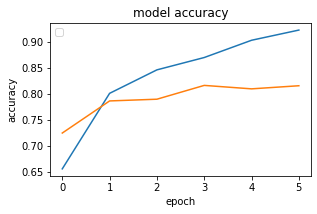
    


    
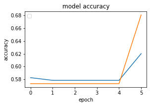
    


    
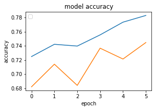
    


```python
for i in range(3):
    plt.figure(figsize=(12, 8))
    plt.subplot(3, 3, i+1)
    plt.title('model loss')
    plt.xlabel('epoch')
    plt.ylabel('loss')
    plt.legend(['train', 'test'], loc = 'upper right')
    plt.plot(hist[i].history['loss'])
    plt.plot(hist[i].history['val_loss'])
    plt.tight_layout(pad=1.0)

plt.show()
```


    
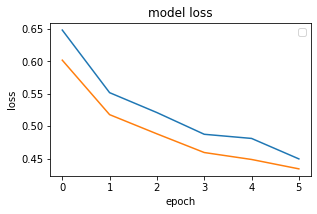
    


    
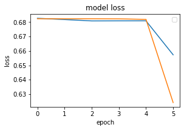
    


    
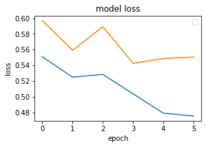
    


## Text Classification with LSTM


```python
model = Sequential()
embed_layer = Embedding(
    vocab_size, 100,
    weights = [embed_matrix],
    input_length = maxlen,
    trainable = False
)
model.add(embed_layer)
model.add(LSTM(128))
```


```python
model.add(
    Dense(
        1,
        activation = 'sigmoid'
    )
)
model.compile(
    optimizer = 'adam',
    loss = 'binary_crossentropy',
    metrics = ['acc']
)
```


```python
model.summary()
```

    Model: "sequential_2"
    _________________________________________________________________
    Layer (type)                 Output Shape              Param #   
    =================================================================
    embedding_2 (Embedding)      (None, 100, 100)          5796100   
    _________________________________________________________________
    lstm (LSTM)                  (None, 128)               117248    
    _________________________________________________________________
    dense_2 (Dense)              (None, 1)                 129       
    =================================================================
    Total params: 5,913,477
    Trainable params: 117,377
    Non-trainable params: 5,796,100
    _________________________________________________________________


```python
hist = [[]] * 3

for i in range(3):
    hist[i] = model.fit(
        X_train[i], y_train[i],
        batch_size = 128,
        epochs = 6,
        verbose = 1,
        validation_split = 0.2
    )
```

    Epoch 1/6
    47/47 [==============================] - 8s 170ms/step - loss: 0.6413 - acc: 0.6295 - val_loss: 0.5895 - val_acc: 0.6900
    Epoch 2/6
    47/47 [==============================] - 9s 202ms/step - loss: 0.5457 - acc: 0.7237 - val_loss: 0.4959 - val_acc: 0.7700
    Epoch 3/6
    47/47 [==============================] - 7s 148ms/step - loss: 0.5098 - acc: 0.7575 - val_loss: 0.4872 - val_acc: 0.7733
    Epoch 4/6
    47/47 [==============================] - 7s 142ms/step - loss: 0.4941 - acc: 0.7657 - val_loss: 0.4887 - val_acc: 0.7640
    Epoch 5/6
    47/47 [==============================] - 7s 145ms/step - loss: 0.4781 - acc: 0.7722 - val_loss: 0.4655 - val_acc: 0.7867
    Epoch 6/6
    47/47 [==============================] - 8s 164ms/step - loss: 0.4523 - acc: 0.7887 - val_loss: 0.4470 - val_acc: 0.7880
    Epoch 1/6
    47/47 [==============================] - 9s 186ms/step - loss: 0.6887 - acc: 0.5797 - val_loss: 0.6824 - val_acc: 0.5733
    Epoch 2/6
    47/47 [==============================] - 8s 174ms/step - loss: 0.6784 - acc: 0.5785 - val_loss: 0.6826 - val_acc: 0.5733
    Epoch 3/6
    47/47 [==============================] - 9s 187ms/step - loss: 0.6828 - acc: 0.5785 - val_loss: 0.6813 - val_acc: 0.5733
    Epoch 4/6
    47/47 [==============================] - 7s 159ms/step - loss: 0.6590 - acc: 0.5710 - val_loss: 0.6888 - val_acc: 0.4480
    Epoch 5/6
    47/47 [==============================] - 8s 163ms/step - loss: 0.6858 - acc: 0.5558 - val_loss: 0.6824 - val_acc: 0.5733
    Epoch 6/6
    47/47 [==============================] - 9s 184ms/step - loss: 0.6810 - acc: 0.5785 - val_loss: 0.6824 - val_acc: 0.5733
    Epoch 1/6
    47/47 [==============================] - 9s 193ms/step - loss: 0.6395 - acc: 0.5720 - val_loss: 0.6075 - val_acc: 0.5940
    Epoch 2/6
    47/47 [==============================] - 7s 148ms/step - loss: 0.5779 - acc: 0.6662 - val_loss: 0.5838 - val_acc: 0.6667
    Epoch 3/6
    47/47 [==============================] - 7s 146ms/step - loss: 0.5549 - acc: 0.6928 - val_loss: 0.5542 - val_acc: 0.7087
    Epoch 4/6
    47/47 [==============================] - 9s 185ms/step - loss: 0.5197 - acc: 0.7353 - val_loss: 0.5607 - val_acc: 0.6940
    Epoch 5/6
    47/47 [==============================] - 7s 152ms/step - loss: 0.5190 - acc: 0.7325 - val_loss: 0.5331 - val_acc: 0.7267
    Epoch 6/6
    47/47 [==============================] - 7s 141ms/step - loss: 0.4809 - acc: 0.7660 - val_loss: 0.5502 - val_acc: 0.7373


```python
loss = [[]] * 3
acc = [[]] * 3

for i in range(3):
    loss[i], acc[i] = model.evaluate(
        X_train[i], y_train[i],
        verbose = 1
    )

for i in range(3):
    print('\ndataset {}: loss - {}, acc - {}'.format(i+1, loss[i], acc[i]))
```

    235/235 [==============================] - 5s 21ms/step - loss: 0.4069 - acc: 0.8216
    235/235 [==============================] - 6s 26ms/step - loss: 0.6664 - acc: 0.7040
    235/235 [==============================] - 5s 21ms/step - loss: 0.4869 - acc: 0.7749
    
    dataset 1: loss - 0.4069167971611023, acc - 0.8216000199317932
    
    dataset 2: loss - 0.6664188504219055, acc - 0.7039999961853027
    
    dataset 3: loss - 0.48685401678085327, acc - 0.7749333381652832


```python
loss = [[]] * 3
acc = [[]] * 3

for i in range(3):
    loss[i], acc[i] = model.evaluate(
        X_test[i], y_test[i],
        verbose = 1
    )
    
for i in range(3):
    print('\ndataset {}: loss - {}, acc - {}'.format(i+1, loss[i], acc[i]))
```

    79/79 [==============================] - 2s 20ms/step - loss: 0.4722 - acc: 0.7860
    79/79 [==============================] - 2s 22ms/step - loss: 0.6870 - acc: 0.6900
    79/79 [==============================] - 2s 19ms/step - loss: 0.5498 - acc: 0.7452
    
    dataset 1: loss - 0.4722077250480652, acc - 0.7860000133514404
    
    dataset 2: loss - 0.686953067779541, acc - 0.6899999976158142
    
    dataset 3: loss - 0.5498132109642029, acc - 0.745199978351593


```python
for i in range(3):
    plt.figure(figsize=(12, 8))
    plt.subplot(3, 3, i+1)
    plt.title('model accuracy')
    plt.xlabel('epoch')
    plt.ylabel('accuracy')
    plt.legend(['train', 'test'], loc = 'upper left')
    plt.plot(hist[i].history['acc'])
    plt.plot(hist[i].history['val_acc'])
    plt.tight_layout(pad=1.0)

plt.show()
```


    
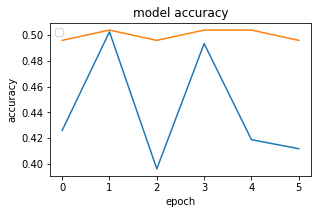
    


    
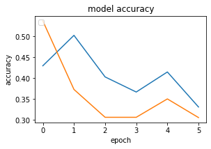
    


    
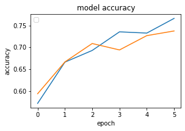
    


```python
for i in range(3):
    plt.figure(figsize=(12, 8))
    plt.subplot(3, 3, i+1)
    plt.title('model loss')
    plt.xlabel('epoch')
    plt.ylabel('loss')
    plt.legend(['train', 'test'], loc = 'upper right')
    plt.plot(hist[i].history['loss'])
    plt.plot(hist[i].history['val_loss'])
    plt.tight_layout(pad=1.0)

plt.show()
```


    
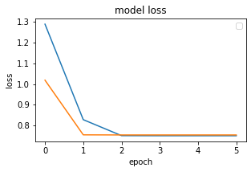
    


    
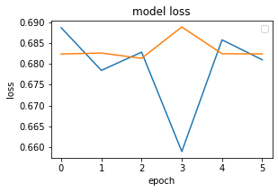
    


    

    


## Text Classification with Bi-Directional LSTM


```python
from keras.layers import TimeDistributed
from keras.layers import Bidirectional

model = Sequential()
embed_layer = Embedding(
    vocab_size,
    100,
    weights = [embed_matrix],
    input_length = maxlen,
    trainable = False
)
model.add(embed_layer)
model.add(
    Bidirectional(
        LSTM(
            100,
            return_sequences = True,
            dropout = 0.50
        ),
        merge_mode = 'concat'
    )
)
model.add(
    TimeDistributed(
        Dense(
            100,
            activation = 'sigmoid'
        )
    )
)
model.add(Flatten())
```


```python
model.add(
    Dense(
        100,
        activation = 'sigmoid'
    )
)
model.add(
    Dense(
        3,
        activation = 'softmax'
    )
)
model.compile(
    optimizer = 'adam',
    loss = 'binary_crossentropy',
    metrics = ['acc']
)
```


```python
model.summary()
```

    Model: "sequential_3"
    _________________________________________________________________
    Layer (type)                 Output Shape              Param #   
    =================================================================
    embedding_3 (Embedding)      (None, 100, 100)          5796100   
    _________________________________________________________________
    bidirectional (Bidirectional (None, 100, 200)          160800    
    _________________________________________________________________
    time_distributed (TimeDistri (None, 100, 100)          20100     
    _________________________________________________________________
    flatten_1 (Flatten)          (None, 10000)             0         
    _________________________________________________________________
    dense_4 (Dense)              (None, 100)               1000100   
    _________________________________________________________________
    dense_5 (Dense)              (None, 3)                 303       
    =================================================================
    Total params: 6,977,403
    Trainable params: 1,181,303
    Non-trainable params: 5,796,100
    _________________________________________________________________


```python
hist = [[]] * 3

for i in range(3):
    hist[i] = model.fit(
        X_train[i], y_train[i],
        batch_size = 128,
        epochs = 6,
        verbose = 1,
        validation_split = 0.2
    )
```

    Epoch 1/6
    47/47 [==============================] - 11s 233ms/step - loss: 1.1249 - acc: 0.4888 - val_loss: 0.8540 - val_acc: 0.4960
    Epoch 2/6
    47/47 [==============================] - 12s 247ms/step - loss: 0.7678 - acc: 0.2550 - val_loss: 0.7554 - val_acc: 0.0000e+00
    Epoch 3/6
    47/47 [==============================] - 12s 264ms/step - loss: 0.7512 - acc: 0.3668 - val_loss: 0.7548 - val_acc: 0.0000e+00
    Epoch 4/6
    47/47 [==============================] - 12s 246ms/step - loss: 0.7511 - acc: 0.2037 - val_loss: 0.7548 - val_acc: 0.4960
    Epoch 5/6
    47/47 [==============================] - 12s 260ms/step - loss: 0.7511 - acc: 0.2125 - val_loss: 0.7548 - val_acc: 0.4947
    Epoch 6/6
    47/47 [==============================] - 10s 222ms/step - loss: 0.7511 - acc: 0.2225 - val_loss: 0.7548 - val_acc: 0.0967
    Epoch 1/6
    47/47 [==============================] - 10s 220ms/step - loss: 0.6976 - acc: 0.2877 - val_loss: 0.7012 - val_acc: 0.5647
    Epoch 2/6
    47/47 [==============================] - 10s 217ms/step - loss: 0.6976 - acc: 0.3460 - val_loss: 0.7012 - val_acc: 0.1627
    Epoch 3/6
    47/47 [==============================] - 10s 209ms/step - loss: 0.6976 - acc: 0.2508 - val_loss: 0.7012 - val_acc: 0.2407
    Epoch 4/6
    47/47 [==============================] - 11s 236ms/step - loss: 0.6976 - acc: 0.2842 - val_loss: 0.7012 - val_acc: 0.2387
    Epoch 5/6
    47/47 [==============================] - 11s 242ms/step - loss: 0.6976 - acc: 0.2833 - val_loss: 0.7012 - val_acc: 0.2427
    Epoch 6/6
    47/47 [==============================] - 11s 226ms/step - loss: 0.6976 - acc: 0.2823 - val_loss: 0.7012 - val_acc: 0.2427
    Epoch 1/6
    47/47 [==============================] - 11s 237ms/step - loss: 0.7667 - acc: 0.2322 - val_loss: 0.7788 - val_acc: 0.2427
    Epoch 2/6
    47/47 [==============================] - 11s 241ms/step - loss: 0.7667 - acc: 0.2377 - val_loss: 0.7788 - val_acc: 0.2427
    Epoch 3/6
    47/47 [==============================] - 12s 260ms/step - loss: 0.7667 - acc: 0.2372 - val_loss: 0.7788 - val_acc: 0.2427
    Epoch 4/6
    47/47 [==============================] - 13s 267ms/step - loss: 0.7667 - acc: 0.2387 - val_loss: 0.7788 - val_acc: 0.2427
    Epoch 5/6
    47/47 [==============================] - 13s 280ms/step - loss: 0.7667 - acc: 0.2373 - val_loss: 0.7788 - val_acc: 0.2427
    Epoch 6/6
    47/47 [==============================] - 11s 234ms/step - loss: 0.7667 - acc: 0.2383 - val_loss: 0.7788 - val_acc: 0.2433


```python
loss = [[]] * 3
acc = [[]] * 3

for i in range(3):
    loss[i], acc[i] = model.evaluate(
        X_train[i], y_train[i],
        verbose = 1
    )

for i in range(3):
    print('\ndataset {}: loss - {}, acc - {}'.format(i+1, loss[i], acc[i]))
```

    235/235 [==============================] - 7s 28ms/step - loss: 0.7519 - acc: 0.0272
    235/235 [==============================] - 5s 22ms/step - loss: 0.6983 - acc: 0.5775
    235/235 [==============================] - 6s 23ms/step - loss: 0.7691 - acc: 0.2371
    
    dataset 1: loss - 0.7518537640571594, acc - 0.0272000003606081
    
    dataset 2: loss - 0.6983428597450256, acc - 0.5774666666984558
    
    dataset 3: loss - 0.7691359519958496, acc - 0.23706667125225067


```python
loss = [[]] * 3
acc = [[]] * 3

for i in range(3):
    loss[i], acc[i] = model.evaluate(
        X_test[i], y_test[i],
        verbose = 1
    )
    
for i in range(3):
    print('\ndataset {}: loss - {}, acc - {}'.format(i+1, loss[i], acc[i]))
```

    79/79 [==============================] - 2s 24ms/step - loss: 0.7604 - acc: 0.0224
    79/79 [==============================] - 2s 26ms/step - loss: 0.6880 - acc: 0.5920
    79/79 [==============================] - 2s 21ms/step - loss: 0.7592 - acc: 0.2428
    
    dataset 1: loss - 0.7603561282157898, acc - 0.02239999920129776
    
    dataset 2: loss - 0.6879917979240417, acc - 0.5920000076293945
    
    dataset 3: loss - 0.7592472434043884, acc - 0.24279999732971191


```python
for i in range(3):
    plt.figure(figsize=(12, 8))
    plt.subplot(3, 3, i+1)
    plt.title('model accuracy')
    plt.xlabel('epoch')
    plt.ylabel('accuracy')
    plt.legend(['train', 'test'], loc = 'upper left')
    plt.plot(hist[i].history['acc'])
    plt.plot(hist[i].history['val_acc'])
    plt.tight_layout(pad=1.0)

plt.show()
```


    
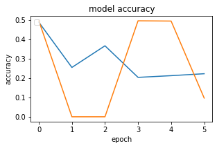
    


    

    


    

    


```python
for i in range(3):
    plt.figure(figsize=(12, 8))
    plt.subplot(3, 3, i+1)
    plt.title('model loss')
    plt.xlabel('epoch')
    plt.ylabel('loss')
    plt.legend(['train', 'test'], loc = 'upper right')
    plt.plot(hist[i].history['loss'])
    plt.plot(hist[i].history['val_loss'])
    plt.tight_layout(pad=1.0)

plt.show()
```


    
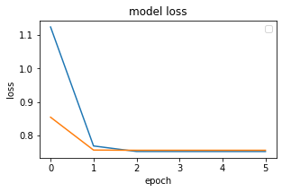
    


    

    


    
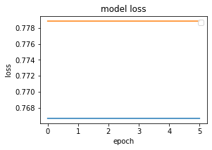
    


## Text Classification with GRU


```python
from keras.layers.recurrent import GRU
```


```python
model = Sequential()
embed_layer = Embedding(
    vocab_size, 100,
    weights = [embed_matrix],
    input_length = maxlen,
    trainable = False
)
model.add(embed_layer)
model.add(
    GRU(256)
)
```


```python
model.add(
    Dense(
        1,
        activation = 'sigmoid'
    )
)
model.compile(
    optimizer = 'adam',
    loss = 'binary_crossentropy',
    metrics = ['acc']
)
```


```python
model.summary()
```

    Model: "sequential_4"
    _________________________________________________________________
    Layer (type)                 Output Shape              Param #   
    =================================================================
    embedding_4 (Embedding)      (None, 100, 100)          5796100   
    _________________________________________________________________
    gru (GRU)                    (None, 256)               274944    
    _________________________________________________________________
    dense_6 (Dense)              (None, 1)                 257       
    =================================================================
    Total params: 6,071,301
    Trainable params: 275,201
    Non-trainable params: 5,796,100
    _________________________________________________________________


```python
hist = [[]] * 3

for i in range(3):
    hist[i] = model.fit(
        X_train[i], y_train[i],
        batch_size = 128,
        epochs = 6,
        verbose = 1,
        validation_split = 0.2
    )
```

    Epoch 1/6
    47/47 [==============================] - 13s 279ms/step - loss: 0.6666 - acc: 0.5842 - val_loss: 0.6300 - val_acc: 0.6440
    Epoch 2/6
    47/47 [==============================] - 13s 274ms/step - loss: 0.5851 - acc: 0.6880 - val_loss: 0.5342 - val_acc: 0.7393
    Epoch 3/6
    47/47 [==============================] - 13s 273ms/step - loss: 0.4775 - acc: 0.7730 - val_loss: 0.4374 - val_acc: 0.7967
    Epoch 4/6
    47/47 [==============================] - 15s 311ms/step - loss: 0.4212 - acc: 0.8058 - val_loss: 0.4018 - val_acc: 0.8180
    Epoch 5/6
    47/47 [==============================] - 13s 273ms/step - loss: 0.3884 - acc: 0.8230 - val_loss: 0.4097 - val_acc: 0.8173
    Epoch 6/6
    47/47 [==============================] - 14s 289ms/step - loss: 0.3625 - acc: 0.8392 - val_loss: 0.4216 - val_acc: 0.8060
    Epoch 1/6
    47/47 [==============================] - 14s 307ms/step - loss: 0.6866 - acc: 0.5773 - val_loss: 0.6830 - val_acc: 0.5733
    Epoch 2/6
    47/47 [==============================] - 15s 318ms/step - loss: 0.6812 - acc: 0.5785 - val_loss: 0.6825 - val_acc: 0.5733
    Epoch 3/6
    47/47 [==============================] - 15s 312ms/step - loss: 0.6812 - acc: 0.5785 - val_loss: 0.6824 - val_acc: 0.5733
    Epoch 4/6
    47/47 [==============================] - 14s 307ms/step - loss: 0.6809 - acc: 0.5785 - val_loss: 0.6824 - val_acc: 0.5733
    Epoch 5/6
    47/47 [==============================] - 15s 328ms/step - loss: 0.6810 - acc: 0.5785 - val_loss: 0.6824 - val_acc: 0.5733
    Epoch 6/6
    47/47 [==============================] - 15s 324ms/step - loss: 0.6809 - acc: 0.5785 - val_loss: 0.6824 - val_acc: 0.5733
    Epoch 1/6
    47/47 [==============================] - 18s 383ms/step - loss: 0.6118 - acc: 0.6138 - val_loss: 0.6254 - val_acc: 0.6300
    Epoch 2/6
    47/47 [==============================] - 20s 416ms/step - loss: 0.5294 - acc: 0.7033 - val_loss: 0.5669 - val_acc: 0.7067
    Epoch 3/6
    47/47 [==============================] - 17s 356ms/step - loss: 0.4990 - acc: 0.7272 - val_loss: 0.5280 - val_acc: 0.7307
    Epoch 4/6
    47/47 [==============================] - 15s 325ms/step - loss: 0.4474 - acc: 0.7847 - val_loss: 0.5485 - val_acc: 0.7273
    Epoch 5/6
    47/47 [==============================] - 15s 315ms/step - loss: 0.4178 - acc: 0.7930 - val_loss: 0.5270 - val_acc: 0.7493
    Epoch 6/6
    47/47 [==============================] - 14s 307ms/step - loss: 0.4099 - acc: 0.7970 - val_loss: 0.5444 - val_acc: 0.7300


```python
loss = [[]] * 3
acc = [[]] * 3

for i in range(3):
    loss[i], acc[i] = model.evaluate(
        X_train[i], y_train[i],
        verbose = 1
    )

for i in range(3):
    print('\ndataset {}: loss - {}, acc - {}'.format(i+1, loss[i], acc[i]))
```

    235/235 [==============================] - 13s 57ms/step - loss: 0.3307 - acc: 0.8625
    235/235 [==============================] - 13s 57ms/step - loss: 0.5471 - acc: 0.7281
    235/235 [==============================] - 13s 54ms/step - loss: 0.4100 - acc: 0.8011
    
    dataset 1: loss - 0.3307272493839264, acc - 0.8625333309173584
    
    dataset 2: loss - 0.5471307039260864, acc - 0.7281333208084106
    
    dataset 3: loss - 0.4100341200828552, acc - 0.8010666370391846


```python
loss = [[]] * 3
acc = [[]] * 3

for i in range(3):
    loss[i], acc[i] = model.evaluate(
        X_test[i], y_test[i],
        verbose = 1
    )
    
for i in range(3):
    print('\ndataset {}: loss - {}, acc - {}'.format(i+1, loss[i], acc[i]))
```

    79/79 [==============================] - 3s 36ms/step - loss: 0.4677 - acc: 0.8016
    79/79 [==============================] - 3s 32ms/step - loss: 0.5715 - acc: 0.7112
    79/79 [==============================] - 3s 34ms/step - loss: 0.5289 - acc: 0.7384
    
    dataset 1: loss - 0.46765264868736267, acc - 0.8015999794006348
    
    dataset 2: loss - 0.5714684128761292, acc - 0.7111999988555908
    
    dataset 3: loss - 0.5288749933242798, acc - 0.7383999824523926


```python
for i in range(3):
    plt.figure(figsize=(12, 8))
    plt.subplot(3, 3, i+1)
    plt.title('model accuracy')
    plt.xlabel('epoch')
    plt.ylabel('accuracy')
    plt.legend(['train', 'test'], loc = 'upper left')
    plt.plot(hist[i].history['acc'])
    plt.plot(hist[i].history['val_acc'])
    plt.tight_layout(pad=1.0)

plt.show()
```


    
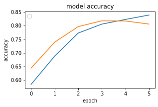
    


    
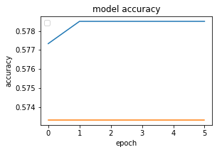
    


    
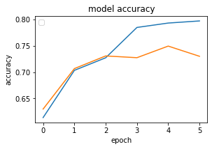
    


```python
for i in range(3):
    plt.figure(figsize=(12, 8))
    plt.subplot(3, 3, i+1)
    plt.title('model loss')
    plt.xlabel('epoch')
    plt.ylabel('loss')
    plt.legend(['train', 'test'], loc = 'upper right')
    plt.plot(hist[i].history['loss'])
    plt.plot(hist[i].history['val_loss'])
    plt.tight_layout(pad=1.0)

plt.show()
```


    
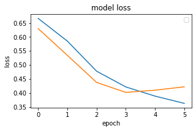
    


    
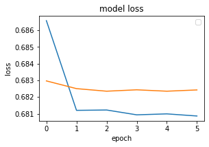
    


    
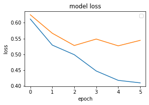
    


```python
model.save('model.m5')
```

    WARNING:tensorflow:From /home/shiningflash/.local/lib/python3.6/site-packages/tensorflow/python/training/tracking/tracking.py:111: Model.state_updates (from tensorflow.python.keras.engine.training) is deprecated and will be removed in a future version.
    Instructions for updating:
    This property should not be used in TensorFlow 2.0, as updates are applied automatically.
    WARNING:tensorflow:From /home/shiningflash/.local/lib/python3.6/site-packages/tensorflow/python/training/tracking/tracking.py:111: Layer.updates (from tensorflow.python.keras.engine.base_layer) is deprecated and will be removed in a future version.
    Instructions for updating:
    This property should not be used in TensorFlow 2.0, as updates are applied automatically.
    INFO:tensorflow:Assets written to: model.m5/assets

