# Sentiment Analysis using Deep Learning in Keras

### Importing Required Libraries


```python
import re
import pandas as pd
import numpy as np
import seaborn as sns
from sklearn.model_selection import train_test_split
from keras.preprocessing.text import Tokenizer
from numpy import array, asarray, zeros
from keras.models import Sequential
from keras.preprocessing.sequence import pad_sequences
from keras.layers import Flatten, GlobalMaxPooling1D
from keras.layers.core import Activation, Dropout, Dense
from keras.layers.embeddings import Embedding
import matplotlib.pyplot as plt
from keras.layers import Conv1D
from keras.layers import LSTM
```

### Importing Dataset

Dataset 1 link: https://www.kaggle.com/lakshmi25npathi/imdb-dataset-of-50k-movie-reviews

Dataset 2 link: https://github.com/vineetdhanawat/twitter-sentiment-analysis/blob/master/datasets/Sentiment%20Analysis%20Dataset%20100000.csv


```python
df = []
df.append(pd.read_csv('IMDB Dataset.csv', nrows = 10000))
df.append(pd.read_csv('Sentiment Analysis Dataset 100000.csv', encoding = 'latin-1', nrows = 10000))
df[1].drop(['ItemID'], axis = 'columns', inplace = True)
```


```python
df[0].head(5)
```


<div>
<style scoped>
    .dataframe tbody tr th:only-of-type {
        vertical-align: middle;
    }

    .dataframe tbody tr th {
        vertical-align: top;
    }

    .dataframe thead th {
        text-align: right;
    }
</style>
<table border="1" class="dataframe">
  <thead>
    <tr style="text-align: right;">
      <th></th>
      <th>text</th>
      <th>sentiment</th>
    </tr>
  </thead>
  <tbody>
    <tr>
      <th>0</th>
      <td>One of the other reviewers has mentioned that ...</td>
      <td>positive</td>
    </tr>
    <tr>
      <th>1</th>
      <td>A wonderful little production. &lt;br /&gt;&lt;br /&gt;The...</td>
      <td>positive</td>
    </tr>
    <tr>
      <th>2</th>
      <td>I thought this was a wonderful way to spend ti...</td>
      <td>positive</td>
    </tr>
    <tr>
      <th>3</th>
      <td>Basically there's a family where a little boy ...</td>
      <td>negative</td>
    </tr>
    <tr>
      <th>4</th>
      <td>Petter Mattei's "Love in the Time of Money" is...</td>
      <td>positive</td>
    </tr>
  </tbody>
</table>
</div>


```python
df[1].head(5)
```


<div>
<style scoped>
    .dataframe tbody tr th:only-of-type {
        vertical-align: middle;
    }

    .dataframe tbody tr th {
        vertical-align: top;
    }

    .dataframe thead th {
        text-align: right;
    }
</style>
=======
Dataset link: https://github.com/vineetdhanawat/twitter-sentiment-analysis/blob/master/datasets/Sentiment%20Analysis%20Dataset%20100000.csv


```python
df = pd.read_csv('Sentiment Analysis Dataset 100000.csv', encoding = 'latin-1', nrows = 10000)
```


```python
df.head(5)
```


<div>    
>>>>>>> 5391f1bf360935b799c0ae9d36f654afa5001782
<table border="1" class="dataframe">
  <thead>
    <tr style="text-align: right;">
      <th></th>
<<<<<<< HEAD
      <th>sentiment</th>
      <th>text</th>
=======
      <th>ItemID</th>
      <th>Sentiment</th>
      <th>SentimentText</th>
>>>>>>> 5391f1bf360935b799c0ae9d36f654afa5001782
    </tr>
  </thead>
  <tbody>
    <tr>
      <th>0</th>
<<<<<<< HEAD
=======
      <td>1</td>
>>>>>>> 5391f1bf360935b799c0ae9d36f654afa5001782
      <td>0</td>
      <td>is so sad for my APL frie...</td>
    </tr>
    <tr>
      <th>1</th>
<<<<<<< HEAD
=======
      <td>2</td>
>>>>>>> 5391f1bf360935b799c0ae9d36f654afa5001782
      <td>0</td>
      <td>I missed the New Moon trail...</td>
    </tr>
    <tr>
      <th>2</th>
<<<<<<< HEAD
=======
      <td>3</td>
>>>>>>> 5391f1bf360935b799c0ae9d36f654afa5001782
      <td>1</td>
      <td>omg its already 7:30 :O</td>
    </tr>
    <tr>
      <th>3</th>
<<<<<<< HEAD
=======
      <td>4</td>
>>>>>>> 5391f1bf360935b799c0ae9d36f654afa5001782
      <td>0</td>
      <td>.. Omgaga. Im sooo  im gunna CRy. I'...</td>
    </tr>
    <tr>
      <th>4</th>
<<<<<<< HEAD
=======
      <td>5</td>
>>>>>>> 5391f1bf360935b799c0ae9d36f654afa5001782
      <td>0</td>
      <td>i think mi bf is cheating on me!!!   ...</td>
    </tr>
  </tbody>
</table>
</div>


```python
<<<<<<< HEAD
df[0]['text'][0]
=======
df['SentimentText'][0]
>>>>>>> 5391f1bf360935b799c0ae9d36f654afa5001782
```


<<<<<<< HEAD
    "One of the other reviewers has mentioned that after watching just 1 Oz episode you'll be hooked. They are right, as this is exactly what happened with me.<br /><br />The first thing that struck me about Oz was its brutality and unflinching scenes of violence, which set in right from the word GO. Trust me, this is not a show for the faint hearted or timid. This show pulls no punches with regards to drugs, sex or violence. Its is hardcore, in the classic use of the word.<br /><br />It is called OZ as that is the nickname given to the Oswald Maximum Security State Penitentary. It focuses mainly on Emerald City, an experimental section of the prison where all the cells have glass fronts and face inwards, so privacy is not high on the agenda. Em City is home to many..Aryans, Muslims, gangstas, Latinos, Christians, Italians, Irish and more....so scuffles, death stares, dodgy dealings and shady agreements are never far away.<br /><br />I would say the main appeal of the show is due to the fact that it goes where other shows wouldn't dare. Forget pretty pictures painted for mainstream audiences, forget charm, forget romance...OZ doesn't mess around. The first episode I ever saw struck me as so nasty it was surreal, I couldn't say I was ready for it, but as I watched more, I developed a taste for Oz, and got accustomed to the high levels of graphic violence. Not just violence, but injustice (crooked guards who'll be sold out for a nickel, inmates who'll kill on order and get away with it, well mannered, middle class inmates being turned into prison bitches due to their lack of street skills or prison experience) Watching Oz, you may become comfortable with what is uncomfortable viewing....thats if you can get in touch with your darker side."
=======
    '                     is so sad for my APL friend.............'
>>>>>>> 5391f1bf360935b799c0ae9d36f654afa5001782


```python
<<<<<<< HEAD
df[1]['text'][0]
=======
df.isnull().values.any()
>>>>>>> 5391f1bf360935b799c0ae9d36f654afa5001782
```


<<<<<<< HEAD
    '                     is so sad for my APL friend.............'


```python
for i in df:
    print(i.isnull().values.any())
```

    False
=======
>>>>>>> 5391f1bf360935b799c0ae9d36f654afa5001782
    False


<<<<<<< HEAD
```python
sns.countplot(x = 'sentiment', data = df[0])
=======

```python
df.shape
>>>>>>> 5391f1bf360935b799c0ae9d36f654afa5001782
```


<<<<<<< HEAD
    <AxesSubplot:xlabel='sentiment', ylabel='count'>
=======
    (10000, 3)
>>>>>>> 5391f1bf360935b799c0ae9d36f654afa5001782


<<<<<<< HEAD
    
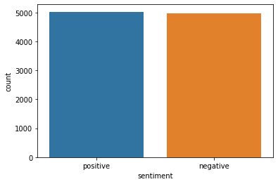
    


```python
sns.countplot(x = 'sentiment', data = df[1])
=======
```python
sns.countplot(x = 'Sentiment', data = df)
>>>>>>> 5391f1bf360935b799c0ae9d36f654afa5001782
```


<<<<<<< HEAD
    <AxesSubplot:xlabel='sentiment', ylabel='count'>
=======
    <AxesSubplot:xlabel='Sentiment', ylabel='count'>
>>>>>>> 5391f1bf360935b799c0ae9d36f654afa5001782


    
<<<<<<< HEAD

=======
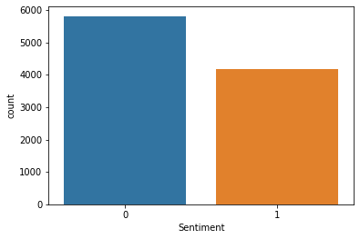
>>>>>>> 5391f1bf360935b799c0ae9d36f654afa5001782
    


## Data Processing

<<<<<<< HEAD
#### Dataset 1 Cleaning


```python
TAG_RE = re.compile(r'<[^>]+>')

def remove_html_tags(sen):
    return TAG_RE.sub('', sen)
```


```python
def data_processing_1(sen):
    sen = remove_html_tags(sen) # remove html tag
    sen = sen.replace('n\'t', ' not') # convert n't to not
    sen = re.sub(r"\s+[a-zA-Z]\s+", ' ', sen) # remove single letter
    sen = re.sub(r'\s+', ' ', sen) # remove multiple spaces
    sen = re.sub(r'[.]+', '.', sen) # remove multiple dots
    sen = sen.replace('\\\'', ' ') # remove \
=======

```python
def removeAndTag(sen):
    sen = sen.replace('&quot;3', '')
    sen = sen.replace('&quot;', '')
    sen = sen.replace('&lt;3', '')
    sen = sen.replace('&lt;', '')
    sen = sen.replace('&gt;', '')
    return sen
```


```python
print(df['SentimentText'][120])
print('\n', removeAndTag(df['SentimentText'][120]))
```

      waahhh now I'm getting sad....miss hub :-'(&quot;&quot;&quot;&quot;&quot;&quot;&quot;&quot;
    
       waahhh now I'm getting sad....miss hub :-'(


```python
def removeUrl(sen):
    sen = re.sub('http[s]?://\S+', '', sen)
>>>>>>> 5391f1bf360935b799c0ae9d36f654afa5001782
    return sen
```


```python
<<<<<<< HEAD
X = [["0"]*10000]*3
```


```python
sentences = list(df[0]['text'])
i = 0

for sen in sentences:
    X[0][i] = data_processing_1(sen)
    i = i + 1

X[0] = np.array(list(X[0]))
=======
print(df['SentimentText'][125])
print('\n', removeUrl(df['SentimentText'][125]))
```

     - Why must people be so picky. I mean 6 hours work and no dice!? what�s up with that! http://tumblr.com/xsg1m3ufn
    
      - Why must people be so picky. I mean 6 hours work and no dice!? what�s up with that! 


```python
def removeMentioned(sen):
    sen = re.sub('[a-zA-Z0-9]*@[a-zA-Z0-9]*', '', sen)
    return sen
>>>>>>> 5391f1bf360935b799c0ae9d36f654afa5001782
```


```python
<<<<<<< HEAD
for i in range(0, 3):
    print(X[0][i], end = '\n\n')
```

    One of the other reviewers has mentioned that after watching just 1 Oz episode you'll be hooked. They are right, as this is exactly what happened with me.The first thing that struck me about Oz was its brutality and unflinching scenes of violence, which set in right from the word GO. Trust me, this is not show for the faint hearted or timid. This show pulls no punches with regards to drugs, sex or violence. Its is hardcore, in the classic use of the word.It is called OZ as that is the nickname given to the Oswald Maximum Security State Penitentary. It focuses mainly on Emerald City, an experimental section of the prison where all the cells have glass fronts and face inwards, so privacy is not high on the agenda. Em City is home to many.Aryans, Muslims, gangstas, Latinos, Christians, Italians, Irish and more.so scuffles, death stares, dodgy dealings and shady agreements are never far away.I would say the main appeal of the show is due to the fact that it goes where other shows would not dare. Forget pretty pictures painted for mainstream audiences, forget charm, forget romance.OZ does not mess around. The first episode ever saw struck me as so nasty it was surreal, could not say was ready for it, but as watched more, developed taste for Oz, and got accustomed to the high levels of graphic violence. Not just violence, but injustice (crooked guards who'll be sold out for nickel, inmates who'll kill on order and get away with it, well mannered, middle class inmates being turned into prison bitches due to their lack of street skills or prison experience) Watching Oz, you may become comfortable with what is uncomfortable viewing.thats if you can get in touch with your darker side.
    
    A wonderful little production. The filming technique is very unassuming- very old-time-BBC fashion and gives comforting, and sometimes discomforting, sense of realism to the entire piece. The actors are extremely well chosen- Michael Sheen not only "has got all the polari" but he has all the voices down pat too! You can truly see the seamless editing guided by the references to Williams' diary entries, not only is it well worth the watching but it is terrificly written and performed piece. masterful production about one of the great master's of comedy and his life. The realism really comes home with the little things: the fantasy of the guard which, rather than use the traditional 'dream' techniques remains solid then disappears. It plays on our knowledge and our senses, particularly with the scenes concerning Orton and Halliwell and the sets (particularly of their flat with Halliwell's murals decorating every surface) are terribly well done.
    
    I thought this was wonderful way to spend time on too hot summer weekend, sitting in the air conditioned theater and watching light-hearted comedy. The plot is simplistic, but the dialogue is witty and the characters are likable (even the well bread suspected serial killer). While some may be disappointed when they realize this is not Match Point 2: Risk Addiction, thought it was proof that Woody Allen is still fully in control of the style many of us have grown to love.This was the most I'd laughed at one of Woody's comedies in years (dare say decade?). While I've never been impressed with Scarlet Johanson, in this she managed to tone down her "sexy" image and jumped right into average, but spirited young woman.This may not be the crown jewel of his career, but it was wittier than "Devil Wears Prada" and more interesting than "Superman" great comedy to go see with friends.
    
=======
print(df['SentimentText'][146])
print('\n', removeMentioned(df['SentimentText'][146]))
```

     &quot;The truth is hiding in your eyes&quot; @patita @MissMarian  Paramore � Decode @Daninho502  ? http://blip.fm/~5ytke
    
      &quot;The truth is hiding in your eyes&quot;    Paramore � Decode   ? http://blip.fm/~5ytke
>>>>>>> 5391f1bf360935b799c0ae9d36f654afa5001782


```python
<<<<<<< HEAD
y = [[0]*10000]*3
y[0] = df[0]['sentiment']
y[0] = np.array(list(map(lambda x: 1 if x == "positive" else 0, y[0])))
=======
def convertShortcutOfNot(sen):
    sen = sen.replace('an\'t', 'an not')
    sen = sen.replace('n\'t', ' not')
    return sen
>>>>>>> 5391f1bf360935b799c0ae9d36f654afa5001782
```


```python
<<<<<<< HEAD
for i in range(0, 5):
    print(y[0][i], end = ', ')
```

    1, 1, 1, 0, 1, 


```python
print(np.shape(X[0]))
print(np.shape(y[0]))
```

    (10000,)
    (10000,)


#### Dataset 2 Cleaning


```python
def data_processing_2(sen):
    sen = sen.replace('&quot;3', '')
    sen = sen.replace('&quot;', '')
    sen = sen.replace('&lt;3', '')
    sen = sen.replace('&lt;', '')
    sen = sen.replace('&gt;', '')
    sen = re.sub('http[s]?://\S+', '', sen)
    sen = re.sub('[a-zA-Z0-9]*@[a-zA-Z0-9]*', '', sen)
    sen = sen.replace('an\'t', 'an not')
    sen = sen.replace('n\'t', ' not')
    sen = re.sub(r"\s+[A-Z]\s+", ' ', sen)
    sen = re.sub(r'[.]+', '.', sen)
    sen = re.sub(r'\s+', ' ', sen)
    sen = re.sub(r'[-]+', ' ', sen)
=======
print(df['SentimentText'][200])
print('\n', convertShortcutOfNot(df['SentimentText'][200]))
```

     @georgediaz #Magic ..thinking less than 50 % chance Hedo stays in Orlando. He's gonna go for the $$. They all do. Can't blame him though.
    
      @georgediaz #Magic ..thinking less than 50 % chance Hedo stays in Orlando. He's gonna go for the $$. They all do. Can not blame him though.


```python
print(df['SentimentText'][220])
print('\n', convertShortcutOfNot(df['SentimentText'][220]))
```

     @Leloz isn't home neither is @sozi1 ... @althani96 U BETTER HAVE IT!!!
    
      @Leloz is not home neither is @sozi1 ... @althani96 U BETTER HAVE IT!!!


```python
def removeSingleChar(sen):
    sen = re.sub(r"\s+[A-Z]\s+", ' ', sen)
>>>>>>> 5391f1bf360935b799c0ae9d36f654afa5001782
    return sen
```


```python
<<<<<<< HEAD
sentences = list(df[1]['text'])
i = 0

for sen in sentences:
    X[1][i] = data_processing_2(sen)
    i = i + 1
    
X[1] = np.array(list(X[1]))
```


```python
y[1] = np.array(list(df[1]['sentiment']))
=======
print(df['SentimentText'][307])
print('\n', removeSingleChar(df['SentimentText'][307]))
```

       a lot, a lot, a lot, a lot, a lot, a lot, a lot, a lot, a lot, a lot, a lot, a lot.
    
        a lot, a lot, a lot, a lot, a lot, a lot, a lot, a lot, a lot, a lot, a lot, a lot.


```python
def removeMultipleSpaceDashAndDot(sen):
    sen = re.sub(r'[.]+', '.', sen)
    sen = re.sub(r'\s+', ' ', sen)
    sen = re.sub(r'[-]+', ' ', sen)
    return sen
>>>>>>> 5391f1bf360935b799c0ae9d36f654afa5001782
```


```python
<<<<<<< HEAD
for i in range(0, 10):
    print(y[1][i], end = ',')
```

    0,0,1,0,0,0,1,0,1,1,


```python
print(np.shape(X[1]))
print(np.shape(y[1]))
```

    (10000,)
    (10000,)


#### Combine Dataset


```python
for i in range(0, 5000):
    X[2][i] = X[0][i]
    y[2][i] = y[0][i]
for i in range(5000, 10000):
    X[2][i] = X[1][i]
    y[2][i] = y[1][i]
    
X[2] = np.array(X[2])
y[2] = np.array(y[2])
```


```python
print(np.shape(X[2]))
print(np.shape(y[2]))
```

    (10000,)
    (10000,)


```python
for sen in range(0, 3):
    print(y[2][sen], X[2][sen], end = '\n\n')
for sen in range(5000, 5003):
    print(y[2][sen], X[2][sen], end = '\n\n')
```

    1 One of the other reviewers has mentioned that after watching just 1 Oz episode you'll be hooked. They are right, as this is exactly what happened with me.The first thing that struck me about Oz was its brutality and unflinching scenes of violence, which set in right from the word GO. Trust me, this is not show for the faint hearted or timid. This show pulls no punches with regards to drugs, sex or violence. Its is hardcore, in the classic use of the word.It is called OZ as that is the nickname given to the Oswald Maximum Security State Penitentary. It focuses mainly on Emerald City, an experimental section of the prison where all the cells have glass fronts and face inwards, so privacy is not high on the agenda. Em City is home to many.Aryans, Muslims, gangstas, Latinos, Christians, Italians, Irish and more.so scuffles, death stares, dodgy dealings and shady agreements are never far away.I would say the main appeal of the show is due to the fact that it goes where other shows would not dare. Forget pretty pictures painted for mainstream audiences, forget charm, forget romance.OZ does not mess around. The first episode ever saw struck me as so nasty it was surreal, could not say was ready for it, but as watched more, developed taste for Oz, and got accustomed to the high levels of graphic violence. Not just violence, but injustice (crooked guards who'll be sold out for nickel, inmates who'll kill on order and get away with it, well mannered, middle class inmates being turned into prison bitches due to their lack of street skills or prison experience) Watching Oz, you may become comfortable with what is uncomfortable viewing.thats if you can get in touch with your darker side.
    
    1 A wonderful little production. The filming technique is very unassuming- very old-time-BBC fashion and gives comforting, and sometimes discomforting, sense of realism to the entire piece. The actors are extremely well chosen- Michael Sheen not only "has got all the polari" but he has all the voices down pat too! You can truly see the seamless editing guided by the references to Williams' diary entries, not only is it well worth the watching but it is terrificly written and performed piece. masterful production about one of the great master's of comedy and his life. The realism really comes home with the little things: the fantasy of the guard which, rather than use the traditional 'dream' techniques remains solid then disappears. It plays on our knowledge and our senses, particularly with the scenes concerning Orton and Halliwell and the sets (particularly of their flat with Halliwell's murals decorating every surface) are terribly well done.
    
    1 I thought this was wonderful way to spend time on too hot summer weekend, sitting in the air conditioned theater and watching light-hearted comedy. The plot is simplistic, but the dialogue is witty and the characters are likable (even the well bread suspected serial killer). While some may be disappointed when they realize this is not Match Point 2: Risk Addiction, thought it was proof that Woody Allen is still fully in control of the style many of us have grown to love.This was the most I'd laughed at one of Woody's comedies in years (dare say decade?). While I've never been impressed with Scarlet Johanson, in this she managed to tone down her "sexy" image and jumped right into average, but spirited young woman.This may not be the crown jewel of his career, but it was wittier than "Devil Wears Prada" and more interesting than "Superman" great comedy to go see with friends.
    
    1  very very very happy and slightly skinny xx
    
    0  waaaaahhh. ohyeah i had something to do eeee. haha
    
    1  Wade.Grad.Hot.Bald. Your not gonna shave your head! Uh. Yeah.I hot.get babes Hahahaha man love Wade!
    


#### Dataset splitting to train and test


```python
X_train = [[]] * 3
X_test = [[]] * 3
y_train = [[]] * 3
y_test = [[]] * 3
=======
print(df['SentimentText'][342])
print('\n', removeMultipleSpaceDashAndDot(df['SentimentText'][342]))
```

         &lt;--------- my face because i'm missing zoro tonight.
    
      &lt;  my face because i'm missing zoro tonight.


```python
print(df['SentimentText'][286])
print('\n', removeMultipleSpaceDashAndDot(df['SentimentText'][286]))
```

              my life is very lazzzzyyyy!!!!!!!            ***********
    
      my life is very lazzzzyyyy!!!!!!! ***********


```python
print(df['SentimentText'][319])
print('\n', removeMultipleSpaceDashAndDot(df['SentimentText'][319]))
```

       i'm so cold this morning......       i have chills all over.....   
    
      i'm so cold this morning. i have chills all over. 


```python
X = []

sentences = list(df['SentimentText'])

for sen in sentences:
    sen = removeAndTag(sen)
    sen = removeUrl(sen)
    sen = removeMentioned(sen)
    sen = convertShortcutOfNot(sen)
    sen = removeSingleChar(sen)
    sen = removeMultipleSpaceDashAndDot(sen)
    X.append(sen)
```


```python
for sen in range(0, 10):
    print(X[sen], end = '\n\n')
```

     is so sad for my APL friend.
    
     missed the New Moon trailer.
    
     omg its already 7:30 :O
    
     . Omgaga. Im sooo im gunna CRy. I've been at this dentist since 11. was suposed 2 just get a crown put on (30mins).
    
     i think mi bf is cheating on me!!! T_T
    
     or i just worry too much? 
    
     Juuuuuuuuuuuuuuuuussssst Chillin!!
    
     Sunny Again Work Tomorrow : | TV Tonight
    
     handed in my uniform today . i miss you already
    
     hmmmm. i wonder how she my number  )
    


```python
y = df['Sentiment']
>>>>>>> 5391f1bf360935b799c0ae9d36f654afa5001782
```


```python
<<<<<<< HEAD
for i in range(0, 3):
    print('dataset ', i+1, ': ', np.shape(X[i]), ', ', np.shape(y[i]), end = '\n')
```

    dataset  1 :  (10000,) ,  (10000,)
    dataset  2 :  (10000,) ,  (10000,)
    dataset  3 :  (10000,) ,  (10000,)


```python
for i in range(0, 3):
    X_train[i], X_test[i], y_train[i], y_test[i] = train_test_split(
        X[i], y[i], test_size = 0.25,
        random_state = 42
    )
=======
for sen in range(0, 5):
    print(y[sen], end = ', ')
```

    0, 0, 1, 0, 0, 


```python
y = np.array(list(y))
```

#### Dataset splitting to train and test


```python
X_train, X_test, y_train, y_test = train_test_split(
    X, y, test_size = 0.25,
    random_state = 42
)
>>>>>>> 5391f1bf360935b799c0ae9d36f654afa5001782
```


```python
<<<<<<< HEAD
for i in range(0, 10):
    print(i, ': ', y_test[1][i], ' --> ', X_train[1][i])
```

    0 :  0  -->  #f1 Rubens knows he has lost any chance of the world championship
    1 :  0  -->  #3turnoffwords   Isit in yet
    2 :  1  -->  #FollowFriday is a ferociously gifted writer whose books &amp; Tweets are magical must reads. Follow &amp; you'll LOVE her too
    3 :  0  -->  My heart sings when think of youuu haha that's all keep singing today. I'm craving cheeto puffs unhealthy!
    4 :  0  -->   guys are pricks. gonna have an early night and cry til i fall asleep. fuck you all.
    5 :  1  -->  #faviphoneapp Black Book. But since only have a Touch it's not as fun. But it's still a great junt organizer
    6 :  0  -->  #musicmonday Crossfire   On Fire
    7 :  1  -->  #3wordsaftersex 'I broke it?!?!' lol
    8 :  0  -->  ! .sooo, any hope for a match up with Liz Cheney and Mikas Daddy? thx!! Ratings Gold I'm sure!! 
    9 :  0  -->   u guys knw whyy
=======
print(X_train[2])
print(y_train[2])
```

    #FollowFriday is a ferociously gifted writer whose books &amp; Tweets are magical must reads. Follow &amp; you'll LOVE her too 
    1
>>>>>>> 5391f1bf360935b799c0ae9d36f654afa5001782


### Preparing Embedding Layer


```python
tokenizer = Tokenizer(num_words = 50000)
<<<<<<< HEAD

for i in range(3):
    tokenizer.fit_on_texts(X_train[i])
=======
tokenizer.fit_on_texts(X_train)
```


```python
X_train = tokenizer.texts_to_sequences(X_train)
>>>>>>> 5391f1bf360935b799c0ae9d36f654afa5001782
```


```python
<<<<<<< HEAD
for i in range(3):
    X_train[i] = tokenizer.texts_to_sequences(X_train[i])
=======
X_test = tokenizer.texts_to_sequences(X_test)
>>>>>>> 5391f1bf360935b799c0ae9d36f654afa5001782
```


```python
<<<<<<< HEAD
for i in range(3):
    X_test[i] = tokenizer.texts_to_sequences(X_test[i])
```

=======
print(sentences[2])
print(X_train[2])
print(len(X_train[2]))
```

                  omg its already 7:30 :O
    [40, 8, 3, 4914, 1948, 691, 594, 774, 22, 262, 31, 4915, 276, 1633, 103, 22, 481, 38, 75, 91]
    20


>>>>>>> 5391f1bf360935b799c0ae9d36f654afa5001782

```python
maxlen = 100
vocab_size = len(tokenizer.word_index) + 1
print(vocab_size)
```

<<<<<<< HEAD
    57961
=======
    13077
>>>>>>> 5391f1bf360935b799c0ae9d36f654afa5001782


```python
<<<<<<< HEAD
for i in range(3):
    X_train[i] = pad_sequences(
        X_train[i],
        padding = 'post',
        maxlen = maxlen
    )
=======
X_train = pad_sequences(
    X_train,
    padding = 'post',
    maxlen = maxlen
)
>>>>>>> 5391f1bf360935b799c0ae9d36f654afa5001782
```


```python
<<<<<<< HEAD
for i in range(3):
    X_test[i] = pad_sequences(
        X_test[i],
        padding = 'post',
        maxlen = maxlen
    )
=======
X_test = pad_sequences(
    X_test,
    padding = 'post',
    maxlen = maxlen
)
>>>>>>> 5391f1bf360935b799c0ae9d36f654afa5001782
```

#### glove.6B.100d.txt Dataset for GloVe Embedding

dataset link: https://www.kaggle.com/danielwillgeorge/glove6b100dtxt


```python
embed_dictionary = dict()
glv_file = open('glove.6B.100d.txt', encoding='utf8')
```


```python
for line in glv_file:
    records = line.split()
    word = records[0]
    vector_dim = asarray(records[1:], dtype='float32')
    embed_dictionary[word] = vector_dim
glv_file.close()
```


```python
embed_matrix = zeros((vocab_size, 100))
```


```python
embed_matrix[1]
```


    array([0., 0., 0., 0., 0., 0., 0., 0., 0., 0., 0., 0., 0., 0., 0., 0., 0.,
           0., 0., 0., 0., 0., 0., 0., 0., 0., 0., 0., 0., 0., 0., 0., 0., 0.,
           0., 0., 0., 0., 0., 0., 0., 0., 0., 0., 0., 0., 0., 0., 0., 0., 0.,
           0., 0., 0., 0., 0., 0., 0., 0., 0., 0., 0., 0., 0., 0., 0., 0., 0.,
           0., 0., 0., 0., 0., 0., 0., 0., 0., 0., 0., 0., 0., 0., 0., 0., 0.,
           0., 0., 0., 0., 0., 0., 0., 0., 0., 0., 0., 0., 0., 0., 0.])


```python
for word, index in tokenizer.word_index.items():
    embed_vector = embed_dictionary.get(word)
    if embed_vector is not None:
        embed_matrix[index] = embed_vector
```


```python
embed_matrix[1]
```


<<<<<<< HEAD
    array([-0.038194  , -0.24487001,  0.72812003, -0.39961001,  0.083172  ,
            0.043953  , -0.39140999,  0.3344    , -0.57545   ,  0.087459  ,
            0.28786999, -0.06731   ,  0.30906001, -0.26383999, -0.13231   ,
           -0.20757   ,  0.33395001, -0.33848   , -0.31742999, -0.48335999,
            0.1464    , -0.37303999,  0.34577   ,  0.052041  ,  0.44946   ,
           -0.46970999,  0.02628   , -0.54154998, -0.15518001, -0.14106999,
           -0.039722  ,  0.28277001,  0.14393   ,  0.23464   , -0.31020999,
            0.086173  ,  0.20397   ,  0.52623999,  0.17163999, -0.082378  ,
           -0.71787   , -0.41531   ,  0.20334999, -0.12763   ,  0.41367   ,
            0.55186999,  0.57907999, -0.33476999, -0.36559001, -0.54856998,
           -0.062892  ,  0.26583999,  0.30204999,  0.99774998, -0.80480999,
           -3.0243001 ,  0.01254   , -0.36941999,  2.21670008,  0.72201002,
           -0.24978   ,  0.92136002,  0.034514  ,  0.46744999,  1.10790002,
           -0.19358   , -0.074575  ,  0.23353   , -0.052062  , -0.22044   ,
            0.057162  , -0.15806   , -0.30798   , -0.41624999,  0.37972   ,
            0.15006   , -0.53211999, -0.20550001, -1.25259995,  0.071624  ,
            0.70564997,  0.49744001, -0.42063001,  0.26148   , -1.53799999,
           -0.30223   , -0.073438  , -0.28312001,  0.37103999, -0.25217   ,
            0.016215  , -0.017099  , -0.38984001,  0.87423998, -0.72569001,
           -0.51058   , -0.52028   , -0.1459    ,  0.82779998,  0.27061999])
=======
    array([-1.89700007e-01,  5.00239991e-02,  1.90840006e-01, -4.91839983e-02,
           -8.97369981e-02,  2.10060000e-01, -5.49520016e-01,  9.83769968e-02,
           -2.01350003e-01,  3.42409998e-01, -9.26769972e-02,  1.60999998e-01,
           -1.32679999e-01, -2.81599998e-01,  1.87370002e-01, -4.29589987e-01,
            9.60389972e-01,  1.39719993e-01, -1.07809997e+00,  4.05180007e-01,
            5.05389988e-01, -5.50639987e-01,  4.84400004e-01,  3.80439997e-01,
           -2.90549989e-03, -3.49420011e-01, -9.96960029e-02, -7.83680022e-01,
            1.03629994e+00, -2.31399998e-01, -4.71210003e-01,  5.71259975e-01,
           -2.14540005e-01,  3.59580010e-01, -4.83190000e-01,  1.08749998e+00,
            2.85239995e-01,  1.24470003e-01, -3.92480008e-02, -7.67320022e-02,
           -7.63429999e-01, -3.24090004e-01, -5.74899971e-01, -1.08930004e+00,
           -4.18110013e-01,  4.51200008e-01,  1.21119998e-01, -5.13670027e-01,
           -1.33489996e-01, -1.13779998e+00, -2.87680000e-01,  1.67740002e-01,
            5.58040023e-01,  1.53869998e+00,  1.88590009e-02, -2.97210002e+00,
           -2.42160007e-01, -9.24950004e-01,  2.19919991e+00,  2.82339990e-01,
           -3.47799987e-01,  5.16210020e-01, -4.33869988e-01,  3.68519992e-01,
            7.45729983e-01,  7.21020028e-02,  2.79309988e-01,  9.25689995e-01,
           -5.03359996e-02, -8.58560026e-01, -1.35800004e-01, -9.25509989e-01,
           -3.39910001e-01, -1.03939998e+00, -6.72030002e-02, -2.13789999e-01,
           -4.76900011e-01,  2.13770002e-01, -8.40080023e-01,  5.25359996e-02,
            5.92980027e-01,  2.96039999e-01, -6.76440001e-01,  1.39160007e-01,
           -1.55040002e+00, -2.07650006e-01,  7.22199976e-01,  5.20560026e-01,
           -7.62209967e-02, -1.51940003e-01, -1.31339997e-01,  5.86169995e-02,
           -3.18690002e-01, -6.14189982e-01, -6.23929977e-01, -4.15479988e-01,
           -3.81750017e-02, -3.98039997e-01,  4.76469994e-01, -1.59830004e-01])
>>>>>>> 5391f1bf360935b799c0ae9d36f654afa5001782


## Text Classification with Simple Neural Network


```python
model = Sequential()
embed_layer = Embedding(
    vocab_size, 100,
    weights = [embed_matrix],
    input_length = maxlen,
    trainable = False
)
model.add(embed_layer)
model.add(Flatten())
```


```python
model.add(
    Dense(
        1,
        activation = 'sigmoid'
    )
)
```


```python
model.compile(
    optimizer = 'adam',
    loss = 'binary_crossentropy',
    metrics = ['acc']
)
```


```python
model.summary()
```

    Model: "sequential"
    _________________________________________________________________
    Layer (type)                 Output Shape              Param #   
    =================================================================
<<<<<<< HEAD
    embedding (Embedding)        (None, 100, 100)          5796100   
=======
    embedding (Embedding)        (None, 100, 100)          1307700   
>>>>>>> 5391f1bf360935b799c0ae9d36f654afa5001782
    _________________________________________________________________
    flatten (Flatten)            (None, 10000)             0         
    _________________________________________________________________
    dense (Dense)                (None, 1)                 10001     
    =================================================================
<<<<<<< HEAD
    Total params: 5,806,101
    Trainable params: 10,001
    Non-trainable params: 5,796,100
=======
    Total params: 1,317,701
    Trainable params: 10,001
    Non-trainable params: 1,307,700
>>>>>>> 5391f1bf360935b799c0ae9d36f654afa5001782
    _________________________________________________________________


```python
<<<<<<< HEAD
hist = [[]] * 3

for i in range(3):
    hist[i] = model.fit(
        X_train[i], y_train[i],
        batch_size = 128,
        epochs = 6,
        verbose = 1,
        validation_split = 0.2
    )
```

    Epoch 1/6
    47/47 [==============================] - 0s 7ms/step - loss: 0.6803 - acc: 0.5865 - val_loss: 0.6259 - val_acc: 0.6553
    Epoch 2/6
    47/47 [==============================] - 0s 5ms/step - loss: 0.5226 - acc: 0.7525 - val_loss: 0.5895 - val_acc: 0.6947
    Epoch 3/6
    47/47 [==============================] - 0s 6ms/step - loss: 0.4426 - acc: 0.8135 - val_loss: 0.5769 - val_acc: 0.6980
    Epoch 4/6
    47/47 [==============================] - 0s 6ms/step - loss: 0.3857 - acc: 0.8547 - val_loss: 0.5823 - val_acc: 0.6953
    Epoch 5/6
    47/47 [==============================] - 0s 5ms/step - loss: 0.3540 - acc: 0.8692 - val_loss: 0.5600 - val_acc: 0.7120
    Epoch 6/6
    47/47 [==============================] - 0s 6ms/step - loss: 0.3156 - acc: 0.8975 - val_loss: 0.5702 - val_acc: 0.7053
    Epoch 1/6
    47/47 [==============================] - 0s 6ms/step - loss: 0.6447 - acc: 0.6280 - val_loss: 0.6215 - val_acc: 0.6593
    Epoch 2/6
    47/47 [==============================] - 0s 5ms/step - loss: 0.5994 - acc: 0.6825 - val_loss: 0.6057 - val_acc: 0.6753
    Epoch 3/6
    47/47 [==============================] - 0s 6ms/step - loss: 0.5754 - acc: 0.7067 - val_loss: 0.5972 - val_acc: 0.6840
    Epoch 4/6
    47/47 [==============================] - 0s 8ms/step - loss: 0.5581 - acc: 0.7217 - val_loss: 0.5937 - val_acc: 0.6880
    Epoch 5/6
    47/47 [==============================] - 0s 7ms/step - loss: 0.5445 - acc: 0.7360 - val_loss: 0.5904 - val_acc: 0.6833
    Epoch 6/6
    47/47 [==============================] - 0s 6ms/step - loss: 0.5342 - acc: 0.7452 - val_loss: 0.5902 - val_acc: 0.6920
    Epoch 1/6
    47/47 [==============================] - 0s 6ms/step - loss: 0.4447 - acc: 0.7982 - val_loss: 0.6227 - val_acc: 0.6793
    Epoch 2/6
    47/47 [==============================] - 0s 8ms/step - loss: 0.4022 - acc: 0.8387 - val_loss: 0.6255 - val_acc: 0.6833
    Epoch 3/6
    47/47 [==============================] - 0s 8ms/step - loss: 0.3763 - acc: 0.8578 - val_loss: 0.6273 - val_acc: 0.6807
    Epoch 4/6
    47/47 [==============================] - 0s 6ms/step - loss: 0.3577 - acc: 0.8690 - val_loss: 0.6384 - val_acc: 0.6667
    Epoch 5/6
    47/47 [==============================] - 0s 6ms/step - loss: 0.3444 - acc: 0.8788 - val_loss: 0.6526 - val_acc: 0.6660
    Epoch 6/6
    47/47 [==============================] - 0s 6ms/step - loss: 0.3323 - acc: 0.8817 - val_loss: 0.6501 - val_acc: 0.6727
=======
hist = model.fit(
    X_train, y_train,
    batch_size = 128,
    epochs = 6,
    verbose = 1,
    validation_split = 0.2
)
```

    Epoch 1/6
    47/47 [==============================] - 0s 5ms/step - loss: 0.6644 - acc: 0.5935 - val_loss: 0.6327 - val_acc: 0.6580
    Epoch 2/6
    47/47 [==============================] - 0s 2ms/step - loss: 0.6034 - acc: 0.6892 - val_loss: 0.6206 - val_acc: 0.6687
    Epoch 3/6
    47/47 [==============================] - 0s 3ms/step - loss: 0.5744 - acc: 0.7113 - val_loss: 0.6036 - val_acc: 0.6693
    Epoch 4/6
    47/47 [==============================] - 0s 3ms/step - loss: 0.5532 - acc: 0.7330 - val_loss: 0.5994 - val_acc: 0.6820
    Epoch 5/6
    47/47 [==============================] - 0s 3ms/step - loss: 0.5375 - acc: 0.7447 - val_loss: 0.5957 - val_acc: 0.6840
    Epoch 6/6
    47/47 [==============================] - 0s 2ms/step - loss: 0.5237 - acc: 0.7538 - val_loss: 0.5939 - val_acc: 0.6887
>>>>>>> 5391f1bf360935b799c0ae9d36f654afa5001782


```python
<<<<<<< HEAD
loss = [[]] * 3
acc = [[]] * 3

for i in range(3):
    loss[i], acc[i] = model.evaluate(
        X_train[i], y_train[i],
        verbose = 1
    )

for i in range(3):
    print('\ndataset {}: loss - {}, acc - {}'.format(i+1, loss[i], acc[i]))
```

    235/235 [==============================] - 1s 3ms/step - loss: 0.3588 - acc: 0.8531
    235/235 [==============================] - 0s 2ms/step - loss: 0.5555 - acc: 0.7299
    235/235 [==============================] - 0s 2ms/step - loss: 0.3828 - acc: 0.8500
    
    dataset 1: loss - 0.3588232398033142, acc - 0.8530666828155518
    
    dataset 2: loss - 0.5555294752120972, acc - 0.7298666834831238
    
    dataset 3: loss - 0.3827632665634155, acc - 0.8500000238418579
=======
score = model.evaluate(
    X_test, y_test,
    verbose = 1
)
```

    79/79 [==============================] - 0s 726us/step - loss: 0.5962 - acc: 0.6920
>>>>>>> 5391f1bf360935b799c0ae9d36f654afa5001782


```python
<<<<<<< HEAD
loss = [[]] * 3
acc = [[]] * 3

for i in range(3):
    loss[i], acc[i] = model.evaluate(
        X_test[i], y_test[i],
        verbose = 1
    )
    
for i in range(3):
    print('\ndataset {}: loss - {}, acc - {}'.format(i+1, loss[i], acc[i]))
```

    79/79 [==============================] - 0s 2ms/step - loss: 0.6778 - acc: 0.6928
    79/79 [==============================] - 0s 3ms/step - loss: 0.6304 - acc: 0.6640
    79/79 [==============================] - 0s 2ms/step - loss: 0.6605 - acc: 0.6716
    
    dataset 1: loss - 0.6778039336204529, acc - 0.692799985408783
    
    dataset 2: loss - 0.6303901076316833, acc - 0.6639999747276306
    
    dataset 3: loss - 0.6605290174484253, acc - 0.6715999841690063
=======
score_train = model.evaluate(X_train, y_train, verbose = 3)
print('train score = ', score_train[0])
print('train acc = ', score_train[1])
```

    train score =  0.5265980362892151
    train acc =  0.7545333504676819
>>>>>>> 5391f1bf360935b799c0ae9d36f654afa5001782


```python
<<<<<<< HEAD
for i in range(3):
    plt.figure(figsize=(12, 8))
    plt.subplot(3, 3, i+1)
    plt.title('model accuracy')
    plt.xlabel('epoch')
    plt.ylabel('accuracy')
    plt.legend(['train', 'test'], loc = 'upper left')
    plt.plot(hist[i].history['acc'])
    plt.plot(hist[i].history['val_acc'])
    plt.tight_layout(pad=1.0)

plt.show()
```


    
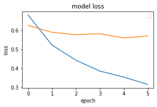
    


    
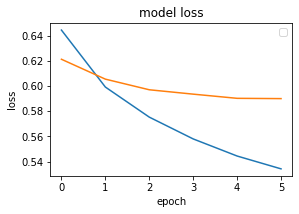
    


    
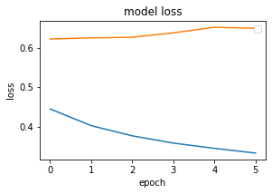
=======
score = model.evaluate(X_test, y_test, verbose = 3)
print('test score = ', score[0])
print('test accuracy = ', score[1])
```

    test score =  0.5962023735046387
    test accuracy =  0.6919999718666077


```python
plt.title('model accuracy')
plt.xlabel('epoch')
plt.ylabel('accuracy')
plt.legend(['train', 'test'])

plt.plot(hist.history['acc'])
plt.plot(hist.history['val_acc'])

plt.show()
```


    
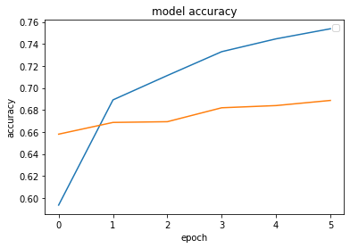
>>>>>>> 5391f1bf360935b799c0ae9d36f654afa5001782
    


```python
<<<<<<< HEAD
for i in range(3):
    plt.figure(figsize=(12, 8))
    plt.subplot(3, 3, i+1)
    plt.title('model loss')
    plt.xlabel('epoch')
    plt.ylabel('loss')
    plt.legend(['train', 'test'], loc = 'upper right')
    plt.plot(hist[i].history['loss'])
    plt.plot(hist[i].history['val_loss'])
    plt.tight_layout(pad=1.0)
=======
plt.title('model loss')
plt.xlabel('epoch')
plt.ylabel('loss')
plt.legend(['train', 'test'], loc = 'upper left')

plt.plot(hist.history['loss'])
plt.plot(hist.history['val_loss'])
>>>>>>> 5391f1bf360935b799c0ae9d36f654afa5001782

plt.show()
```


    
<<<<<<< HEAD

    


    

    


    

=======
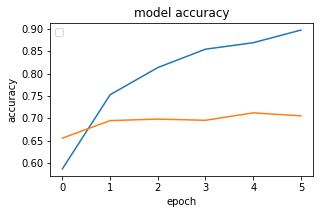
>>>>>>> 5391f1bf360935b799c0ae9d36f654afa5001782
    


## Text Classification with CNN


```python
model = Sequential()

embed_layer = Embedding(
    vocab_size, 100,
    weights = [embed_matrix],
    input_length = maxlen,
    trainable = False
)
model.add(embed_layer)
```


```python
model.add(
    Conv1D(128, 5,
        activation = 'relu'
    )
)
model.add(GlobalMaxPooling1D())
model.add(
    Dense(1,
          activation = 'sigmoid'
    )
)
```


```python
model.compile(
    optimizer = 'adam',
    loss = 'binary_crossentropy',
    metrics = ['accuracy']
)
```


```python
model.summary()
```

    Model: "sequential_1"
    _________________________________________________________________
    Layer (type)                 Output Shape              Param #   
    =================================================================
<<<<<<< HEAD
    embedding_1 (Embedding)      (None, 100, 100)          5796100   
=======
    embedding_1 (Embedding)      (None, 100, 100)          1307700   
>>>>>>> 5391f1bf360935b799c0ae9d36f654afa5001782
    _________________________________________________________________
    conv1d (Conv1D)              (None, 96, 128)           64128     
    _________________________________________________________________
    global_max_pooling1d (Global (None, 128)               0         
    _________________________________________________________________
    dense_1 (Dense)              (None, 1)                 129       
    =================================================================
<<<<<<< HEAD
    Total params: 5,860,357
    Trainable params: 64,257
    Non-trainable params: 5,796,100
=======
    Total params: 1,371,957
    Trainable params: 64,257
    Non-trainable params: 1,307,700
>>>>>>> 5391f1bf360935b799c0ae9d36f654afa5001782
    _________________________________________________________________


```python
<<<<<<< HEAD
hist = [[]] * 3

for i in range(3):
    hist[i] = model.fit(
        X_train[i], y_train[i],
        batch_size = 128,
        epochs = 6,
        verbose = 1,
        validation_split = 0.2
    )
```

    Epoch 1/6
    47/47 [==============================] - 4s 75ms/step - loss: 0.6544 - accuracy: 0.6195 - val_loss: 0.5749 - val_accuracy: 0.7093
    Epoch 2/6
    47/47 [==============================] - 3s 70ms/step - loss: 0.5118 - accuracy: 0.7758 - val_loss: 0.4996 - val_accuracy: 0.7733
    Epoch 3/6
    47/47 [==============================] - 3s 74ms/step - loss: 0.4254 - accuracy: 0.8340 - val_loss: 0.4578 - val_accuracy: 0.7887
    Epoch 4/6
    47/47 [==============================] - 3s 74ms/step - loss: 0.3652 - accuracy: 0.8733 - val_loss: 0.4324 - val_accuracy: 0.8100
    Epoch 5/6
    47/47 [==============================] - 3s 72ms/step - loss: 0.3189 - accuracy: 0.8958 - val_loss: 0.4151 - val_accuracy: 0.8133
    Epoch 6/6
    47/47 [==============================] - 4s 75ms/step - loss: 0.2814 - accuracy: 0.9120 - val_loss: 0.4105 - val_accuracy: 0.8140
    Epoch 1/6
    47/47 [==============================] - 3s 71ms/step - loss: 0.6389 - accuracy: 0.6732 - val_loss: 0.5720 - val_accuracy: 0.7100
    Epoch 2/6
    47/47 [==============================] - 3s 74ms/step - loss: 0.5010 - accuracy: 0.7560 - val_loss: 0.5498 - val_accuracy: 0.7173
    Epoch 3/6
    47/47 [==============================] - 3s 69ms/step - loss: 0.4479 - accuracy: 0.7960 - val_loss: 0.5519 - val_accuracy: 0.7220
    Epoch 4/6
    47/47 [==============================] - 4s 75ms/step - loss: 0.4021 - accuracy: 0.8273 - val_loss: 0.5393 - val_accuracy: 0.7313
    Epoch 5/6
    47/47 [==============================] - 3s 68ms/step - loss: 0.3689 - accuracy: 0.8595 - val_loss: 0.5358 - val_accuracy: 0.7333
    Epoch 6/6
    47/47 [==============================] - 3s 74ms/step - loss: 0.3305 - accuracy: 0.8902 - val_loss: 0.5296 - val_accuracy: 0.7320
    Epoch 1/6
    47/47 [==============================] - 3s 72ms/step - loss: 0.3157 - accuracy: 0.8930 - val_loss: 0.5199 - val_accuracy: 0.7460
    Epoch 2/6
    47/47 [==============================] - 4s 75ms/step - loss: 0.2599 - accuracy: 0.9332 - val_loss: 0.5067 - val_accuracy: 0.7573
    Epoch 3/6
    47/47 [==============================] - 3s 71ms/step - loss: 0.2234 - accuracy: 0.9515 - val_loss: 0.5165 - val_accuracy: 0.7580
    Epoch 4/6
    47/47 [==============================] - 4s 76ms/step - loss: 0.1869 - accuracy: 0.9718 - val_loss: 0.5129 - val_accuracy: 0.7620
    Epoch 5/6
    47/47 [==============================] - 4s 77ms/step - loss: 0.1621 - accuracy: 0.9825 - val_loss: 0.5173 - val_accuracy: 0.7567
    Epoch 6/6
    47/47 [==============================] - 3s 71ms/step - loss: 0.1400 - accuracy: 0.9878 - val_loss: 0.5230 - val_accuracy: 0.7547
=======
hist = model.fit(
    X_train, y_train,
    batch_size = 128,
    epochs = 6,
    verbose = 1,
    validation_split = 0.2
)
```

    Epoch 1/6
    47/47 [==============================] - 2s 44ms/step - loss: 0.6321 - accuracy: 0.6448 - val_loss: 0.5887 - val_accuracy: 0.6827
    Epoch 2/6
    47/47 [==============================] - 2s 40ms/step - loss: 0.5228 - accuracy: 0.7463 - val_loss: 0.5762 - val_accuracy: 0.7053
    Epoch 3/6
    47/47 [==============================] - 2s 40ms/step - loss: 0.4707 - accuracy: 0.7902 - val_loss: 0.5762 - val_accuracy: 0.7020
    Epoch 4/6
    47/47 [==============================] - 2s 39ms/step - loss: 0.4253 - accuracy: 0.8195 - val_loss: 0.5708 - val_accuracy: 0.7080
    Epoch 5/6
    47/47 [==============================] - 2s 39ms/step - loss: 0.3770 - accuracy: 0.8562 - val_loss: 0.5408 - val_accuracy: 0.7247
    Epoch 6/6
    47/47 [==============================] - 2s 40ms/step - loss: 0.3341 - accuracy: 0.8885 - val_loss: 0.5374 - val_accuracy: 0.7287
>>>>>>> 5391f1bf360935b799c0ae9d36f654afa5001782


```python
<<<<<<< HEAD
loss = [[]] * 3
acc = [[]] * 3

for i in range(3):
    loss[i], acc[i] = model.evaluate(
        X_train[i], y_train[i],
        verbose = 1
    )

for i in range(3):
    print('\ndataset {}: loss - {}, acc - {}'.format(i+1, loss[i], acc[i]))
```

    235/235 [==============================] - 2s 9ms/step - loss: 0.2376 - accuracy: 0.9131
    235/235 [==============================] - 2s 9ms/step - loss: 0.3271 - accuracy: 0.8732
    235/235 [==============================] - 2s 8ms/step - loss: 0.2018 - accuracy: 0.9441
    
    dataset 1: loss - 0.23759202659130096, acc - 0.9130666851997375
    
    dataset 2: loss - 0.3270639181137085, acc - 0.873199999332428
    
    dataset 3: loss - 0.20183543860912323, acc - 0.9441333413124084
=======
score_train_cnn = model.evaluate(X_train, y_train, verbose = 3)
print('train score = ', score_train_cnn[0])
print('train acc = ', score_train_cnn[1])
```

    train score =  0.3403852880001068
    train acc =  0.8862666487693787
>>>>>>> 5391f1bf360935b799c0ae9d36f654afa5001782


```python
<<<<<<< HEAD
loss = [[]] * 3
acc = [[]] * 3

for i in range(3):
    loss[i], acc[i] = model.evaluate(
        X_test[i], y_test[i],
        verbose = 1
    )
    
for i in range(3):
    print('\ndataset {}: loss - {}, acc - {}'.format(i+1, loss[i], acc[i]))
```

    79/79 [==============================] - 1s 9ms/step - loss: 0.4515 - accuracy: 0.7864
    79/79 [==============================] - 1s 7ms/step - loss: 0.6190 - accuracy: 0.7076
    79/79 [==============================] - 1s 9ms/step - loss: 0.5296 - accuracy: 0.7476
    
    dataset 1: loss - 0.4515243172645569, acc - 0.7864000201225281
    
    dataset 2: loss - 0.6189744472503662, acc - 0.7075999975204468
    
    dataset 3: loss - 0.5295751690864563, acc - 0.7476000189781189
=======
score_cnn = model.evaluate(
    X_test, y_test,
    verbose = 1
)
print('test score = ', score_cnn[0])
print('test acc = ', score_cnn[1])
```

    79/79 [==============================] - 0s 5ms/step - loss: 0.5445 - accuracy: 0.7280
    test score =  0.5444665551185608
    test acc =  0.7279999852180481
>>>>>>> 5391f1bf360935b799c0ae9d36f654afa5001782


```python
<<<<<<< HEAD
for i in range(3):
    plt.figure(figsize=(12, 8))
    plt.subplot(3, 3, i+1)
    plt.title('model accuracy')
    plt.xlabel('epoch')
    plt.ylabel('accuracy')
    plt.legend(['train', 'test'], loc = 'upper left')
    plt.plot(hist[i].history['accuracy'])
    plt.plot(hist[i].history['val_accuracy'])
    plt.tight_layout(pad=1.0)
=======
plt.title('model accuracy')
plt.xlabel('epoch')
plt.ylabel('accuracy')
plt.legend(['train', 'test'])

plt.plot(hist.history['accuracy'])
plt.plot(hist.history['val_accuracy'])
>>>>>>> 5391f1bf360935b799c0ae9d36f654afa5001782

plt.show()
```


    
<<<<<<< HEAD
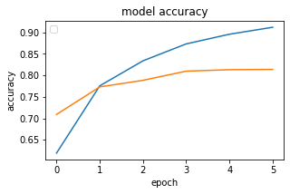
    


    
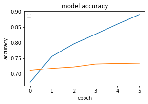
    


    
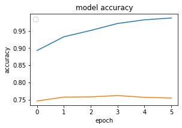
=======
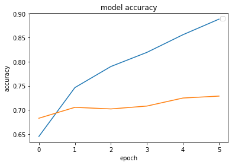
>>>>>>> 5391f1bf360935b799c0ae9d36f654afa5001782
    


```python
<<<<<<< HEAD
for i in range(3):
    plt.figure(figsize=(12, 8))
    plt.subplot(3, 3, i+1)
    plt.title('model loss')
    plt.xlabel('epoch')
    plt.ylabel('loss')
    plt.legend(['train', 'test'], loc = 'upper right')
    plt.plot(hist[i].history['loss'])
    plt.plot(hist[i].history['val_loss'])
    plt.tight_layout(pad=1.0)
=======
plt.title('model loss')
plt.xlabel('epoch')
plt.ylabel('loss')
plt.legend(['train', 'test'], loc = 'upper left')

plt.plot(hist.history['loss'])
plt.plot(hist.history['val_loss'])
>>>>>>> 5391f1bf360935b799c0ae9d36f654afa5001782

plt.show()
```


    
<<<<<<< HEAD
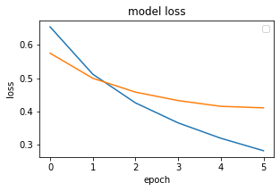
    


    
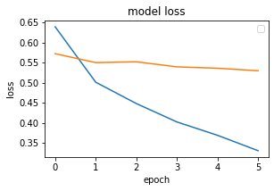
    


    
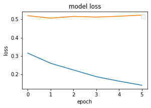
=======
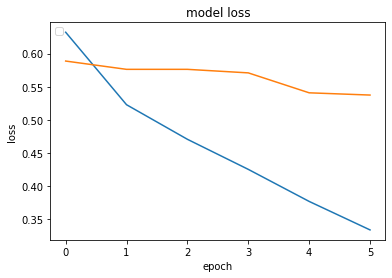
>>>>>>> 5391f1bf360935b799c0ae9d36f654afa5001782
    


## Text Classification with LSTM


```python
model = Sequential()
embed_layer = Embedding(
    vocab_size, 100,
    weights = [embed_matrix],
    input_length = maxlen,
    trainable = False
)
model.add(embed_layer)
model.add(LSTM(128))
```


```python
model.add(
    Dense(
        1,
        activation = 'sigmoid'
    )
)
model.compile(
    optimizer = 'adam',
    loss = 'binary_crossentropy',
    metrics = ['acc']
)
```


```python
model.summary()
```

    Model: "sequential_2"
    _________________________________________________________________
    Layer (type)                 Output Shape              Param #   
    =================================================================
<<<<<<< HEAD
    embedding_2 (Embedding)      (None, 100, 100)          5796100   
=======
    embedding_2 (Embedding)      (None, 100, 100)          1307700   
>>>>>>> 5391f1bf360935b799c0ae9d36f654afa5001782
    _________________________________________________________________
    lstm (LSTM)                  (None, 128)               117248    
    _________________________________________________________________
    dense_2 (Dense)              (None, 1)                 129       
    =================================================================
<<<<<<< HEAD
    Total params: 5,913,477
    Trainable params: 117,377
    Non-trainable params: 5,796,100
=======
    Total params: 1,425,077
    Trainable params: 117,377
    Non-trainable params: 1,307,700
>>>>>>> 5391f1bf360935b799c0ae9d36f654afa5001782
    _________________________________________________________________


```python
<<<<<<< HEAD
hist = [[]] * 3

for i in range(3):
    hist[i] = model.fit(
        X_train[i], y_train[i],
        batch_size = 128,
        epochs = 6,
        verbose = 1,
        validation_split = 0.2
    )
```

    Epoch 1/6
    47/47 [==============================] - 11s 235ms/step - loss: 0.6452 - acc: 0.6195 - val_loss: 0.5662 - val_acc: 0.7267
    Epoch 2/6
    47/47 [==============================] - 10s 223ms/step - loss: 0.5383 - acc: 0.7312 - val_loss: 0.4911 - val_acc: 0.7713
    Epoch 3/6
    47/47 [==============================] - 11s 232ms/step - loss: 0.4894 - acc: 0.7670 - val_loss: 0.4677 - val_acc: 0.7753
    Epoch 4/6
    47/47 [==============================] - 11s 226ms/step - loss: 0.4714 - acc: 0.7770 - val_loss: 0.4526 - val_acc: 0.7940
    Epoch 5/6
    47/47 [==============================] - 11s 224ms/step - loss: 0.4440 - acc: 0.7877 - val_loss: 0.4347 - val_acc: 0.8080
    Epoch 6/6
    47/47 [==============================] - 11s 232ms/step - loss: 0.4583 - acc: 0.7857 - val_loss: 0.5533 - val_acc: 0.7120
    Epoch 1/6
    47/47 [==============================] - 11s 234ms/step - loss: 0.6353 - acc: 0.6613 - val_loss: 0.6286 - val_acc: 0.6867
    Epoch 2/6
    47/47 [==============================] - 11s 225ms/step - loss: 0.6537 - acc: 0.6258 - val_loss: 0.6784 - val_acc: 0.5800
    Epoch 3/6
    47/47 [==============================] - 11s 229ms/step - loss: 0.6781 - acc: 0.5862 - val_loss: 0.6803 - val_acc: 0.5900
    Epoch 4/6
    47/47 [==============================] - 11s 232ms/step - loss: 0.6775 - acc: 0.5958 - val_loss: 0.6760 - val_acc: 0.5920
    Epoch 5/6
    47/47 [==============================] - 11s 226ms/step - loss: 0.6757 - acc: 0.5957 - val_loss: 0.6756 - val_acc: 0.5927
    Epoch 6/6
    47/47 [==============================] - 11s 229ms/step - loss: 0.6752 - acc: 0.5957 - val_loss: 0.6758 - val_acc: 0.5920
    Epoch 1/6
    47/47 [==============================] - 13s 268ms/step - loss: 0.6684 - acc: 0.5748 - val_loss: 0.6682 - val_acc: 0.5727
    Epoch 2/6
    47/47 [==============================] - 14s 289ms/step - loss: 0.6456 - acc: 0.6175 - val_loss: 0.7151 - val_acc: 0.5520
    Epoch 3/6
    47/47 [==============================] - 12s 259ms/step - loss: 0.6270 - acc: 0.6202 - val_loss: 0.6230 - val_acc: 0.6293
    Epoch 4/6
    47/47 [==============================] - 12s 250ms/step - loss: 0.5929 - acc: 0.6542 - val_loss: 0.6107 - val_acc: 0.6433
    Epoch 5/6
    47/47 [==============================] - 13s 282ms/step - loss: 0.5661 - acc: 0.7003 - val_loss: 0.5860 - val_acc: 0.6893
    Epoch 6/6
    47/47 [==============================] - 13s 273ms/step - loss: 0.5510 - acc: 0.7160 - val_loss: 0.5691 - val_acc: 0.7067
=======
hist = model.fit(
    X_train, y_train,
    batch_size = 128,
    epochs = 6,
    verbose = 1,
    validation_split = 0.2
)
```

    Epoch 1/6
    47/47 [==============================] - 7s 152ms/step - loss: 0.6829 - acc: 0.5785 - val_loss: 0.6831 - val_acc: 0.5733
    Epoch 2/6
    47/47 [==============================] - 7s 152ms/step - loss: 0.6812 - acc: 0.5785 - val_loss: 0.6824 - val_acc: 0.5733
    Epoch 3/6
    47/47 [==============================] - 8s 172ms/step - loss: 0.6814 - acc: 0.5785 - val_loss: 0.6824 - val_acc: 0.5733
    Epoch 4/6
    47/47 [==============================] - 8s 169ms/step - loss: 0.6811 - acc: 0.5785 - val_loss: 0.6824 - val_acc: 0.5733
    Epoch 5/6
    47/47 [==============================] - 9s 181ms/step - loss: 0.6810 - acc: 0.5785 - val_loss: 0.6824 - val_acc: 0.5733
    Epoch 6/6
    47/47 [==============================] - 9s 184ms/step - loss: 0.6810 - acc: 0.5785 - val_loss: 0.6824 - val_acc: 0.5733
>>>>>>> 5391f1bf360935b799c0ae9d36f654afa5001782


```python
<<<<<<< HEAD
loss = [[]] * 3
acc = [[]] * 3

for i in range(3):
    loss[i], acc[i] = model.evaluate(
        X_train[i], y_train[i],
        verbose = 1
    )

for i in range(3):
    print('\ndataset {}: loss - {}, acc - {}'.format(i+1, loss[i], acc[i]))
```

    235/235 [==============================] - 11s 46ms/step - loss: 0.4520 - acc: 0.7955
    235/235 [==============================] - 9s 40ms/step - loss: 0.6223 - acc: 0.6547
    235/235 [==============================] - 10s 44ms/step - loss: 0.5390 - acc: 0.7317
    
    dataset 1: loss - 0.4520241320133209, acc - 0.7954666614532471
    
    dataset 2: loss - 0.6222530007362366, acc - 0.6546666622161865
    
    dataset 3: loss - 0.5390162467956543, acc - 0.7317333221435547
=======
score_train_lstm = model.evaluate(
    X_train, y_train,
    verbose = 1
)
print('train score = ', score_train_lstm[0])
print('train acc = ', score_train_lstm[1])
```

    235/235 [==============================] - 8s 32ms/step - loss: 0.6811 - acc: 0.5775
    train score =  0.6811463832855225
    train acc =  0.5774666666984558
>>>>>>> 5391f1bf360935b799c0ae9d36f654afa5001782


```python
<<<<<<< HEAD
loss = [[]] * 3
acc = [[]] * 3

for i in range(3):
    loss[i], acc[i] = model.evaluate(
        X_test[i], y_test[i],
        verbose = 1
    )
    
for i in range(3):
    print('\ndataset {}: loss - {}, acc - {}'.format(i+1, loss[i], acc[i]))
```

    79/79 [==============================] - 3s 44ms/step - loss: 0.4807 - acc: 0.7744
    79/79 [==============================] - 4s 55ms/step - loss: 0.6306 - acc: 0.6400
    79/79 [==============================] - 4s 46ms/step - loss: 0.5504 - acc: 0.7200
    
    dataset 1: loss - 0.48068588972091675, acc - 0.774399995803833
    
    dataset 2: loss - 0.6306218504905701, acc - 0.6399999856948853
    
    dataset 3: loss - 0.5504348874092102, acc - 0.7200000286102295
=======
score_lstm = model.evaluate(
    X_test, y_test,
    verbose = 1
)
print('test score = ', score_lstm[0])
print('test acc = ', score_lstm[1])
```

    79/79 [==============================] - 2s 28ms/step - loss: 0.6767 - acc: 0.5924
    test score =  0.6767327785491943
    test acc =  0.5924000144004822
>>>>>>> 5391f1bf360935b799c0ae9d36f654afa5001782


```python
<<<<<<< HEAD
for i in range(3):
    plt.figure(figsize=(12, 8))
    plt.subplot(3, 3, i+1)
    plt.title('model accuracy')
    plt.xlabel('epoch')
    plt.ylabel('accuracy')
    plt.legend(['train', 'test'], loc = 'upper left')
    plt.plot(hist[i].history['acc'])
    plt.plot(hist[i].history['val_acc'])
    plt.tight_layout(pad=1.0)
=======
plt.title('model accuracy')
plt.xlabel('epoch')
plt.ylabel('accuracy')
plt.legend(['train', 'test'])

plt.plot(hist.history['acc'])
plt.plot(hist.history['val_acc'])
>>>>>>> 5391f1bf360935b799c0ae9d36f654afa5001782

plt.show()
```


    
<<<<<<< HEAD
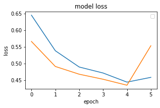
    


    
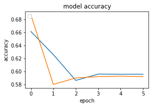
    


    
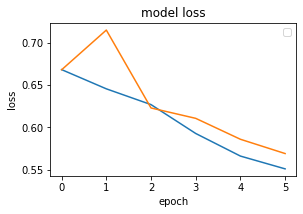
=======
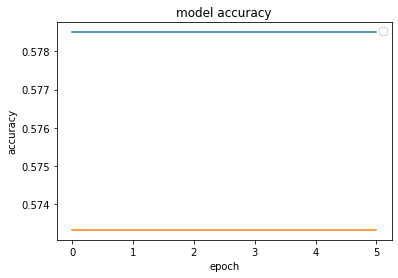
>>>>>>> 5391f1bf360935b799c0ae9d36f654afa5001782
    


```python
<<<<<<< HEAD
for i in range(3):
    plt.figure(figsize=(12, 8))
    plt.subplot(3, 3, i+1)
    plt.title('model loss')
    plt.xlabel('epoch')
    plt.ylabel('loss')
    plt.legend(['train', 'test'], loc = 'upper right')
    plt.plot(hist[i].history['loss'])
    plt.plot(hist[i].history['val_loss'])
    plt.tight_layout(pad=1.0)
=======
plt.title('model loss')
plt.xlabel('epoch')
plt.ylabel('loss')
plt.legend(['train', 'test'], loc = 'upper left')

plt.plot(hist.history['loss'])
plt.plot(hist.history['val_loss'])
>>>>>>> 5391f1bf360935b799c0ae9d36f654afa5001782

plt.show()
```


    
<<<<<<< HEAD

    


    
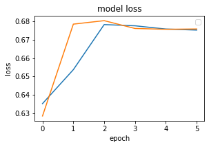
    


    

=======
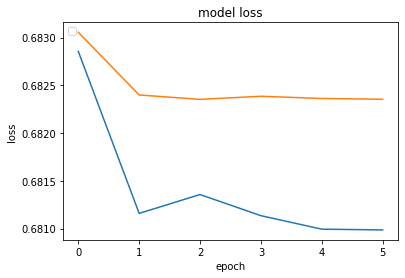
>>>>>>> 5391f1bf360935b799c0ae9d36f654afa5001782
    


## Text Classification with Bi-Directional LSTM


```python
from keras.layers import TimeDistributed
from keras.layers import Bidirectional

model = Sequential()
embed_layer = Embedding(
    vocab_size,
    100,
    weights = [embed_matrix],
    input_length = maxlen,
    trainable = False
)
model.add(embed_layer)
model.add(
    Bidirectional(
        LSTM(
            100,
            return_sequences = True,
            dropout = 0.50
        ),
        merge_mode = 'concat'
    )
)
model.add(
    TimeDistributed(
        Dense(
            100,
            activation = 'sigmoid'
        )
    )
)
model.add(Flatten())
```


```python
model.add(
    Dense(
        100,
        activation = 'sigmoid'
    )
)
model.add(
    Dense(
        3,
        activation = 'softmax'
    )
)
model.compile(
    optimizer = 'adam',
    loss = 'binary_crossentropy',
    metrics = ['acc']
)
```


```python
model.summary()
```

<<<<<<< HEAD
    Model: "sequential_9"
    _________________________________________________________________
    Layer (type)                 Output Shape              Param #   
    =================================================================
    embedding_9 (Embedding)      (None, 100, 100)          5796100   
    _________________________________________________________________
    bidirectional_4 (Bidirection (None, 100, 200)          160800    
    _________________________________________________________________
    time_distributed_4 (TimeDist (None, 100, 100)          20100     
    _________________________________________________________________
    flatten_5 (Flatten)          (None, 10000)             0         
    _________________________________________________________________
    dense_16 (Dense)             (None, 100)               1000100   
    _________________________________________________________________
    dense_17 (Dense)             (None, 3)                 303       
    =================================================================
    Total params: 6,977,403
    Trainable params: 1,181,303
    Non-trainable params: 5,796,100
=======
    Model: "sequential_3"
    _________________________________________________________________
    Layer (type)                 Output Shape              Param #   
    =================================================================
    embedding_3 (Embedding)      (None, 100, 100)          1307700   
    _________________________________________________________________
    bidirectional (Bidirectional (None, 100, 200)          160800    
    _________________________________________________________________
    time_distributed (TimeDistri (None, 100, 100)          20100     
    _________________________________________________________________
    flatten_1 (Flatten)          (None, 10000)             0         
    _________________________________________________________________
    dense_4 (Dense)              (None, 100)               1000100   
    _________________________________________________________________
    dense_5 (Dense)              (None, 3)                 303       
    =================================================================
    Total params: 2,489,003
    Trainable params: 1,181,303
    Non-trainable params: 1,307,700
>>>>>>> 5391f1bf360935b799c0ae9d36f654afa5001782
    _________________________________________________________________


```python
<<<<<<< HEAD
hist = [[]] * 3

for i in range(3):
    hist[i] = model.fit(
        X_train[i], y_train[i],
        batch_size = 128,
        epochs = 6,
        verbose = 1,
        validation_split = 0.2
    )
```

    Epoch 1/6


    ------------------------------------------------------------------------

    ValueError                             Traceback (most recent call last)

    <ipython-input-104-465d943cbfba> in <module>
          7         epochs = 6,
          8         verbose = 1,
    ----> 9         validation_split = 0.2
         10     )


    ~/.local/lib/python3.6/site-packages/tensorflow/python/keras/engine/training.py in _method_wrapper(self, *args, **kwargs)
        106   def _method_wrapper(self, *args, **kwargs):
        107     if not self._in_multi_worker_mode():  # pylint: disable=protected-access
    --> 108       return method(self, *args, **kwargs)
        109 
        110     # Running inside `run_distribute_coordinator` already.


    ~/.local/lib/python3.6/site-packages/tensorflow/python/keras/engine/training.py in fit(self, x, y, batch_size, epochs, verbose, callbacks, validation_split, validation_data, shuffle, class_weight, sample_weight, initial_epoch, steps_per_epoch, validation_steps, validation_batch_size, validation_freq, max_queue_size, workers, use_multiprocessing)
       1096                 batch_size=batch_size):
       1097               callbacks.on_train_batch_begin(step)
    -> 1098               tmp_logs = train_function(iterator)
       1099               if data_handler.should_sync:
       1100                 context.async_wait()


    ~/.local/lib/python3.6/site-packages/tensorflow/python/eager/def_function.py in __call__(self, *args, **kwds)
        778       else:
        779         compiler = "nonXla"
    --> 780         result = self._call(*args, **kwds)
        781 
        782       new_tracing_count = self._get_tracing_count()


    ~/.local/lib/python3.6/site-packages/tensorflow/python/eager/def_function.py in _call(self, *args, **kwds)
        821       # This is the first call of __call__, so we have to initialize.
        822       initializers = []
    --> 823       self._initialize(args, kwds, add_initializers_to=initializers)
        824     finally:
        825       # At this point we know that the initialization is complete (or less


    ~/.local/lib/python3.6/site-packages/tensorflow/python/eager/def_function.py in _initialize(self, args, kwds, add_initializers_to)
        695     self._concrete_stateful_fn = (
        696         self._stateful_fn._get_concrete_function_internal_garbage_collected(  # pylint: disable=protected-access
    --> 697             *args, **kwds))
        698 
        699     def invalid_creator_scope(*unused_args, **unused_kwds):


    ~/.local/lib/python3.6/site-packages/tensorflow/python/eager/function.py in _get_concrete_function_internal_garbage_collected(self, *args, **kwargs)
       2853       args, kwargs = None, None
       2854     with self._lock:
    -> 2855       graph_function, _, _ = self._maybe_define_function(args, kwargs)
       2856     return graph_function
       2857 


    ~/.local/lib/python3.6/site-packages/tensorflow/python/eager/function.py in _maybe_define_function(self, args, kwargs)
       3211 
       3212       self._function_cache.missed.add(call_context_key)
    -> 3213       graph_function = self._create_graph_function(args, kwargs)
       3214       self._function_cache.primary[cache_key] = graph_function
       3215       return graph_function, args, kwargs


    ~/.local/lib/python3.6/site-packages/tensorflow/python/eager/function.py in _create_graph_function(self, args, kwargs, override_flat_arg_shapes)
       3073             arg_names=arg_names,
       3074             override_flat_arg_shapes=override_flat_arg_shapes,
    -> 3075             capture_by_value=self._capture_by_value),
       3076         self._function_attributes,
       3077         function_spec=self.function_spec,


    ~/.local/lib/python3.6/site-packages/tensorflow/python/framework/func_graph.py in func_graph_from_py_func(name, python_func, args, kwargs, signature, func_graph, autograph, autograph_options, add_control_dependencies, arg_names, op_return_value, collections, capture_by_value, override_flat_arg_shapes)
        984         _, original_func = tf_decorator.unwrap(python_func)
        985 
    --> 986       func_outputs = python_func(*func_args, **func_kwargs)
        987 
        988       # invariant: `func_outputs` contains only Tensors, CompositeTensors,


    ~/.local/lib/python3.6/site-packages/tensorflow/python/eager/def_function.py in wrapped_fn(*args, **kwds)
        598         # __wrapped__ allows AutoGraph to swap in a converted function. We give
        599         # the function a weak reference to itself to avoid a reference cycle.
    --> 600         return weak_wrapped_fn().__wrapped__(*args, **kwds)
        601     weak_wrapped_fn = weakref.ref(wrapped_fn)
        602 


    ~/.local/lib/python3.6/site-packages/tensorflow/python/framework/func_graph.py in wrapper(*args, **kwargs)
        971           except Exception as e:  # pylint:disable=broad-except
        972             if hasattr(e, "ag_error_metadata"):
    --> 973               raise e.ag_error_metadata.to_exception(e)
        974             else:
        975               raise


    ValueError: in user code:
    
        /home/shiningflash/.local/lib/python3.6/site-packages/tensorflow/python/keras/engine/training.py:806 train_function  *
            return step_function(self, iterator)
        /home/shiningflash/.local/lib/python3.6/site-packages/tensorflow/python/keras/engine/training.py:796 step_function  **
            outputs = model.distribute_strategy.run(run_step, args=(data,))
        /home/shiningflash/.local/lib/python3.6/site-packages/tensorflow/python/distribute/distribute_lib.py:1211 run
            return self._extended.call_for_each_replica(fn, args=args, kwargs=kwargs)
        /home/shiningflash/.local/lib/python3.6/site-packages/tensorflow/python/distribute/distribute_lib.py:2585 call_for_each_replica
            return self._call_for_each_replica(fn, args, kwargs)
        /home/shiningflash/.local/lib/python3.6/site-packages/tensorflow/python/distribute/distribute_lib.py:2945 _call_for_each_replica
            return fn(*args, **kwargs)
        /home/shiningflash/.local/lib/python3.6/site-packages/tensorflow/python/keras/engine/training.py:789 run_step  **
            outputs = model.train_step(data)
        /home/shiningflash/.local/lib/python3.6/site-packages/tensorflow/python/keras/engine/training.py:749 train_step
            y, y_pred, sample_weight, regularization_losses=self.losses)
        /home/shiningflash/.local/lib/python3.6/site-packages/tensorflow/python/keras/engine/compile_utils.py:204 __call__
            loss_value = loss_obj(y_t, y_p, sample_weight=sw)
        /home/shiningflash/.local/lib/python3.6/site-packages/tensorflow/python/keras/losses.py:149 __call__
            losses = ag_call(y_true, y_pred)
        /home/shiningflash/.local/lib/python3.6/site-packages/tensorflow/python/keras/losses.py:253 call  **
            return ag_fn(y_true, y_pred, **self._fn_kwargs)
        /home/shiningflash/.local/lib/python3.6/site-packages/tensorflow/python/util/dispatch.py:201 wrapper
            return target(*args, **kwargs)
        /home/shiningflash/.local/lib/python3.6/site-packages/tensorflow/python/keras/losses.py:1605 binary_crossentropy
            K.binary_crossentropy(y_true, y_pred, from_logits=from_logits), axis=-1)
        /home/shiningflash/.local/lib/python3.6/site-packages/tensorflow/python/util/dispatch.py:201 wrapper
            return target(*args, **kwargs)
        /home/shiningflash/.local/lib/python3.6/site-packages/tensorflow/python/keras/backend.py:4823 binary_crossentropy
            return nn.sigmoid_cross_entropy_with_logits(labels=target, logits=output)
        /home/shiningflash/.local/lib/python3.6/site-packages/tensorflow/python/util/dispatch.py:201 wrapper
            return target(*args, **kwargs)
        /home/shiningflash/.local/lib/python3.6/site-packages/tensorflow/python/ops/nn_impl.py:174 sigmoid_cross_entropy_with_logits
            (logits.get_shape(), labels.get_shape()))
    
        ValueError: logits and labels must have the same shape ((None, 3) vs (None, 1))


```python
loss = [[]] * 3
acc = [[]] * 3

for i in range(3):
    loss[i], acc[i] = model.evaluate(
        X_train[i], y_train[i],
        verbose = 1
    )

for i in range(3):
    print('\ndataset {}: loss - {}, acc - {}'.format(i+1, loss[i], acc[i]))
```

    235/235 [==============================] - 10s 42ms/step - loss: 0.7519 - acc: 0.4927
    235/235 [==============================] - 10s 41ms/step - loss: 0.6983 - acc: 0.5775
    235/235 [==============================] - 9s 40ms/step - loss: 0.7691 - acc: 0.4649
    
    dataset 1: loss - 0.7518537640571594, acc - 0.49266666173934937
    
    dataset 2: loss - 0.6983428597450256, acc - 0.5774666666984558
    
    dataset 3: loss - 0.7691359519958496, acc - 0.4649333357810974


```python
loss = [[]] * 3
acc = [[]] * 3

for i in range(3):
    loss[i], acc[i] = model.evaluate(
        X_test[i], y_test[i],
        verbose = 1
    )
    
for i in range(3):
    print('\ndataset {}: loss - {}, acc - {}'.format(i+1, loss[i], acc[i]))
```

    79/79 [==============================] - 3s 40ms/step - loss: 0.7604 - acc: 0.4968
    79/79 [==============================] - 3s 40ms/step - loss: 0.6880 - acc: 0.5920
    79/79 [==============================] - 3s 38ms/step - loss: 0.7592 - acc: 0.4752
    
    dataset 1: loss - 0.760356068611145, acc - 0.4968000054359436
    
    dataset 2: loss - 0.6879917979240417, acc - 0.5920000076293945
    
    dataset 3: loss - 0.7592472434043884, acc - 0.47519999742507935


```python
for i in range(3):
    plt.figure(figsize=(12, 8))
    plt.subplot(3, 3, i+1)
    plt.title('model accuracy')
    plt.xlabel('epoch')
    plt.ylabel('accuracy')
    plt.legend(['train', 'test'], loc = 'upper left')
    plt.plot(hist[i].history['acc'])
    plt.plot(hist[i].history['val_acc'])
    plt.tight_layout(pad=1.0)

plt.show()
```


    
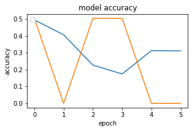
    


    

    


    
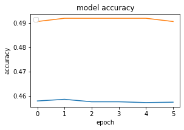
    


```python
for i in range(3):
    plt.figure(figsize=(12, 8))
    plt.subplot(3, 3, i+1)
    plt.title('model loss')
    plt.xlabel('epoch')
    plt.ylabel('loss')
    plt.legend(['train', 'test'], loc = 'upper right')
    plt.plot(hist[i].history['loss'])
    plt.plot(hist[i].history['val_loss'])
    plt.tight_layout(pad=1.0)

plt.show()
```


    
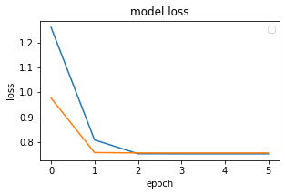
    


    
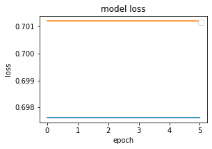
    


    
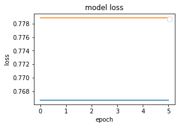
    


## Text Classification with GRU


```python
from keras.layers.recurrent import GRU
```


```python
model = Sequential()
embed_layer = Embedding(
    vocab_size, 100,
    weights = [embed_matrix],
    input_length = maxlen,
    trainable = False
)
model.add(embed_layer)
model.add(
    GRU(256)
)
```


```python
model.add(
    Dense(
        1,
        activation = 'sigmoid'
    )
)
model.compile(
    optimizer = 'adam',
    loss = 'binary_crossentropy',
    metrics = ['acc']
)
```


```python
model.summary()
```

    Model: "sequential_4"
    _________________________________________________________________
    Layer (type)                 Output Shape              Param #   
    =================================================================
    embedding_4 (Embedding)      (None, 100, 100)          5796100   
    _________________________________________________________________
    gru (GRU)                    (None, 1024)              3459072   
    _________________________________________________________________
    dense_6 (Dense)              (None, 1)                 1025      
    =================================================================
    Total params: 9,256,197
    Trainable params: 3,460,097
    Non-trainable params: 5,796,100
    _________________________________________________________________


```python
hist = [[]] * 3

for i in range(3):
    hist[i] = model.fit(
        X_train[i], y_train[i],
        batch_size = 128,
        epochs = 6,
        verbose = 1,
        validation_split = 0.2
    )
```

    Epoch 1/6
    47/47 [==============================] - 20s 422ms/step - loss: 0.6553 - acc: 0.6068 - val_loss: 0.6120 - val_acc: 0.6713
    Epoch 2/6
    47/47 [==============================] - 21s 444ms/step - loss: 0.5447 - acc: 0.7278 - val_loss: 0.4431 - val_acc: 0.8027
    Epoch 3/6
    47/47 [==============================] - 21s 443ms/step - loss: 0.4692 - acc: 0.7792 - val_loss: 0.4714 - val_acc: 0.7813
    Epoch 4/6
    47/47 [==============================] - 21s 442ms/step - loss: 0.4357 - acc: 0.8017 - val_loss: 0.3979 - val_acc: 0.8267
    Epoch 5/6
    47/47 [==============================] - 21s 448ms/step - loss: 0.3932 - acc: 0.8242 - val_loss: 0.3944 - val_acc: 0.8307
    Epoch 6/6
    47/47 [==============================] - 21s 454ms/step - loss: 0.3715 - acc: 0.8335 - val_loss: 0.4261 - val_acc: 0.7947
    Epoch 1/6
    47/47 [==============================] - 20s 436ms/step - loss: 0.6812 - acc: 0.5742 - val_loss: 0.6824 - val_acc: 0.5733
    Epoch 2/6
    47/47 [==============================] - 19s 413ms/step - loss: 0.6814 - acc: 0.5785 - val_loss: 0.6831 - val_acc: 0.5733
    Epoch 3/6
    47/47 [==============================] - 22s 459ms/step - loss: 0.6809 - acc: 0.5785 - val_loss: 0.6825 - val_acc: 0.5733
    Epoch 4/6
    47/47 [==============================] - 23s 491ms/step - loss: 0.6812 - acc: 0.5785 - val_loss: 0.6831 - val_acc: 0.5733
    Epoch 5/6
    47/47 [==============================] - 21s 449ms/step - loss: 0.6812 - acc: 0.5785 - val_loss: 0.6827 - val_acc: 0.5733
    Epoch 6/6
    47/47 [==============================] - 20s 427ms/step - loss: 0.6807 - acc: 0.5785 - val_loss: 0.6825 - val_acc: 0.5733
    Epoch 1/6
    47/47 [==============================] - 21s 452ms/step - loss: 0.5697 - acc: 0.6580 - val_loss: 0.5795 - val_acc: 0.6713
    Epoch 2/6
    47/47 [==============================] - 21s 455ms/step - loss: 0.5129 - acc: 0.7242 - val_loss: 0.5427 - val_acc: 0.7153
    Epoch 3/6
    47/47 [==============================] - 22s 461ms/step - loss: 0.4868 - acc: 0.7427 - val_loss: 0.5253 - val_acc: 0.7173
    Epoch 4/6
    47/47 [==============================] - 22s 462ms/step - loss: 0.4540 - acc: 0.7717 - val_loss: 0.5325 - val_acc: 0.7293
    Epoch 5/6
    47/47 [==============================] - 21s 444ms/step - loss: 0.4371 - acc: 0.7893 - val_loss: 0.5477 - val_acc: 0.7280
    Epoch 6/6
    47/47 [==============================] - 19s 405ms/step - loss: 0.4171 - acc: 0.7963 - val_loss: 0.5262 - val_acc: 0.7487


```python
loss = [[]] * 3
acc = [[]] * 3

for i in range(3):
    loss[i], acc[i] = model.evaluate(
        X_train[i], y_train[i],
        verbose = 1
    )

for i in range(3):
    print('\ndataset {}: loss - {}, acc - {}'.format(i+1, loss[i], acc[i]))
```

    235/235 [==============================] - 16s 69ms/step - loss: 0.3286 - acc: 0.8660
    235/235 [==============================] - 17s 71ms/step - loss: 0.6117 - acc: 0.6855
    235/235 [==============================] - 18s 78ms/step - loss: 0.3990 - acc: 0.8172
    
    dataset 1: loss - 0.3286373019218445, acc - 0.8659999966621399
    
    dataset 2: loss - 0.611741840839386, acc - 0.6854666471481323
    
    dataset 3: loss - 0.39899224042892456, acc - 0.8172000050544739
=======
hist = model.fit(
    X_train,
    y_train,
    batch_size = 128,
    epochs = 6,
    verbose = 1,
    validation_split = 0.2
)
```

    Epoch 1/10
    47/47 [==============================] - 11s 240ms/step - loss: 1.1251 - acc: 0.1488 - val_loss: 0.8458 - val_acc: 0.0000e+00
    Epoch 2/10
    47/47 [==============================] - 11s 230ms/step - loss: 0.7255 - acc: 0.1803 - val_loss: 0.7023 - val_acc: 0.4267
    Epoch 3/10
    47/47 [==============================] - 12s 245ms/step - loss: 0.6977 - acc: 0.2368 - val_loss: 0.7012 - val_acc: 0.4267
    Epoch 4/10
    47/47 [==============================] - 16s 341ms/step - loss: 0.6976 - acc: 0.2080 - val_loss: 0.7012 - val_acc: 0.5733
    Epoch 5/10
    47/47 [==============================] - 16s 339ms/step - loss: 0.6976 - acc: 0.2812 - val_loss: 0.7012 - val_acc: 0.5733
    Epoch 6/10
    47/47 [==============================] - 11s 241ms/step - loss: 0.6976 - acc: 0.3358 - val_loss: 0.7012 - val_acc: 0.0000e+00
    Epoch 7/10
    47/47 [==============================] - 19s 401ms/step - loss: 0.6976 - acc: 0.2703 - val_loss: 0.7012 - val_acc: 0.0000e+00
    Epoch 8/10
    47/47 [==============================] - 19s 409ms/step - loss: 0.6976 - acc: 0.3672 - val_loss: 0.7012 - val_acc: 0.5733
    Epoch 9/10
    47/47 [==============================] - 17s 371ms/step - loss: 0.6976 - acc: 0.5785 - val_loss: 0.7012 - val_acc: 0.5733
    Epoch 10/10
    47/47 [==============================] - 15s 320ms/step - loss: 0.6976 - acc: 0.5785 - val_loss: 0.7012 - val_acc: 0.5733


```python
loss, acc = model.evaluate(
    X_train,
    y_train,
    verbose = 1
)

loss, acc
```

    235/235 [==============================] - 9s 37ms/step - loss: 0.6983 - acc: 0.5775


    (0.6983428597450256, 0.5774666666984558)


```python
loss, acc = model.evaluate(
    X_test,
    y_test,
    verbose = 1
)

loss, acc
```

    79/79 [==============================] - 3s 36ms/step - loss: 0.6880 - acc: 0.5924


    (0.6879918575286865, 0.5924000144004822)

>>>>>>> 5391f1bf360935b799c0ae9d36f654afa5001782


```python
<<<<<<< HEAD
loss = [[]] * 3
acc = [[]] * 3

for i in range(3):
    loss[i], acc[i] = model.evaluate(
        X_test[i], y_test[i],
        verbose = 1
    )
    
for i in range(3):
    print('\ndataset {}: loss - {}, acc - {}'.format(i+1, loss[i], acc[i]))
```

    79/79 [==============================] - 6s 76ms/step - loss: 0.4706 - acc: 0.8068
    79/79 [==============================] - 6s 73ms/step - loss: 0.6372 - acc: 0.6644
    79/79 [==============================] - 6s 73ms/step - loss: 0.5320 - acc: 0.7408
    
    dataset 1: loss - 0.47061043977737427, acc - 0.8068000078201294
    
    dataset 2: loss - 0.6372184753417969, acc - 0.6643999814987183
    
    dataset 3: loss - 0.5320340394973755, acc - 0.7408000230789185


```python
for i in range(3):
    plt.figure(figsize=(12, 8))
    plt.subplot(3, 3, i+1)
    plt.title('model accuracy')
    plt.xlabel('epoch')
    plt.ylabel('accuracy')
    plt.legend(['train', 'test'], loc = 'upper left')
    plt.plot(hist[i].history['acc'])
    plt.plot(hist[i].history['val_acc'])
    plt.tight_layout(pad=1.0)
=======
plt.title('model accuracy')
plt.xlabel('epoch')
plt.ylabel('accuracy')
plt.legend(['train', 'test'])

plt.plot(hist.history['acc'])
plt.plot(hist.history['val_acc'])
>>>>>>> 5391f1bf360935b799c0ae9d36f654afa5001782

plt.show()
```


    
<<<<<<< HEAD
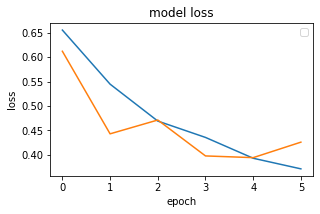
    


    
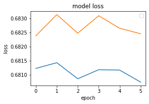
    


    
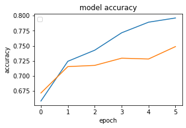
=======
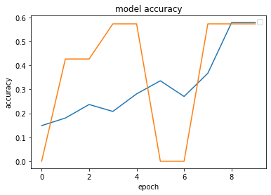
>>>>>>> 5391f1bf360935b799c0ae9d36f654afa5001782
    


```python
<<<<<<< HEAD
for i in range(3):
    plt.figure(figsize=(12, 8))
    plt.subplot(3, 3, i+1)
    plt.title('model loss')
    plt.xlabel('epoch')
    plt.ylabel('loss')
    plt.legend(['train', 'test'], loc = 'upper right')
    plt.plot(hist[i].history['loss'])
    plt.plot(hist[i].history['val_loss'])
    plt.tight_layout(pad=1.0)
=======
plt.title('model loss')
plt.xlabel('epoch')
plt.ylabel('loss')
plt.legend(['train', 'test'], loc = 'upper left')

plt.plot(hist.history['loss'])
plt.plot(hist.history['val_loss'])
>>>>>>> 5391f1bf360935b799c0ae9d36f654afa5001782

plt.show()
```


    
<<<<<<< HEAD

    


    

    


    

=======

>>>>>>> 5391f1bf360935b799c0ae9d36f654afa5001782
    


```python
model.save('model.m5')
```

    WARNING:tensorflow:From /home/shiningflash/.local/lib/python3.6/site-packages/tensorflow/python/training/tracking/tracking.py:111: Model.state_updates (from tensorflow.python.keras.engine.training) is deprecated and will be removed in a future version.
    Instructions for updating:
    This property should not be used in TensorFlow 2.0, as updates are applied automatically.
    WARNING:tensorflow:From /home/shiningflash/.local/lib/python3.6/site-packages/tensorflow/python/training/tracking/tracking.py:111: Layer.updates (from tensorflow.python.keras.engine.base_layer) is deprecated and will be removed in a future version.
    Instructions for updating:
    This property should not be used in TensorFlow 2.0, as updates are applied automatically.
    INFO:tensorflow:Assets written to: model.m5/assets

