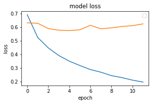
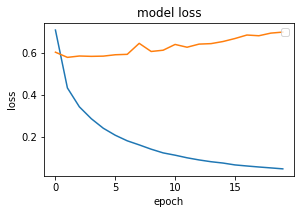

# Sentiment Analysis using Deep Learning in Keras

### Importing Required Libraries


```python
import re
import pandas as pd
import numpy as np
import seaborn as sns
from sklearn.model_selection import train_test_split
from keras.preprocessing.text import Tokenizer
from numpy import array, asarray, zeros
from keras.models import Sequential
from keras.preprocessing.sequence import pad_sequences
from keras.layers import Flatten, GlobalMaxPooling1D
from keras.layers.core import Activation, Dropout, Dense
from keras.layers.embeddings import Embedding
import matplotlib.pyplot as plt
from keras.layers import Conv1D
from keras.layers import LSTM
```

### Importing Dataset

Dataset 1 link: https://www.kaggle.com/lakshmi25npathi/imdb-dataset-of-50k-movie-reviews

Dataset 2 link: https://github.com/vineetdhanawat/twitter-sentiment-analysis/blob/master/datasets/Sentiment%20Analysis%20Dataset%20100000.csv


```python
df = []
df.append(pd.read_csv('data/IMDB Dataset.csv', nrows = 10000))
df.append(pd.read_csv('data/Sentiment Analysis Dataset 100000.csv', encoding = 'latin-1', nrows = 10000))
df[1].drop(['ItemID'], axis = 'columns', inplace = True)
```


```python
df[0].head(5)
```


<div>
<style scoped>
    .dataframe tbody tr th:only-of-type {
        vertical-align: middle;
    }

    .dataframe tbody tr th {
        vertical-align: top;
    }

    .dataframe thead th {
        text-align: right;
    }
</style>
<table border="1" class="dataframe">
  <thead>
    <tr style="text-align: right;">
      <th></th>
      <th>text</th>
      <th>sentiment</th>
    </tr>
  </thead>
  <tbody>
    <tr>
      <th>0</th>
      <td>One of the other reviewers has mentioned that ...</td>
      <td>positive</td>
    </tr>
    <tr>
      <th>1</th>
      <td>A wonderful little production. &lt;br /&gt;&lt;br /&gt;The...</td>
      <td>positive</td>
    </tr>
    <tr>
      <th>2</th>
      <td>I thought this was a wonderful way to spend ti...</td>
      <td>positive</td>
    </tr>
    <tr>
      <th>3</th>
      <td>Basically there's a family where a little boy ...</td>
      <td>negative</td>
    </tr>
    <tr>
      <th>4</th>
      <td>Petter Mattei's "Love in the Time of Money" is...</td>
      <td>positive</td>
    </tr>
  </tbody>
</table>
</div>


```python
df[1].head(5)
```


<div>
<style scoped>
    .dataframe tbody tr th:only-of-type {
        vertical-align: middle;
    }

    .dataframe tbody tr th {
        vertical-align: top;
    }

    .dataframe thead th {
        text-align: right;
    }
</style>
<table border="1" class="dataframe">
  <thead>
    <tr style="text-align: right;">
      <th></th>
      <th>sentiment</th>
      <th>text</th>
    </tr>
  </thead>
  <tbody>
    <tr>
      <th>0</th>
      <td>0</td>
      <td>is so sad for my APL frie...</td>
    </tr>
    <tr>
      <th>1</th>
      <td>0</td>
      <td>I missed the New Moon trail...</td>
    </tr>
    <tr>
      <th>2</th>
      <td>1</td>
      <td>omg its already 7:30 :O</td>
    </tr>
    <tr>
      <th>3</th>
      <td>0</td>
      <td>.. Omgaga. Im sooo  im gunna CRy. I'...</td>
    </tr>
    <tr>
      <th>4</th>
      <td>0</td>
      <td>i think mi bf is cheating on me!!!   ...</td>
    </tr>
  </tbody>
</table>
</div>


```python
df[0]['text'][0]
```


    "One of the other reviewers has mentioned that after watching just 1 Oz episode you'll be hooked. They are right, as this is exactly what happened with me.<br /><br />The first thing that struck me about Oz was its brutality and unflinching scenes of violence, which set in right from the word GO. Trust me, this is not a show for the faint hearted or timid. This show pulls no punches with regards to drugs, sex or violence. Its is hardcore, in the classic use of the word.<br /><br />It is called OZ as that is the nickname given to the Oswald Maximum Security State Penitentary. It focuses mainly on Emerald City, an experimental section of the prison where all the cells have glass fronts and face inwards, so privacy is not high on the agenda. Em City is home to many..Aryans, Muslims, gangstas, Latinos, Christians, Italians, Irish and more....so scuffles, death stares, dodgy dealings and shady agreements are never far away.<br /><br />I would say the main appeal of the show is due to the fact that it goes where other shows wouldn't dare. Forget pretty pictures painted for mainstream audiences, forget charm, forget romance...OZ doesn't mess around. The first episode I ever saw struck me as so nasty it was surreal, I couldn't say I was ready for it, but as I watched more, I developed a taste for Oz, and got accustomed to the high levels of graphic violence. Not just violence, but injustice (crooked guards who'll be sold out for a nickel, inmates who'll kill on order and get away with it, well mannered, middle class inmates being turned into prison bitches due to their lack of street skills or prison experience) Watching Oz, you may become comfortable with what is uncomfortable viewing....thats if you can get in touch with your darker side."


```python
df[1]['text'][0]
```


    '                     is so sad for my APL friend.............'


```python
for i in df:
    print(i.isnull().values.any())
```

    False
    False


```python
sns.countplot(x = 'sentiment', data = df[0])
```


    <AxesSubplot:xlabel='sentiment', ylabel='count'>


    

    


```python
sns.countplot(x = 'sentiment', data = df[1])
```


    <AxesSubplot:xlabel='sentiment', ylabel='count'>


    

    


## Data Processing

#### Dataset 1 Cleaning


```python
TAG_RE = re.compile(r'<[^>]+>')

def remove_html_tags(sen):
    return TAG_RE.sub('', sen)
```


```python
def data_processing_1(sen):
    sen = remove_html_tags(sen) # remove html tag
    sen = sen.replace('n\'t', ' not') # convert n't to not
    sen = re.sub(r"\s+[a-zA-Z]\s+", ' ', sen) # remove single letter
    sen = re.sub(r'\s+', ' ', sen) # remove multiple spaces
    sen = re.sub(r'[.]+', '.', sen) # remove multiple dots
    sen = sen.replace('\\\'', ' ') # remove \
    return sen
```


```python
X = [["0"]*10000]*3
```


```python
sentences = list(df[0]['text'])
i = 0

for sen in sentences:
    X[0][i] = data_processing_1(sen)
    i = i + 1

X[0] = np.array(list(X[0]))
```


```python
for i in range(0, 3):
    print(X[0][i], end = '\n\n')
```

    One of the other reviewers has mentioned that after watching just 1 Oz episode you'll be hooked. They are right, as this is exactly what happened with me.The first thing that struck me about Oz was its brutality and unflinching scenes of violence, which set in right from the word GO. Trust me, this is not show for the faint hearted or timid. This show pulls no punches with regards to drugs, sex or violence. Its is hardcore, in the classic use of the word.It is called OZ as that is the nickname given to the Oswald Maximum Security State Penitentary. It focuses mainly on Emerald City, an experimental section of the prison where all the cells have glass fronts and face inwards, so privacy is not high on the agenda. Em City is home to many.Aryans, Muslims, gangstas, Latinos, Christians, Italians, Irish and more.so scuffles, death stares, dodgy dealings and shady agreements are never far away.I would say the main appeal of the show is due to the fact that it goes where other shows would not dare. Forget pretty pictures painted for mainstream audiences, forget charm, forget romance.OZ does not mess around. The first episode ever saw struck me as so nasty it was surreal, could not say was ready for it, but as watched more, developed taste for Oz, and got accustomed to the high levels of graphic violence. Not just violence, but injustice (crooked guards who'll be sold out for nickel, inmates who'll kill on order and get away with it, well mannered, middle class inmates being turned into prison bitches due to their lack of street skills or prison experience) Watching Oz, you may become comfortable with what is uncomfortable viewing.thats if you can get in touch with your darker side.
    
    A wonderful little production. The filming technique is very unassuming- very old-time-BBC fashion and gives comforting, and sometimes discomforting, sense of realism to the entire piece. The actors are extremely well chosen- Michael Sheen not only "has got all the polari" but he has all the voices down pat too! You can truly see the seamless editing guided by the references to Williams' diary entries, not only is it well worth the watching but it is terrificly written and performed piece. masterful production about one of the great master's of comedy and his life. The realism really comes home with the little things: the fantasy of the guard which, rather than use the traditional 'dream' techniques remains solid then disappears. It plays on our knowledge and our senses, particularly with the scenes concerning Orton and Halliwell and the sets (particularly of their flat with Halliwell's murals decorating every surface) are terribly well done.
    
    I thought this was wonderful way to spend time on too hot summer weekend, sitting in the air conditioned theater and watching light-hearted comedy. The plot is simplistic, but the dialogue is witty and the characters are likable (even the well bread suspected serial killer). While some may be disappointed when they realize this is not Match Point 2: Risk Addiction, thought it was proof that Woody Allen is still fully in control of the style many of us have grown to love.This was the most I'd laughed at one of Woody's comedies in years (dare say decade?). While I've never been impressed with Scarlet Johanson, in this she managed to tone down her "sexy" image and jumped right into average, but spirited young woman.This may not be the crown jewel of his career, but it was wittier than "Devil Wears Prada" and more interesting than "Superman" great comedy to go see with friends.
    


```python
y = [[0]*10000]*3
y[0] = df[0]['sentiment']
y[0] = np.array(list(map(lambda x: 1 if x == "positive" else 0, y[0])))
```


```python
for i in range(0, 5):
    print(y[0][i], end = ', ')
```

    1, 1, 1, 0, 1, 


```python
print(np.shape(X[0]))
print(np.shape(y[0]))
```

    (10000,)
    (10000,)


#### Dataset 2 Cleaning


```python
def data_processing_2(sen):
    sen = sen.replace('&quot;3', '')
    sen = sen.replace('&quot;', '')
    sen = sen.replace('&lt;3', '')
    sen = sen.replace('&lt;', '')
    sen = sen.replace('&gt;', '')
    sen = re.sub('http[s]?://\S+', '', sen)
    sen = re.sub('[a-zA-Z0-9]*@[a-zA-Z0-9]*', '', sen)
    sen = sen.replace('an\'t', 'an not')
    sen = sen.replace('n\'t', ' not')
    sen = re.sub(r"\s+[A-Z]\s+", ' ', sen)
    sen = re.sub(r'[.]+', '.', sen)
    sen = re.sub(r'\s+', ' ', sen)
    sen = re.sub(r'[-]+', ' ', sen)
    return sen
```


```python
sentences = list(df[1]['text'])
i = 0

for sen in sentences:
    X[1][i] = data_processing_2(sen)
    i = i + 1
    
X[1] = np.array(list(X[1]))
```


```python
y[1] = np.array(list(df[1]['sentiment']))
```


```python
for i in range(0, 10):
    print(y[1][i], end = ',')
```

    0,0,1,0,0,0,1,0,1,1,


```python
print(np.shape(X[1]))
print(np.shape(y[1]))
```

    (10000,)
    (10000,)


#### Combine Dataset


```python
for i in range(0, 5000):
    X[2][i] = X[0][i]
    y[2][i] = y[0][i]
for i in range(5000, 10000):
    X[2][i] = X[1][i]
    y[2][i] = y[1][i]
    
X[2] = np.array(X[2])
y[2] = np.array(y[2])
```


```python
print(np.shape(X[2]))
print(np.shape(y[2]))
```

    (10000,)
    (10000,)


```python
for sen in range(0, 3):
    print(y[2][sen], X[2][sen], end = '\n\n')
for sen in range(5000, 5003):
    print(y[2][sen], X[2][sen], end = '\n\n')
```

    1 One of the other reviewers has mentioned that after watching just 1 Oz episode you'll be hooked. They are right, as this is exactly what happened with me.The first thing that struck me about Oz was its brutality and unflinching scenes of violence, which set in right from the word GO. Trust me, this is not show for the faint hearted or timid. This show pulls no punches with regards to drugs, sex or violence. Its is hardcore, in the classic use of the word.It is called OZ as that is the nickname given to the Oswald Maximum Security State Penitentary. It focuses mainly on Emerald City, an experimental section of the prison where all the cells have glass fronts and face inwards, so privacy is not high on the agenda. Em City is home to many.Aryans, Muslims, gangstas, Latinos, Christians, Italians, Irish and more.so scuffles, death stares, dodgy dealings and shady agreements are never far away.I would say the main appeal of the show is due to the fact that it goes where other shows would not dare. Forget pretty pictures painted for mainstream audiences, forget charm, forget romance.OZ does not mess around. The first episode ever saw struck me as so nasty it was surreal, could not say was ready for it, but as watched more, developed taste for Oz, and got accustomed to the high levels of graphic violence. Not just violence, but injustice (crooked guards who'll be sold out for nickel, inmates who'll kill on order and get away with it, well mannered, middle class inmates being turned into prison bitches due to their lack of street skills or prison experience) Watching Oz, you may become comfortable with what is uncomfortable viewing.thats if you can get in touch with your darker side.
    
    1 A wonderful little production. The filming technique is very unassuming- very old-time-BBC fashion and gives comforting, and sometimes discomforting, sense of realism to the entire piece. The actors are extremely well chosen- Michael Sheen not only "has got all the polari" but he has all the voices down pat too! You can truly see the seamless editing guided by the references to Williams' diary entries, not only is it well worth the watching but it is terrificly written and performed piece. masterful production about one of the great master's of comedy and his life. The realism really comes home with the little things: the fantasy of the guard which, rather than use the traditional 'dream' techniques remains solid then disappears. It plays on our knowledge and our senses, particularly with the scenes concerning Orton and Halliwell and the sets (particularly of their flat with Halliwell's murals decorating every surface) are terribly well done.
    
    1 I thought this was wonderful way to spend time on too hot summer weekend, sitting in the air conditioned theater and watching light-hearted comedy. The plot is simplistic, but the dialogue is witty and the characters are likable (even the well bread suspected serial killer). While some may be disappointed when they realize this is not Match Point 2: Risk Addiction, thought it was proof that Woody Allen is still fully in control of the style many of us have grown to love.This was the most I'd laughed at one of Woody's comedies in years (dare say decade?). While I've never been impressed with Scarlet Johanson, in this she managed to tone down her "sexy" image and jumped right into average, but spirited young woman.This may not be the crown jewel of his career, but it was wittier than "Devil Wears Prada" and more interesting than "Superman" great comedy to go see with friends.
    
    1  very very very happy and slightly skinny xx
    
    0  waaaaahhh. ohyeah i had something to do eeee. haha
    
    1  Wade.Grad.Hot.Bald. Your not gonna shave your head! Uh. Yeah.I hot.get babes Hahahaha man love Wade!
    


#### Dataset splitting to train and test


```python
X_train = [[]] * 3
X_test = [[]] * 3
y_train = [[]] * 3
y_test = [[]] * 3
```


```python
for i in range(0, 3):
    print('dataset ', i+1, ': ', np.shape(X[i]), ', ', np.shape(y[i]), end = '\n')
```

    dataset  1 :  (10000,) ,  (10000,)
    dataset  2 :  (10000,) ,  (10000,)
    dataset  3 :  (10000,) ,  (10000,)


```python
for i in range(0, 3):
    X_train[i], X_test[i], y_train[i], y_test[i] = train_test_split(
        X[i], y[i], test_size = 0.25,
        random_state = 42
    )
```


```python
for i in range(0, 10):
    print(i, ': ', y_test[1][i], ' --> ', X_train[1][i])
```

    0 :  0  -->  #f1 Rubens knows he has lost any chance of the world championship
    1 :  0  -->  #3turnoffwords   Isit in yet
    2 :  1  -->  #FollowFriday is a ferociously gifted writer whose books &amp; Tweets are magical must reads. Follow &amp; you'll LOVE her too
    3 :  0  -->  My heart sings when think of youuu haha that's all keep singing today. I'm craving cheeto puffs unhealthy!
    4 :  0  -->   guys are pricks. gonna have an early night and cry til i fall asleep. fuck you all.
    5 :  1  -->  #faviphoneapp Black Book. But since only have a Touch it's not as fun. But it's still a great junt organizer
    6 :  0  -->  #musicmonday Crossfire   On Fire
    7 :  1  -->  #3wordsaftersex 'I broke it?!?!' lol
    8 :  0  -->  ! .sooo, any hope for a match up with Liz Cheney and Mikas Daddy? thx!! Ratings Gold I'm sure!! 
    9 :  0  -->   u guys knw whyy


### Preparing Embedding Layer


```python
tokenizer = Tokenizer(num_words = 50000)

for i in range(3):
    tokenizer.fit_on_texts(X_train[i])
```


```python
for i in range(3):
    X_train[i] = tokenizer.texts_to_sequences(X_train[i])
```


```python
for i in range(3):
    X_test[i] = tokenizer.texts_to_sequences(X_test[i])
```


```python
maxlen = 100
vocab_size = len(tokenizer.word_index) + 1
print(vocab_size)
```

    57961


```python
for i in range(3):
    X_train[i] = pad_sequences(
        X_train[i],
        padding = 'post',
        maxlen = maxlen
    )
```


```python
for i in range(3):
    X_test[i] = pad_sequences(
        X_test[i],
        padding = 'post',
        maxlen = maxlen
    )
```

#### glove.6B.100d.txt Dataset for GloVe Embedding

dataset link: https://www.kaggle.com/danielwillgeorge/glove6b100dtxt


```python
embed_dictionary = dict()
glv_file = open('data/glove.6B.100d.txt', encoding='utf8')
```


```python
for line in glv_file:
    records = line.split()
    word = records[0]
    vector_dim = asarray(records[1:], dtype='float32')
    embed_dictionary[word] = vector_dim
glv_file.close()
```


```python
embed_matrix = zeros((vocab_size, 100))
```


```python
for word, index in tokenizer.word_index.items():
    embed_vector = embed_dictionary.get(word)
    if embed_vector is not None:
        embed_matrix[index] = embed_vector
```


```python
embed_matrix[1]
```


    array([-0.038194  , -0.24487001,  0.72812003, -0.39961001,  0.083172  ,
            0.043953  , -0.39140999,  0.3344    , -0.57545   ,  0.087459  ,
            0.28786999, -0.06731   ,  0.30906001, -0.26383999, -0.13231   ,
           -0.20757   ,  0.33395001, -0.33848   , -0.31742999, -0.48335999,
            0.1464    , -0.37303999,  0.34577   ,  0.052041  ,  0.44946   ,
           -0.46970999,  0.02628   , -0.54154998, -0.15518001, -0.14106999,
           -0.039722  ,  0.28277001,  0.14393   ,  0.23464   , -0.31020999,
            0.086173  ,  0.20397   ,  0.52623999,  0.17163999, -0.082378  ,
           -0.71787   , -0.41531   ,  0.20334999, -0.12763   ,  0.41367   ,
            0.55186999,  0.57907999, -0.33476999, -0.36559001, -0.54856998,
           -0.062892  ,  0.26583999,  0.30204999,  0.99774998, -0.80480999,
           -3.0243001 ,  0.01254   , -0.36941999,  2.21670008,  0.72201002,
           -0.24978   ,  0.92136002,  0.034514  ,  0.46744999,  1.10790002,
           -0.19358   , -0.074575  ,  0.23353   , -0.052062  , -0.22044   ,
            0.057162  , -0.15806   , -0.30798   , -0.41624999,  0.37972   ,
            0.15006   , -0.53211999, -0.20550001, -1.25259995,  0.071624  ,
            0.70564997,  0.49744001, -0.42063001,  0.26148   , -1.53799999,
           -0.30223   , -0.073438  , -0.28312001,  0.37103999, -0.25217   ,
            0.016215  , -0.017099  , -0.38984001,  0.87423998, -0.72569001,
           -0.51058   , -0.52028   , -0.1459    ,  0.82779998,  0.27061999])


## Text Classification with Simple Neural Network


```python
model = Sequential()
embed_layer = Embedding(
    vocab_size, 100,
    weights = [embed_matrix],
    input_length = maxlen,
    trainable = False
)
model.add(embed_layer)
model.add(Flatten())
```


```python
model.add(
    Dense(
        1,
        activation = 'sigmoid'
    )
)
```


```python
model.compile(
    optimizer = 'adam',
    loss = 'binary_crossentropy',
    metrics = ['acc']
)
```


```python
model.summary()
```

    Model: "sequential"
    _________________________________________________________________
    Layer (type)                 Output Shape              Param #   
    =================================================================
    embedding (Embedding)        (None, 100, 100)          5796100   
    _________________________________________________________________
    flatten (Flatten)            (None, 10000)             0         
    _________________________________________________________________
    dense (Dense)                (None, 1)                 10001     
    =================================================================
    Total params: 5,806,101
    Trainable params: 10,001
    Non-trainable params: 5,796,100
    _________________________________________________________________


```python
hist = [[]] * 3

for i in range(3):
    hist[i] = model.fit(
        X_train[i], y_train[i],
        batch_size = 128,
        epochs = 6,
        verbose = 1,
        validation_split = 0.2
    )
```

    Epoch 1/6
    47/47 [==============================] - 1s 11ms/step - loss: 0.6925 - acc: 0.5907 - val_loss: 0.6186 - val_acc: 0.6573
    Epoch 2/6
    47/47 [==============================] - 0s 6ms/step - loss: 0.5245 - acc: 0.7500 - val_loss: 0.6090 - val_acc: 0.6673
    Epoch 3/6
    47/47 [==============================] - 0s 6ms/step - loss: 0.4504 - acc: 0.8112 - val_loss: 0.5855 - val_acc: 0.6880
    Epoch 4/6
    47/47 [==============================] - 0s 6ms/step - loss: 0.3977 - acc: 0.8417 - val_loss: 0.5799 - val_acc: 0.6960
    Epoch 5/6
    47/47 [==============================] - 0s 7ms/step - loss: 0.3576 - acc: 0.8663 - val_loss: 0.5831 - val_acc: 0.6933
    Epoch 6/6
    47/47 [==============================] - 0s 7ms/step - loss: 0.3253 - acc: 0.8908 - val_loss: 0.5698 - val_acc: 0.6953
    Epoch 1/6
    47/47 [==============================] - 0s 10ms/step - loss: 0.6423 - acc: 0.6285 - val_loss: 0.6191 - val_acc: 0.6573
    Epoch 2/6
    47/47 [==============================] - 0s 6ms/step - loss: 0.5984 - acc: 0.6852 - val_loss: 0.6043 - val_acc: 0.6747
    Epoch 3/6
    47/47 [==============================] - 0s 6ms/step - loss: 0.5762 - acc: 0.7098 - val_loss: 0.5959 - val_acc: 0.6807
    Epoch 4/6
    47/47 [==============================] - 0s 4ms/step - loss: 0.5591 - acc: 0.7230 - val_loss: 0.5921 - val_acc: 0.6833
    Epoch 5/6
    47/47 [==============================] - 0s 4ms/step - loss: 0.5438 - acc: 0.7345 - val_loss: 0.5952 - val_acc: 0.6767
    Epoch 6/6
    47/47 [==============================] - 0s 3ms/step - loss: 0.5334 - acc: 0.7473 - val_loss: 0.5890 - val_acc: 0.6900
    Epoch 1/6
    47/47 [==============================] - 0s 6ms/step - loss: 0.4419 - acc: 0.8020 - val_loss: 0.6203 - val_acc: 0.6907
    Epoch 2/6
    47/47 [==============================] - 0s 3ms/step - loss: 0.4067 - acc: 0.8325 - val_loss: 0.6233 - val_acc: 0.6807
    Epoch 3/6
    47/47 [==============================] - 0s 3ms/step - loss: 0.3788 - acc: 0.8538 - val_loss: 0.6266 - val_acc: 0.6807
    Epoch 4/6
    47/47 [==============================] - 0s 3ms/step - loss: 0.3609 - acc: 0.8668 - val_loss: 0.6341 - val_acc: 0.6767
    Epoch 5/6
    47/47 [==============================] - 0s 4ms/step - loss: 0.3476 - acc: 0.8740 - val_loss: 0.6476 - val_acc: 0.6653
    Epoch 6/6
    47/47 [==============================] - 0s 3ms/step - loss: 0.3341 - acc: 0.8825 - val_loss: 0.6486 - val_acc: 0.6740


```python
loss = [[]] * 3
acc = [[]] * 3

for i in range(3):
    loss[i], acc[i] = model.evaluate(
        X_train[i], y_train[i],
        verbose = 1
    )

for i in range(3):
    print('\ndataset {}: loss - {}, acc - {}'.format(i+1, loss[i], acc[i]))
```

    235/235 [==============================] - 0s 970us/step - loss: 0.3632 - acc: 0.8519
    235/235 [==============================] - 0s 751us/step - loss: 0.5615 - acc: 0.7179
    235/235 [==============================] - 0s 851us/step - loss: 0.3843 - acc: 0.8493
    
    dataset 1: loss - 0.36317798495292664, acc - 0.8518666625022888
    
    dataset 2: loss - 0.5614890456199646, acc - 0.7178666591644287
    
    dataset 3: loss - 0.384299099445343, acc - 0.8493333458900452


```python
loss = [[]] * 3
acc = [[]] * 3

for i in range(3):
    loss[i], acc[i] = model.evaluate(
        X_test[i], y_test[i],
        verbose = 1
    )
    
for i in range(3):
    print('\ndataset {}: loss - {}, acc - {}'.format(i+1, loss[i], acc[i]))
```

    79/79 [==============================] - 0s 926us/step - loss: 0.6849 - acc: 0.6900
    79/79 [==============================] - 0s 886us/step - loss: 0.6355 - acc: 0.6488
    79/79 [==============================] - 0s 814us/step - loss: 0.6645 - acc: 0.6684
    
    dataset 1: loss - 0.6849325895309448, acc - 0.6899999976158142
    
    dataset 2: loss - 0.6354695558547974, acc - 0.6488000154495239
    
    dataset 3: loss - 0.6644997000694275, acc - 0.66839998960495


```python
for i in range(3):
    plt.figure(figsize=(12, 8))
    plt.subplot(3, 3, i+1)
    plt.title('model accuracy')
    plt.xlabel('epoch')
    plt.ylabel('accuracy')
    plt.legend(['train', 'test'], loc = 'upper left')
    plt.plot(hist[i].history['acc'])
    plt.plot(hist[i].history['val_acc'])
    plt.tight_layout(pad=1.0)

plt.show()
```


    

    


    

    


    

    


```python
for i in range(3):
    plt.figure(figsize=(12, 8))
    plt.subplot(3, 3, i+1)
    plt.title('model loss')
    plt.xlabel('epoch')
    plt.ylabel('loss')
    plt.legend(['train', 'test'], loc = 'upper right')
    plt.plot(hist[i].history['loss'])
    plt.plot(hist[i].history['val_loss'])
    plt.tight_layout(pad=1.0)

plt.show()
```


    

    


    

    


    

    


## Text Classification with CNN

## Text Classification with LSTM


```python
model = Sequential()
embed_layer = Embedding(
    vocab_size, 100,
    weights = [embed_matrix],
    input_length = maxlen,
    trainable = False
)
model.add(embed_layer)
model.add(LSTM(128))
```


```python
model.add(
    Dense(
        1,
        activation = 'sigmoid'
    )
)
model.compile(
    optimizer = 'adam',
    loss = 'binary_crossentropy',
    metrics = ['acc']
)
```


```python
model.summary()
```

    Model: "sequential_1"
    _________________________________________________________________
    Layer (type)                 Output Shape              Param #   
    =================================================================
    embedding_1 (Embedding)      (None, 100, 100)          5796100   
    _________________________________________________________________
    lstm (LSTM)                  (None, 128)               117248    
    _________________________________________________________________
    dense_1 (Dense)              (None, 1)                 129       
    =================================================================
    Total params: 5,913,477
    Trainable params: 117,377
    Non-trainable params: 5,796,100
    _________________________________________________________________


```python
hist = [[]] * 3

for i in range(3):
    hist[i] = model.fit(
        X_train[i], y_train[i],
        batch_size = 128,
        epochs = 6,
        verbose = 1,
        validation_split = 0.2
    )
```

    Epoch 1/6
    47/47 [==============================] - 15s 316ms/step - loss: 0.6483 - acc: 0.6265 - val_loss: 0.6020 - val_acc: 0.6927
    Epoch 2/6
    47/47 [==============================] - 12s 264ms/step - loss: 0.5519 - acc: 0.7228 - val_loss: 0.5181 - val_acc: 0.7513
    Epoch 3/6
    47/47 [==============================] - 12s 265ms/step - loss: 0.5213 - acc: 0.7433 - val_loss: 0.4885 - val_acc: 0.7720
    Epoch 4/6
    47/47 [==============================] - 16s 343ms/step - loss: 0.4878 - acc: 0.7667 - val_loss: 0.4597 - val_acc: 0.7820
    Epoch 5/6
    47/47 [==============================] - 15s 326ms/step - loss: 0.4814 - acc: 0.7710 - val_loss: 0.4490 - val_acc: 0.7940
    Epoch 6/6
    47/47 [==============================] - 15s 327ms/step - loss: 0.4499 - acc: 0.7865 - val_loss: 0.4345 - val_acc: 0.7993
    Epoch 1/6
    47/47 [==============================] - 15s 326ms/step - loss: 0.6827 - acc: 0.5827 - val_loss: 0.6824 - val_acc: 0.5733
    Epoch 2/6
    47/47 [==============================] - 22s 458ms/step - loss: 0.6818 - acc: 0.5785 - val_loss: 0.6823 - val_acc: 0.5733
    Epoch 3/6
    47/47 [==============================] - 18s 381ms/step - loss: 0.6809 - acc: 0.5785 - val_loss: 0.6824 - val_acc: 0.5733
    Epoch 4/6
    47/47 [==============================] - 15s 318ms/step - loss: 0.6809 - acc: 0.5785 - val_loss: 0.6823 - val_acc: 0.5733
    Epoch 5/6
    47/47 [==============================] - 16s 333ms/step - loss: 0.6809 - acc: 0.5785 - val_loss: 0.6819 - val_acc: 0.5733
    Epoch 6/6
    47/47 [==============================] - 11s 227ms/step - loss: 0.6574 - acc: 0.6202 - val_loss: 0.6242 - val_acc: 0.6807
    Epoch 1/6
    47/47 [==============================] - 12s 265ms/step - loss: 0.5510 - acc: 0.7248 - val_loss: 0.5969 - val_acc: 0.6820
    Epoch 2/6
    47/47 [==============================] - 7s 157ms/step - loss: 0.5251 - acc: 0.7422 - val_loss: 0.5594 - val_acc: 0.7140
    Epoch 3/6
    47/47 [==============================] - 9s 181ms/step - loss: 0.5286 - acc: 0.7397 - val_loss: 0.5892 - val_acc: 0.6840
    Epoch 4/6
    47/47 [==============================] - 8s 162ms/step - loss: 0.5039 - acc: 0.7555 - val_loss: 0.5427 - val_acc: 0.7367
    Epoch 5/6
    47/47 [==============================] - 7s 154ms/step - loss: 0.4793 - acc: 0.7735 - val_loss: 0.5487 - val_acc: 0.7213
    Epoch 6/6
    47/47 [==============================] - 8s 179ms/step - loss: 0.4757 - acc: 0.7830 - val_loss: 0.5506 - val_acc: 0.7447


```python
loss = [[]] * 3
acc = [[]] * 3

for i in range(3):
    loss[i], acc[i] = model.evaluate(
        X_train[i], y_train[i],
        verbose = 1
    )

for i in range(3):
    print('\ndataset {}: loss - {}, acc - {}'.format(i+1, loss[i], acc[i]))
```

    235/235 [==============================] - 6s 27ms/step - loss: 0.4178 - acc: 0.8145
    235/235 [==============================] - 5s 21ms/step - loss: 0.5735 - acc: 0.7364
    235/235 [==============================] - 5s 20ms/step - loss: 0.4731 - acc: 0.7789
    
    dataset 1: loss - 0.4177885949611664, acc - 0.8145333528518677
    
    dataset 2: loss - 0.5735248327255249, acc - 0.7364000082015991
    
    dataset 3: loss - 0.47305428981781006, acc - 0.7789333462715149


```python
loss = [[]] * 3
acc = [[]] * 3

for i in range(3):
    loss[i], acc[i] = model.evaluate(
        X_test[i], y_test[i],
        verbose = 1
    )
    
for i in range(3):
    print('\ndataset {}: loss - {}, acc - {}'.format(i+1, loss[i], acc[i]))
```

    79/79 [==============================] - 2s 22ms/step - loss: 0.4927 - acc: 0.7760
    79/79 [==============================] - 2s 31ms/step - loss: 0.5941 - acc: 0.7204
    79/79 [==============================] - 2s 20ms/step - loss: 0.5383 - acc: 0.7452
    
    dataset 1: loss - 0.49267593026161194, acc - 0.7760000228881836
    
    dataset 2: loss - 0.5940758585929871, acc - 0.7203999757766724
    
    dataset 3: loss - 0.5382635593414307, acc - 0.745199978351593


```python
for i in range(3):
    plt.figure(figsize=(12, 8))
    plt.subplot(3, 3, i+1)
    plt.title('model accuracy')
    plt.xlabel('epoch')
    plt.ylabel('accuracy')
    plt.legend(['train', 'test'], loc = 'upper left')
    plt.plot(hist[i].history['acc'])
    plt.plot(hist[i].history['val_acc'])
    plt.tight_layout(pad=1.0)

plt.show()
```


    

    


    

    


    

    


```python
for i in range(3):
    plt.figure(figsize=(12, 8))
    plt.subplot(3, 3, i+1)
    plt.title('model loss')
    plt.xlabel('epoch')
    plt.ylabel('loss')
    plt.legend(['train', 'test'], loc = 'upper right')
    plt.plot(hist[i].history['loss'])
    plt.plot(hist[i].history['val_loss'])
    plt.tight_layout(pad=1.0)

plt.show()
```


    

    


    

    


    

    


## Text Classification with Bi-Directional LSTM


```python
from keras.layers import TimeDistributed
from keras.layers import Bidirectional

model = Sequential()
embed_layer = Embedding(
    vocab_size,
    100,
    weights = [embed_matrix],
    input_length = maxlen,
    trainable = False
)
model.add(embed_layer)
model.add(
    Bidirectional(
        LSTM(
            100,
            return_sequences = True,
            dropout = 0.50
        ),
        merge_mode = 'concat'
    )
)
model.add(
    TimeDistributed(
        Dense(
            100,
            activation = 'sigmoid'
        )
    )
)
model.add(Flatten())
```


```python
model.add(
    Dense(
        100,
        activation = 'sigmoid'
    )
)
model.add(
    Dense(
        3,
        activation = 'softmax'
    )
)
model.compile(
    optimizer = 'adam',
    loss = 'binary_crossentropy',
    metrics = ['acc']
)
```


```python
model.summary()
```

    Model: "sequential_2"
    _________________________________________________________________
    Layer (type)                 Output Shape              Param #   
    =================================================================
    embedding_2 (Embedding)      (None, 100, 100)          5796100   
    _________________________________________________________________
    bidirectional (Bidirectional (None, 100, 200)          160800    
    _________________________________________________________________
    time_distributed (TimeDistri (None, 100, 100)          20100     
    _________________________________________________________________
    flatten_1 (Flatten)          (None, 10000)             0         
    _________________________________________________________________
    dense_3 (Dense)              (None, 100)               1000100   
    _________________________________________________________________
    dense_4 (Dense)              (None, 3)                 303       
    =================================================================
    Total params: 6,977,403
    Trainable params: 1,181,303
    Non-trainable params: 5,796,100
    _________________________________________________________________


```python
hist = [[]] * 3

for i in range(3):
    hist[i] = model.fit(
        X_train[i], y_train[i],
        batch_size = 128,
        epochs = 6,
        verbose = 1,
        validation_split = 0.2
    )
```

    Epoch 1/6
    47/47 [==============================] - 11s 236ms/step - loss: 1.2885 - acc: 0.4260 - val_loss: 1.0186 - val_acc: 0.4960
    Epoch 2/6
    47/47 [==============================] - 11s 230ms/step - loss: 0.8285 - acc: 0.5027 - val_loss: 0.7553 - val_acc: 0.5040
    Epoch 3/6
    47/47 [==============================] - 13s 271ms/step - loss: 0.7515 - acc: 0.3962 - val_loss: 0.7548 - val_acc: 0.4960
    Epoch 4/6
    47/47 [==============================] - 10s 223ms/step - loss: 0.7511 - acc: 0.4935 - val_loss: 0.7548 - val_acc: 0.5040
    Epoch 5/6
    47/47 [==============================] - 14s 300ms/step - loss: 0.7511 - acc: 0.4188 - val_loss: 0.7548 - val_acc: 0.5040
    Epoch 6/6
    47/47 [==============================] - 15s 310ms/step - loss: 0.7511 - acc: 0.4118 - val_loss: 0.7548 - val_acc: 0.4960
    Epoch 1/6
    47/47 [==============================] - 13s 269ms/step - loss: 0.6976 - acc: 0.4300 - val_loss: 0.7012 - val_acc: 0.5373
    Epoch 2/6
    47/47 [==============================] - 10s 218ms/step - loss: 0.6976 - acc: 0.5028 - val_loss: 0.7012 - val_acc: 0.3733
    Epoch 3/6
    47/47 [==============================] - 11s 237ms/step - loss: 0.6976 - acc: 0.4033 - val_loss: 0.7012 - val_acc: 0.3067
    Epoch 4/6
    47/47 [==============================] - 12s 245ms/step - loss: 0.6976 - acc: 0.3672 - val_loss: 0.7012 - val_acc: 0.3067
    Epoch 5/6
    47/47 [==============================] - 14s 288ms/step - loss: 0.6976 - acc: 0.4152 - val_loss: 0.7012 - val_acc: 0.3507
    Epoch 6/6
    47/47 [==============================] - 15s 325ms/step - loss: 0.6976 - acc: 0.3313 - val_loss: 0.7012 - val_acc: 0.3060
    Epoch 1/6
    47/47 [==============================] - 16s 337ms/step - loss: 0.7667 - acc: 0.2237 - val_loss: 0.7788 - val_acc: 0.2320
    Epoch 2/6
    47/47 [==============================] - 16s 335ms/step - loss: 0.7667 - acc: 0.2307 - val_loss: 0.7788 - val_acc: 0.2333
    Epoch 3/6
    47/47 [==============================] - 23s 497ms/step - loss: 0.7667 - acc: 0.2303 - val_loss: 0.7788 - val_acc: 0.2333
    Epoch 4/6
    47/47 [==============================] - 17s 360ms/step - loss: 0.7667 - acc: 0.2307 - val_loss: 0.7788 - val_acc: 0.2333
    Epoch 5/6
    47/47 [==============================] - 15s 317ms/step - loss: 0.7667 - acc: 0.2310 - val_loss: 0.7788 - val_acc: 0.2327
    Epoch 6/6
    47/47 [==============================] - 15s 309ms/step - loss: 0.7667 - acc: 0.2307 - val_loss: 0.7788 - val_acc: 0.2333


```python
loss = [[]] * 3
acc = [[]] * 3

for i in range(3):
    loss[i], acc[i] = model.evaluate(
        X_train[i], y_train[i],
        verbose = 1
    )

for i in range(3):
    print('\ndataset {}: loss - {}, acc - {}'.format(i+1, loss[i], acc[i]))
```

    235/235 [==============================] - 9s 40ms/step - loss: 0.7519 - acc: 0.0108
    235/235 [==============================] - 6s 24ms/step - loss: 0.6983 - acc: 0.5775
    235/235 [==============================] - 5s 23ms/step - loss: 0.7691 - acc: 0.2293
    
    dataset 1: loss - 0.7518537640571594, acc - 0.01080000028014183
    
    dataset 2: loss - 0.6983428597450256, acc - 0.5774666666984558
    
    dataset 3: loss - 0.7691359519958496, acc - 0.2293333262205124


```python
loss = [[]] * 3
acc = [[]] * 3

for i in range(3):
    loss[i], acc[i] = model.evaluate(
        X_test[i], y_test[i],
        verbose = 1
    )
    
for i in range(3):
    print('\ndataset {}: loss - {}, acc - {}'.format(i+1, loss[i], acc[i]))
```

    79/79 [==============================] - 2s 21ms/step - loss: 0.7604 - acc: 0.0092
    79/79 [==============================] - 2s 27ms/step - loss: 0.6880 - acc: 0.5920
    79/79 [==============================] - 2s 25ms/step - loss: 0.7592 - acc: 0.2380
    
    dataset 1: loss - 0.760356068611145, acc - 0.009200000204145908
    
    dataset 2: loss - 0.6879917979240417, acc - 0.5920000076293945
    
    dataset 3: loss - 0.7592472434043884, acc - 0.23800000548362732


```python
for i in range(3):
    plt.figure(figsize=(12, 8))
    plt.subplot(3, 3, i+1)
    plt.title('model accuracy')
    plt.xlabel('epoch')
    plt.ylabel('accuracy')
    plt.legend(['train', 'test'], loc = 'upper left')
    plt.plot(hist[i].history['acc'])
    plt.plot(hist[i].history['val_acc'])
    plt.tight_layout(pad=1.0)

plt.show()
```


    

    


    

    


    

    


```python
for i in range(3):
    plt.figure(figsize=(12, 8))
    plt.subplot(3, 3, i+1)
    plt.title('model loss')
    plt.xlabel('epoch')
    plt.ylabel('loss')
    plt.legend(['train', 'test'], loc = 'upper right')
    plt.plot(hist[i].history['loss'])
    plt.plot(hist[i].history['val_loss'])
    plt.tight_layout(pad=1.0)

plt.show()
```


    

    


    

    


    

    


## Text Classification with GRU


```python
from keras.layers.recurrent import GRU
```


```python
model = Sequential()
embed_layer = Embedding(
    vocab_size, 100,
    weights = [embed_matrix],
    input_length = maxlen,
    trainable = False
)
model.add(embed_layer)
model.add(
    GRU(256)
)
```


```python
model.add(
    Dense(
        1,
        activation = 'sigmoid'
    )
)
model.compile(
    optimizer = 'adam',
    loss = 'binary_crossentropy',
    metrics = ['acc']
)
```


```python
model.summary()
```

    Model: "sequential_3"
    _________________________________________________________________
    Layer (type)                 Output Shape              Param #   
    =================================================================
    embedding_3 (Embedding)      (None, 100, 100)          5796100   
    _________________________________________________________________
    gru (GRU)                    (None, 256)               274944    
    _________________________________________________________________
    dense_5 (Dense)              (None, 1)                 257       
    =================================================================
    Total params: 6,071,301
    Trainable params: 275,201
    Non-trainable params: 5,796,100
    _________________________________________________________________


```python
hist = [[]] * 3

for i in range(3):
    hist[i] = model.fit(
        X_train[i], y_train[i],
        batch_size = 128,
        epochs = 6,
        verbose = 1,
        validation_split = 0.2
    )
```

    Epoch 1/6
    47/47 [==============================] - 14s 306ms/step - loss: 0.6584 - acc: 0.6063 - val_loss: 0.6503 - val_acc: 0.6140
    Epoch 2/6
    47/47 [==============================] - 20s 433ms/step - loss: 0.5568 - acc: 0.7110 - val_loss: 0.5429 - val_acc: 0.7407
    Epoch 3/6
    47/47 [==============================] - 16s 347ms/step - loss: 0.4663 - acc: 0.7867 - val_loss: 0.4488 - val_acc: 0.8093
    Epoch 4/6
    47/47 [==============================] - 13s 281ms/step - loss: 0.4511 - acc: 0.7907 - val_loss: 0.4084 - val_acc: 0.8173
    Epoch 5/6
    47/47 [==============================] - 13s 272ms/step - loss: 0.3941 - acc: 0.8205 - val_loss: 0.4185 - val_acc: 0.8033
    Epoch 6/6
    47/47 [==============================] - 13s 277ms/step - loss: 0.3790 - acc: 0.8283 - val_loss: 0.3911 - val_acc: 0.8287
    Epoch 1/6
    47/47 [==============================] - 13s 272ms/step - loss: 0.6886 - acc: 0.5778 - val_loss: 0.6824 - val_acc: 0.5733
    Epoch 2/6
    47/47 [==============================] - 13s 270ms/step - loss: 0.6811 - acc: 0.5785 - val_loss: 0.6826 - val_acc: 0.5733
    Epoch 3/6
    47/47 [==============================] - 13s 287ms/step - loss: 0.6809 - acc: 0.5785 - val_loss: 0.6825 - val_acc: 0.5733
    Epoch 4/6
    47/47 [==============================] - 13s 270ms/step - loss: 0.6818 - acc: 0.5785 - val_loss: 0.6824 - val_acc: 0.5733
    Epoch 5/6
    47/47 [==============================] - 13s 286ms/step - loss: 0.6810 - acc: 0.5785 - val_loss: 0.6826 - val_acc: 0.5733
    Epoch 6/6
    47/47 [==============================] - 17s 361ms/step - loss: 0.6810 - acc: 0.5785 - val_loss: 0.6830 - val_acc: 0.5733
    Epoch 1/6
    47/47 [==============================] - 16s 342ms/step - loss: 0.6017 - acc: 0.6093 - val_loss: 0.5681 - val_acc: 0.6793
    Epoch 2/6
    47/47 [==============================] - 15s 317ms/step - loss: 0.5231 - acc: 0.7127 - val_loss: 0.5382 - val_acc: 0.6933
    Epoch 3/6
    47/47 [==============================] - 15s 330ms/step - loss: 0.5086 - acc: 0.7233 - val_loss: 0.5408 - val_acc: 0.7300
    Epoch 4/6
    47/47 [==============================] - 14s 298ms/step - loss: 0.4671 - acc: 0.7657 - val_loss: 0.5378 - val_acc: 0.7207
    Epoch 5/6
    47/47 [==============================] - 14s 298ms/step - loss: 0.4488 - acc: 0.7783 - val_loss: 0.5466 - val_acc: 0.7373
    Epoch 6/6
    47/47 [==============================] - 14s 288ms/step - loss: 0.4270 - acc: 0.7937 - val_loss: 0.5295 - val_acc: 0.7380


```python
loss = [[]] * 3
acc = [[]] * 3

for i in range(3):
    loss[i], acc[i] = model.evaluate(
        X_train[i], y_train[i],
        verbose = 1
    )

for i in range(3):
    print('\ndataset {}: loss - {}, acc - {}'.format(i+1, loss[i], acc[i]))
```

    235/235 [==============================] - 9s 40ms/step - loss: 0.3470 - acc: 0.8504
    235/235 [==============================] - 8s 34ms/step - loss: 0.5689 - acc: 0.7211
    235/235 [==============================] - 8s 35ms/step - loss: 0.4250 - acc: 0.7913
    
    dataset 1: loss - 0.3470296859741211, acc - 0.8503999710083008
    
    dataset 2: loss - 0.568907618522644, acc - 0.7210666537284851
    
    dataset 3: loss - 0.42503830790519714, acc - 0.7913333177566528


```python
loss = [[]] * 3
acc = [[]] * 3

for i in range(3):
    loss[i], acc[i] = model.evaluate(
        X_test[i], y_test[i],
        verbose = 1
    )
    
for i in range(3):
    print('\ndataset {}: loss - {}, acc - {}'.format(i+1, loss[i], acc[i]))
```

    79/79 [==============================] - 3s 35ms/step - loss: 0.4740 - acc: 0.7912
    79/79 [==============================] - 3s 35ms/step - loss: 0.5991 - acc: 0.7052
    79/79 [==============================] - 3s 32ms/step - loss: 0.5362 - acc: 0.7384
    
    dataset 1: loss - 0.4740312397480011, acc - 0.7911999821662903
    
    dataset 2: loss - 0.5990695357322693, acc - 0.7052000164985657
    
    dataset 3: loss - 0.5361627340316772, acc - 0.7383999824523926


```python
for i in range(3):
    plt.figure(figsize=(12, 8))
    plt.subplot(3, 3, i+1)
    plt.title('model accuracy')
    plt.xlabel('epoch')
    plt.ylabel('accuracy')
    plt.legend(['train', 'test'], loc = 'upper left')
    plt.plot(hist[i].history['acc'])
    plt.plot(hist[i].history['val_acc'])
    plt.tight_layout(pad=1.0)

plt.show()
```


    

    


    

    


    

    


```python
for i in range(3):
    plt.figure(figsize=(12, 8))
    plt.subplot(3, 3, i+1)
    plt.title('model loss')
    plt.xlabel('epoch')
    plt.ylabel('loss')
    plt.legend(['train', 'test'], loc = 'upper right')
    plt.plot(hist[i].history['loss'])
    plt.plot(hist[i].history['val_loss'])
    plt.tight_layout(pad=1.0)

plt.show()
```


    

    


    

    


    

    


```python
model = Sequential()

embed_layer = Embedding(
    vocab_size, 100,
    weights = [embed_matrix],
    input_length = maxlen,
    trainable = False
)
model.add(embed_layer)

model.add(
    Conv1D(128, 5,
        activation = 'relu'
    )
)
model.add(GlobalMaxPooling1D())
model.add(
    Dense(1,
          activation = 'sigmoid'
    )
)

model.compile(
    optimizer = 'adam',
    loss = 'binary_crossentropy',
    metrics = ['accuracy']
)
model.summary()
```

    Model: "sequential_5"
    _________________________________________________________________
    Layer (type)                 Output Shape              Param #   
    =================================================================
    embedding_5 (Embedding)      (None, 100, 100)          5796100   
    _________________________________________________________________
    conv1d_2 (Conv1D)            (None, 96, 128)           64128     
    _________________________________________________________________
    global_max_pooling1d_1 (Glob (None, 128)               0         
    _________________________________________________________________
    dense_7 (Dense)              (None, 1)                 129       
    =================================================================
    Total params: 5,860,357
    Trainable params: 64,257
    Non-trainable params: 5,796,100
    _________________________________________________________________


```python
model.save('model.m5')
```

    INFO:tensorflow:Assets written to: model.m5/assets


```python
hist = [[]] * 3

for i in range(3):
    hist[i] = model.fit(
        X_train[i], y_train[i],
        batch_size = 128,
        epochs = 6,
        verbose = 1,
        validation_split = 0.2
    )
```

    Epoch 1/6
    47/47 [==============================] - 2s 42ms/step - loss: 0.6406 - accuracy: 0.6342 - val_loss: 0.5582 - val_accuracy: 0.7380
    Epoch 2/6
    47/47 [==============================] - 2s 51ms/step - loss: 0.4887 - accuracy: 0.8023 - val_loss: 0.4852 - val_accuracy: 0.7887
    Epoch 3/6
    47/47 [==============================] - 2s 45ms/step - loss: 0.4036 - accuracy: 0.8470 - val_loss: 0.4428 - val_accuracy: 0.8060
    Epoch 4/6
    47/47 [==============================] - 3s 58ms/step - loss: 0.3424 - accuracy: 0.8762 - val_loss: 0.4221 - val_accuracy: 0.8100
    Epoch 5/6
    47/47 [==============================] - 2s 41ms/step - loss: 0.2989 - accuracy: 0.8987 - val_loss: 0.4308 - val_accuracy: 0.7967
    Epoch 6/6
    47/47 [==============================] - 2s 42ms/step - loss: 0.2590 - accuracy: 0.9182 - val_loss: 0.4047 - val_accuracy: 0.8127
    Epoch 1/6
    47/47 [==============================] - 2s 40ms/step - loss: 0.6254 - accuracy: 0.6783 - val_loss: 0.5808 - val_accuracy: 0.6993
    Epoch 2/6
    47/47 [==============================] - 2s 41ms/step - loss: 0.4917 - accuracy: 0.7607 - val_loss: 0.5591 - val_accuracy: 0.7207
    Epoch 3/6
    47/47 [==============================] - 2s 41ms/step - loss: 0.4284 - accuracy: 0.8158 - val_loss: 0.5432 - val_accuracy: 0.7333
    Epoch 4/6
    47/47 [==============================] - 2s 43ms/step - loss: 0.3864 - accuracy: 0.8418 - val_loss: 0.5464 - val_accuracy: 0.7233
    Epoch 5/6
    47/47 [==============================] - 2s 41ms/step - loss: 0.3474 - accuracy: 0.8740 - val_loss: 0.5368 - val_accuracy: 0.7387
    Epoch 6/6
    47/47 [==============================] - 2s 42ms/step - loss: 0.3107 - accuracy: 0.9000 - val_loss: 0.5370 - val_accuracy: 0.7400
    Epoch 1/6
    47/47 [==============================] - 3s 56ms/step - loss: 0.3114 - accuracy: 0.8842 - val_loss: 0.5453 - val_accuracy: 0.7360
    Epoch 2/6
    47/47 [==============================] - 3s 72ms/step - loss: 0.2428 - accuracy: 0.9387 - val_loss: 0.5140 - val_accuracy: 0.7600
    Epoch 3/6
    47/47 [==============================] - 2s 53ms/step - loss: 0.1991 - accuracy: 0.9658 - val_loss: 0.5223 - val_accuracy: 0.7553
    Epoch 4/6
    47/47 [==============================] - 3s 68ms/step - loss: 0.1708 - accuracy: 0.9778 - val_loss: 0.5204 - val_accuracy: 0.7587
    Epoch 5/6
    47/47 [==============================] - 3s 60ms/step - loss: 0.1489 - accuracy: 0.9850 - val_loss: 0.5417 - val_accuracy: 0.7493
    Epoch 6/6
    47/47 [==============================] - 3s 72ms/step - loss: 0.1289 - accuracy: 0.9905 - val_loss: 0.5339 - val_accuracy: 0.7553


```python
loss = [[]] * 3
acc = [[]] * 3

for i in range(3):
    loss[i], acc[i] = model.evaluate(
        X_train[i], y_train[i],
        verbose = 1
    )

for i in range(3):
    print('\ndataset {}: loss - {}, acc - {}'.format(i+1, loss[i], acc[i]))
```

    235/235 [==============================] - 1s 6ms/step - loss: 0.2309 - accuracy: 0.9159
    235/235 [==============================] - 1s 5ms/step - loss: 0.3048 - accuracy: 0.8873
    235/235 [==============================] - 1s 5ms/step - loss: 0.1942 - accuracy: 0.9465
    
    dataset 1: loss - 0.23094239830970764, acc - 0.9158666729927063
    
    dataset 2: loss - 0.3047662675380707, acc - 0.887333333492279
    
    dataset 3: loss - 0.19415146112442017, acc - 0.9465333223342896


```python
loss = [[]] * 3
acc = [[]] * 3

for i in range(3):
    loss[i], acc[i] = model.evaluate(
        X_test[i], y_test[i],
        verbose = 1
    )
    
for i in range(3):
    print('\ndataset {}: loss - {}, acc - {}'.format(i+1, loss[i], acc[i]))
```

    79/79 [==============================] - 0s 5ms/step - loss: 0.4385 - accuracy: 0.7980
    79/79 [==============================] - 0s 6ms/step - loss: 0.5981 - accuracy: 0.7292
    79/79 [==============================] - 0s 5ms/step - loss: 0.5148 - accuracy: 0.7660
    
    dataset 1: loss - 0.43845272064208984, acc - 0.7979999780654907
    
    dataset 2: loss - 0.5981062054634094, acc - 0.729200005531311
    
    dataset 3: loss - 0.514782726764679, acc - 0.765999972820282


```python
for i in range(3):
    plt.figure(figsize=(12, 8))
    plt.subplot(3, 3, i+1)
    plt.title('model accuracy')
    plt.xlabel('epoch')
    plt.ylabel('accuracy')
    plt.legend(['train', 'test'], loc = 'upper left')
    plt.plot(hist[i].history['accuracy'])
    plt.plot(hist[i].history['val_accuracy'])
    plt.tight_layout(pad=1.0)

plt.show()
```


    

    


    

    


    

    


```python
for i in range(3):
    plt.figure(figsize=(12, 8))
    plt.subplot(3, 3, i+1)
    plt.title('model loss')
    plt.xlabel('epoch')
    plt.ylabel('loss')
    plt.legend(['train', 'test'], loc = 'upper right')
    plt.plot(hist[i].history['loss'])
    plt.plot(hist[i].history['val_loss'])
    plt.tight_layout(pad=1.0)

plt.show()
```


    

    


    

    


    

    


```python
def predictions(text):
  text1 = tokenizer.texts_to_sequences(text)
  text2 = pad_sequences(
        text1,
        padding = 'post',
        maxlen = maxlen
    )
  pred = model.predict(text2)
  return 'positive' if pred[0] >= 0.5 else 'negative'
```


```python
predictions(["Wade.Grad.Hot.Bald. Your not gonna shave your head! Uh. Yeah.I hot.get babes Hahahaha man love Wade!"])
```


    'positive'


```python
predictions(["waaaaahhh. ohyeah i had something to do eeee. haha"])
```


    'negative'


```python
predictions(["This is very bad. You should not do this."])
```


    'negative'


```python
predictions(["I am very happy to hear that."])
```


    'positive'


```python
predictions(["Wow! You look so beautiful."])
```


    'positive'

