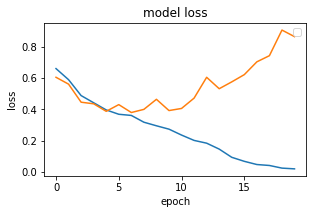
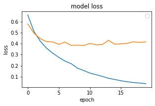

# Sentiment Analysis using Deep Learning in Keras

### Importing Required Libraries


```python
import re
import pandas as pd
import numpy as np
import seaborn as sns
from sklearn.model_selection import train_test_split
from keras.preprocessing.text import Tokenizer
from numpy import array, asarray, zeros
from keras.models import Sequential
from keras.preprocessing.sequence import pad_sequences
from keras.layers import Flatten, GlobalMaxPooling1D
from keras.layers.core import Activation, Dropout, Dense
from keras.layers.embeddings import Embedding
import matplotlib.pyplot as plt
from keras.layers import Conv1D
from keras.layers import LSTM
```

### Importing Dataset

Dataset 1 link: https://www.kaggle.com/lakshmi25npathi/imdb-dataset-of-50k-movie-reviews

Dataset 2 link: https://github.com/vineetdhanawat/twitter-sentiment-analysis/blob/master/datasets/Sentiment%20Analysis%20Dataset%20100000.csv


```python
df = []
df.append(pd.read_csv('data/IMDB Dataset.csv', nrows = 10000))
df.append(pd.read_csv('data/Sentiment Analysis Dataset 100000.csv', encoding = 'latin-1', nrows = 10000))
df[1].drop(['ItemID'], axis = 'columns', inplace = True)
```


```python
df[0].head(5)
```


<div>
<style scoped>
    .dataframe tbody tr th:only-of-type {
        vertical-align: middle;
    }

    .dataframe tbody tr th {
        vertical-align: top;
    }

    .dataframe thead th {
        text-align: right;
    }
</style>
<table border="1" class="dataframe">
  <thead>
    <tr style="text-align: right;">
      <th></th>
      <th>text</th>
      <th>sentiment</th>
    </tr>
  </thead>
  <tbody>
    <tr>
      <th>0</th>
      <td>One of the other reviewers has mentioned that ...</td>
      <td>positive</td>
    </tr>
    <tr>
      <th>1</th>
      <td>A wonderful little production. &lt;br /&gt;&lt;br /&gt;The...</td>
      <td>positive</td>
    </tr>
    <tr>
      <th>2</th>
      <td>I thought this was a wonderful way to spend ti...</td>
      <td>positive</td>
    </tr>
    <tr>
      <th>3</th>
      <td>Basically there's a family where a little boy ...</td>
      <td>negative</td>
    </tr>
    <tr>
      <th>4</th>
      <td>Petter Mattei's "Love in the Time of Money" is...</td>
      <td>positive</td>
    </tr>
  </tbody>
</table>
</div>


```python
df[1].head(5)
```


<div>
<style scoped>
    .dataframe tbody tr th:only-of-type {
        vertical-align: middle;
    }

    .dataframe tbody tr th {
        vertical-align: top;
    }

    .dataframe thead th {
        text-align: right;
    }
</style>
<table border="1" class="dataframe">
  <thead>
    <tr style="text-align: right;">
      <th></th>
      <th>sentiment</th>
      <th>text</th>
    </tr>
  </thead>
  <tbody>
    <tr>
      <th>0</th>
      <td>0</td>
      <td>is so sad for my APL frie...</td>
    </tr>
    <tr>
      <th>1</th>
      <td>0</td>
      <td>I missed the New Moon trail...</td>
    </tr>
    <tr>
      <th>2</th>
      <td>1</td>
      <td>omg its already 7:30 :O</td>
    </tr>
    <tr>
      <th>3</th>
      <td>0</td>
      <td>.. Omgaga. Im sooo  im gunna CRy. I'...</td>
    </tr>
    <tr>
      <th>4</th>
      <td>0</td>
      <td>i think mi bf is cheating on me!!!   ...</td>
    </tr>
  </tbody>
</table>
</div>


```python
df[0]['text'][0]
```


    "One of the other reviewers has mentioned that after watching just 1 Oz episode you'll be hooked. They are right, as this is exactly what happened with me.<br /><br />The first thing that struck me about Oz was its brutality and unflinching scenes of violence, which set in right from the word GO. Trust me, this is not a show for the faint hearted or timid. This show pulls no punches with regards to drugs, sex or violence. Its is hardcore, in the classic use of the word.<br /><br />It is called OZ as that is the nickname given to the Oswald Maximum Security State Penitentary. It focuses mainly on Emerald City, an experimental section of the prison where all the cells have glass fronts and face inwards, so privacy is not high on the agenda. Em City is home to many..Aryans, Muslims, gangstas, Latinos, Christians, Italians, Irish and more....so scuffles, death stares, dodgy dealings and shady agreements are never far away.<br /><br />I would say the main appeal of the show is due to the fact that it goes where other shows wouldn't dare. Forget pretty pictures painted for mainstream audiences, forget charm, forget romance...OZ doesn't mess around. The first episode I ever saw struck me as so nasty it was surreal, I couldn't say I was ready for it, but as I watched more, I developed a taste for Oz, and got accustomed to the high levels of graphic violence. Not just violence, but injustice (crooked guards who'll be sold out for a nickel, inmates who'll kill on order and get away with it, well mannered, middle class inmates being turned into prison bitches due to their lack of street skills or prison experience) Watching Oz, you may become comfortable with what is uncomfortable viewing....thats if you can get in touch with your darker side."


```python
df[1]['text'][0]
```


    '                     is so sad for my APL friend.............'


```python
for i in df:
    print(i.isnull().values.any())
```

    False
    False


```python
sns.countplot(x = 'sentiment', data = df[0])
```


    <AxesSubplot:xlabel='sentiment', ylabel='count'>


    

    


```python
sns.countplot(x = 'sentiment', data = df[1])
```


    <AxesSubplot:xlabel='sentiment', ylabel='count'>


    

    


## Data Processing

#### Dataset 1 Cleaning


```python
TAG_RE = re.compile(r'<[^>]+>')

def remove_html_tags(sen):
    return TAG_RE.sub('', sen)
```


```python
def data_processing_1(sen):
    sen = remove_html_tags(sen) # remove html tag
    sen = sen.replace('n\'t', ' not') # convert n't to not
    sen = re.sub(r"\s+[a-zA-Z]\s+", ' ', sen) # remove single letter
    sen = re.sub(r'\s+', ' ', sen) # remove multiple spaces
    sen = re.sub(r'[.]+', '.', sen) # remove multiple dots
    sen = sen.replace('\\\'', ' ') # remove \
    return sen
```


```python
X = [["0"]*10000]*3
```


```python
sentences = list(df[0]['text'])
i = 0

for sen in sentences:
    X[0][i] = data_processing_1(sen)
    i = i + 1

X[0] = np.array(list(X[0]))
```


```python
y = [[0]*10000]*3
y[0] = df[0]['sentiment']
y[0] = np.array(list(map(lambda x: 1 if x == "positive" else 0, y[0])))
```


```python
for i in range(0, 5):
    print(y[0][i], end = ', ')
```

    1, 1, 1, 0, 1, 


```python
print(np.shape(X[0]))
print(np.shape(y[0]))
```

    (10000,)
    (10000,)


#### Dataset 2 Cleaning


```python
def data_processing_2(sen):
    sen = sen.replace('&quot;3', '')
    sen = sen.replace('&quot;', '')
    sen = sen.replace('&lt;3', '')
    sen = sen.replace('&lt;', '')
    sen = sen.replace('&gt;', '')
    sen = re.sub('http[s]?://\S+', '', sen)
    sen = re.sub('[a-zA-Z0-9]*@[a-zA-Z0-9]*', '', sen)
    sen = sen.replace('an\'t', 'an not')
    sen = sen.replace('n\'t', ' not')
    sen = re.sub(r"\s+[A-Z]\s+", ' ', sen)
    sen = re.sub(r'[.]+', '.', sen)
    sen = re.sub(r'\s+', ' ', sen)
    sen = re.sub(r'[-]+', ' ', sen)
    return sen
```


```python
sentences = list(df[1]['text'])
i = 0

for sen in sentences:
    X[1][i] = data_processing_2(sen)
    i = i + 1
    
X[1] = np.array(list(X[1]))
```


```python
y[1] = np.array(list(df[1]['sentiment']))
```


```python
for i in range(0, 10):
    print(y[1][i], end = ',')
```

    0,0,1,0,0,0,1,0,1,1,


```python
print(np.shape(X[1]))
print(np.shape(y[1]))
```

    (10000,)
    (10000,)


#### Combine Dataset


```python
for i in range(0, 5000):
    X[2][i] = X[0][i]
    y[2][i] = y[0][i]
for i in range(5000, 10000):
    X[2][i] = X[1][i]
    y[2][i] = y[1][i]
    
X[2] = np.array(X[2])
y[2] = np.array(y[2])
```


```python
print(np.shape(X[2]))
print(np.shape(y[2]))
```

    (10000,)
    (10000,)


```python
for sen in range(0, 2):
    print(y[2][sen], X[2][sen], end = '\n\n')
for sen in range(5000, 5002):
    print(y[2][sen], X[2][sen], end = '\n\n')
```

    1 One of the other reviewers has mentioned that after watching just 1 Oz episode you'll be hooked. They are right, as this is exactly what happened with me.The first thing that struck me about Oz was its brutality and unflinching scenes of violence, which set in right from the word GO. Trust me, this is not show for the faint hearted or timid. This show pulls no punches with regards to drugs, sex or violence. Its is hardcore, in the classic use of the word.It is called OZ as that is the nickname given to the Oswald Maximum Security State Penitentary. It focuses mainly on Emerald City, an experimental section of the prison where all the cells have glass fronts and face inwards, so privacy is not high on the agenda. Em City is home to many.Aryans, Muslims, gangstas, Latinos, Christians, Italians, Irish and more.so scuffles, death stares, dodgy dealings and shady agreements are never far away.I would say the main appeal of the show is due to the fact that it goes where other shows would not dare. Forget pretty pictures painted for mainstream audiences, forget charm, forget romance.OZ does not mess around. The first episode ever saw struck me as so nasty it was surreal, could not say was ready for it, but as watched more, developed taste for Oz, and got accustomed to the high levels of graphic violence. Not just violence, but injustice (crooked guards who'll be sold out for nickel, inmates who'll kill on order and get away with it, well mannered, middle class inmates being turned into prison bitches due to their lack of street skills or prison experience) Watching Oz, you may become comfortable with what is uncomfortable viewing.thats if you can get in touch with your darker side.
    
    1 A wonderful little production. The filming technique is very unassuming- very old-time-BBC fashion and gives comforting, and sometimes discomforting, sense of realism to the entire piece. The actors are extremely well chosen- Michael Sheen not only "has got all the polari" but he has all the voices down pat too! You can truly see the seamless editing guided by the references to Williams' diary entries, not only is it well worth the watching but it is terrificly written and performed piece. masterful production about one of the great master's of comedy and his life. The realism really comes home with the little things: the fantasy of the guard which, rather than use the traditional 'dream' techniques remains solid then disappears. It plays on our knowledge and our senses, particularly with the scenes concerning Orton and Halliwell and the sets (particularly of their flat with Halliwell's murals decorating every surface) are terribly well done.
    
    1  very very very happy and slightly skinny xx
    
    0  waaaaahhh. ohyeah i had something to do eeee. haha
    


#### Dataset splitting to train and test


```python
X_train = [[]] * 3
X_test = [[]] * 3
y_train = [[]] * 3
y_test = [[]] * 3
```


```python
for i in range(0, 3):
    print('dataset ', i+1, ': ', np.shape(X[i]), ', ', np.shape(y[i]), end = '\n')
```

    dataset  1 :  (10000,) ,  (10000,)
    dataset  2 :  (10000,) ,  (10000,)
    dataset  3 :  (10000,) ,  (10000,)


```python
for i in range(0, 3):
    X_train[i], X_test[i], y_train[i], y_test[i] = train_test_split(
        X[i], y[i], test_size = 0.25,
        random_state = 42
    )
```


```python
for i in range(0, 10):
    print(i, ': ', y_test[1][i], ' --> ', X_train[1][i])
```

    0 :  0  -->  #f1 Rubens knows he has lost any chance of the world championship
    1 :  0  -->  #3turnoffwords   Isit in yet
    2 :  1  -->  #FollowFriday is a ferociously gifted writer whose books &amp; Tweets are magical must reads. Follow &amp; you'll LOVE her too
    3 :  0  -->  My heart sings when think of youuu haha that's all keep singing today. I'm craving cheeto puffs unhealthy!
    4 :  0  -->   guys are pricks. gonna have an early night and cry til i fall asleep. fuck you all.
    5 :  1  -->  #faviphoneapp Black Book. But since only have a Touch it's not as fun. But it's still a great junt organizer
    6 :  0  -->  #musicmonday Crossfire   On Fire
    7 :  1  -->  #3wordsaftersex 'I broke it?!?!' lol
    8 :  0  -->  ! .sooo, any hope for a match up with Liz Cheney and Mikas Daddy? thx!! Ratings Gold I'm sure!! 
    9 :  0  -->   u guys knw whyy


### Preparing Embedding Layer


```python
tokenizer = Tokenizer(num_words = 50000)

for i in range(3):
    tokenizer.fit_on_texts(X_train[i])
```


```python
for i in range(3):
    X_train[i] = tokenizer.texts_to_sequences(X_train[i])
```


```python
for i in range(3):
    X_test[i] = tokenizer.texts_to_sequences(X_test[i])
```


```python
maxlen = 100
vocab_size = len(tokenizer.word_index) + 1
print(vocab_size)
```

    57961


```python
for i in range(3):
    X_train[i] = pad_sequences(
        X_train[i],
        padding = 'post',
        maxlen = maxlen
    )
```


```python
for i in range(3):
    X_test[i] = pad_sequences(
        X_test[i],
        padding = 'post',
        maxlen = maxlen
    )
```

#### glove.6B.100d.txt Dataset for GloVe Embedding

dataset link: https://www.kaggle.com/danielwillgeorge/glove6b100dtxt


```python
embed_dictionary = dict()
glv_file = open('data/glove.6B.100d.txt', encoding='utf8')
```


```python
for line in glv_file:
    records = line.split()
    word = records[0]
    vector_dim = asarray(records[1:], dtype='float32')
    embed_dictionary[word] = vector_dim
glv_file.close()
```


```python
embed_matrix = zeros((vocab_size, 100))
```


```python
for word, index in tokenizer.word_index.items():
    embed_vector = embed_dictionary.get(word)
    if embed_vector is not None:
        embed_matrix[index] = embed_vector
```


```python
embed_matrix[1]
```


    array([-0.038194  , -0.24487001,  0.72812003, -0.39961001,  0.083172  ,
            0.043953  , -0.39140999,  0.3344    , -0.57545   ,  0.087459  ,
            0.28786999, -0.06731   ,  0.30906001, -0.26383999, -0.13231   ,
           -0.20757   ,  0.33395001, -0.33848   , -0.31742999, -0.48335999,
            0.1464    , -0.37303999,  0.34577   ,  0.052041  ,  0.44946   ,
           -0.46970999,  0.02628   , -0.54154998, -0.15518001, -0.14106999,
           -0.039722  ,  0.28277001,  0.14393   ,  0.23464   , -0.31020999,
            0.086173  ,  0.20397   ,  0.52623999,  0.17163999, -0.082378  ,
           -0.71787   , -0.41531   ,  0.20334999, -0.12763   ,  0.41367   ,
            0.55186999,  0.57907999, -0.33476999, -0.36559001, -0.54856998,
           -0.062892  ,  0.26583999,  0.30204999,  0.99774998, -0.80480999,
           -3.0243001 ,  0.01254   , -0.36941999,  2.21670008,  0.72201002,
           -0.24978   ,  0.92136002,  0.034514  ,  0.46744999,  1.10790002,
           -0.19358   , -0.074575  ,  0.23353   , -0.052062  , -0.22044   ,
            0.057162  , -0.15806   , -0.30798   , -0.41624999,  0.37972   ,
            0.15006   , -0.53211999, -0.20550001, -1.25259995,  0.071624  ,
            0.70564997,  0.49744001, -0.42063001,  0.26148   , -1.53799999,
           -0.30223   , -0.073438  , -0.28312001,  0.37103999, -0.25217   ,
            0.016215  , -0.017099  , -0.38984001,  0.87423998, -0.72569001,
           -0.51058   , -0.52028   , -0.1459    ,  0.82779998,  0.27061999])


## Text Classification with Simple Neural Network


```python
model = Sequential()
embed_layer = Embedding(
    vocab_size, 100,
    weights = [embed_matrix],
    input_length = maxlen,
    trainable = False
)
model.add(embed_layer)
model.add(Flatten())
```


```python
model.add(
    Dense(
        1,
        activation = 'sigmoid'
    )
)
```


```python
model.compile(
    optimizer = 'adam',
    loss = 'binary_crossentropy',
    metrics = ['acc']
)
```


```python
model.summary()
```

    Model: "sequential"
    _________________________________________________________________
    Layer (type)                 Output Shape              Param #   
    =================================================================
    embedding (Embedding)        (None, 100, 100)          5796100   
    _________________________________________________________________
    flatten (Flatten)            (None, 10000)             0         
    _________________________________________________________________
    dense (Dense)                (None, 1)                 10001     
    =================================================================
    Total params: 5,806,101
    Trainable params: 10,001
    Non-trainable params: 5,796,100
    _________________________________________________________________


```python
hist = [[]] * 3

for i in range(3):
    print('for dataset: ', i+1)
    print()
    hist[i] = model.fit(
        X_train[i], y_train[i],
        batch_size = 128,
        epochs = 12,
        verbose = 1,
        validation_split = 0.2
    )
    print()
```

    for dataset:  1
    
    Epoch 1/12
    47/47 [==============================] - 0s 9ms/step - loss: 0.6929 - acc: 0.5930 - val_loss: 0.6323 - val_acc: 0.6453
    Epoch 2/12
    47/47 [==============================] - 0s 4ms/step - loss: 0.5249 - acc: 0.7533 - val_loss: 0.6296 - val_acc: 0.6533
    Epoch 3/12
    47/47 [==============================] - 0s 4ms/step - loss: 0.4488 - acc: 0.8182 - val_loss: 0.5902 - val_acc: 0.6947
    Epoch 4/12
    47/47 [==============================] - 0s 5ms/step - loss: 0.3923 - acc: 0.8545 - val_loss: 0.5785 - val_acc: 0.6940
    Epoch 5/12
    47/47 [==============================] - 0s 6ms/step - loss: 0.3511 - acc: 0.8803 - val_loss: 0.5760 - val_acc: 0.6947
    Epoch 6/12
    47/47 [==============================] - 0s 4ms/step - loss: 0.3192 - acc: 0.9018 - val_loss: 0.5816 - val_acc: 0.6927
    Epoch 7/12
    47/47 [==============================] - 0s 4ms/step - loss: 0.2896 - acc: 0.9175 - val_loss: 0.6142 - val_acc: 0.6953
    Epoch 8/12
    47/47 [==============================] - 0s 4ms/step - loss: 0.2700 - acc: 0.9288 - val_loss: 0.5885 - val_acc: 0.6953
    Epoch 9/12
    47/47 [==============================] - 0s 7ms/step - loss: 0.2449 - acc: 0.9437 - val_loss: 0.5958 - val_acc: 0.6980
    Epoch 10/12
    47/47 [==============================] - 0s 6ms/step - loss: 0.2302 - acc: 0.9485 - val_loss: 0.6059 - val_acc: 0.6953
    Epoch 11/12
    47/47 [==============================] - 0s 7ms/step - loss: 0.2117 - acc: 0.9605 - val_loss: 0.6118 - val_acc: 0.6967
    Epoch 12/12
    47/47 [==============================] - 0s 8ms/step - loss: 0.1976 - acc: 0.9688 - val_loss: 0.6249 - val_acc: 0.7007
    
    for dataset:  2
    
    Epoch 1/12
    47/47 [==============================] - 0s 7ms/step - loss: 0.6487 - acc: 0.6263 - val_loss: 0.6231 - val_acc: 0.6573
    Epoch 2/12
    47/47 [==============================] - 0s 5ms/step - loss: 0.6001 - acc: 0.6798 - val_loss: 0.6139 - val_acc: 0.6647
    Epoch 3/12
    47/47 [==============================] - 0s 5ms/step - loss: 0.5739 - acc: 0.7073 - val_loss: 0.6015 - val_acc: 0.6787
    Epoch 4/12
    47/47 [==============================] - 0s 4ms/step - loss: 0.5548 - acc: 0.7238 - val_loss: 0.6011 - val_acc: 0.6773
    Epoch 5/12
    47/47 [==============================] - 0s 6ms/step - loss: 0.5403 - acc: 0.7360 - val_loss: 0.5938 - val_acc: 0.6853
    Epoch 6/12
    47/47 [==============================] - 0s 6ms/step - loss: 0.5274 - acc: 0.7482 - val_loss: 0.5930 - val_acc: 0.6840
    Epoch 7/12
    47/47 [==============================] - 0s 4ms/step - loss: 0.5177 - acc: 0.7532 - val_loss: 0.5925 - val_acc: 0.6927
    Epoch 8/12
    47/47 [==============================] - 0s 4ms/step - loss: 0.5095 - acc: 0.7603 - val_loss: 0.5939 - val_acc: 0.6933
    Epoch 9/12
    47/47 [==============================] - 0s 4ms/step - loss: 0.5019 - acc: 0.7653 - val_loss: 0.5923 - val_acc: 0.6933
    Epoch 10/12
    47/47 [==============================] - 0s 5ms/step - loss: 0.4943 - acc: 0.7690 - val_loss: 0.5935 - val_acc: 0.6940
    Epoch 11/12
    47/47 [==============================] - 0s 6ms/step - loss: 0.4888 - acc: 0.7725 - val_loss: 0.5957 - val_acc: 0.6960
    Epoch 12/12
    47/47 [==============================] - 0s 4ms/step - loss: 0.4827 - acc: 0.7782 - val_loss: 0.5949 - val_acc: 0.6973
    
    for dataset:  3
    
    Epoch 1/12
    47/47 [==============================] - 0s 5ms/step - loss: 0.3894 - acc: 0.8258 - val_loss: 0.6623 - val_acc: 0.6793
    Epoch 2/12
    47/47 [==============================] - 0s 5ms/step - loss: 0.3443 - acc: 0.8655 - val_loss: 0.6861 - val_acc: 0.6693
    Epoch 3/12
    47/47 [==============================] - 0s 7ms/step - loss: 0.3229 - acc: 0.8813 - val_loss: 0.6737 - val_acc: 0.6767
    Epoch 4/12
    47/47 [==============================] - 0s 5ms/step - loss: 0.3053 - acc: 0.8948 - val_loss: 0.6776 - val_acc: 0.6793
    Epoch 5/12
    47/47 [==============================] - 0s 4ms/step - loss: 0.2964 - acc: 0.8980 - val_loss: 0.6891 - val_acc: 0.6713
    Epoch 6/12
    47/47 [==============================] - 0s 6ms/step - loss: 0.2871 - acc: 0.9017 - val_loss: 0.6998 - val_acc: 0.6727
    Epoch 7/12
    47/47 [==============================] - 0s 5ms/step - loss: 0.2787 - acc: 0.9057 - val_loss: 0.7064 - val_acc: 0.6687
    Epoch 8/12
    47/47 [==============================] - 0s 4ms/step - loss: 0.2707 - acc: 0.9093 - val_loss: 0.7104 - val_acc: 0.6707
    Epoch 9/12
    47/47 [==============================] - 0s 4ms/step - loss: 0.2646 - acc: 0.9117 - val_loss: 0.7162 - val_acc: 0.6740
    Epoch 10/12
    47/47 [==============================] - 0s 5ms/step - loss: 0.2598 - acc: 0.9113 - val_loss: 0.7262 - val_acc: 0.6720
    Epoch 11/12
    47/47 [==============================] - 0s 5ms/step - loss: 0.2548 - acc: 0.9150 - val_loss: 0.7409 - val_acc: 0.6620
    Epoch 12/12
    47/47 [==============================] - 0s 4ms/step - loss: 0.2503 - acc: 0.9153 - val_loss: 0.7415 - val_acc: 0.6700
    


```python
loss = [[]] * 3
acc = [[]] * 3

for i in range(3):
    print('for dataset: ', i+1)
    loss[i], acc[i] = model.evaluate(
        X_train[i], y_train[i],
        verbose = 1
    )

for i in range(3):
    print('\ndataset {}: loss - {}, acc - {}'.format(i+1, loss[i], acc[i]))
```

    for dataset:  1
    235/235 [==============================] - 0s 2ms/step - loss: 0.3706 - acc: 0.8564
    for dataset:  2
    235/235 [==============================] - 0s 1ms/step - loss: 0.5398 - acc: 0.7392
    for dataset:  3
    235/235 [==============================] - 0s 2ms/step - loss: 0.3429 - acc: 0.8692
    
    dataset 1: loss - 0.3706037104129791, acc - 0.8564000129699707
    
    dataset 2: loss - 0.5398017168045044, acc - 0.7391999959945679
    
    dataset 3: loss - 0.3428674340248108, acc - 0.8691999912261963


```python
loss = [[]] * 3
acc = [[]] * 3

for i in range(3):
    print('for dataset: ', i+1)
    loss[i], acc[i] = model.evaluate(
        X_test[i], y_test[i],
        verbose = 1
    )
    
for i in range(3):
    print('\ndataset {}: loss - {}, acc - {}'.format(i+1, loss[i], acc[i]))
```

    for dataset:  1
    79/79 [==============================] - 0s 1ms/step - loss: 0.8167 - acc: 0.6804
    for dataset:  2
    79/79 [==============================] - 0s 2ms/step - loss: 0.6585 - acc: 0.6488
    for dataset:  3
    79/79 [==============================] - 0s 2ms/step - loss: 0.7532 - acc: 0.6608
    
    dataset 1: loss - 0.8167381882667542, acc - 0.680400013923645
    
    dataset 2: loss - 0.6584822535514832, acc - 0.6488000154495239
    
    dataset 3: loss - 0.7532461881637573, acc - 0.6607999801635742


```python
for i in range(3):
    print('for dataset: ', i+1)
    plt.figure(figsize=(12, 8))
    plt.subplot(3, 3, i+1)
    plt.title('model accuracy')
    plt.xlabel('epoch')
    plt.ylabel('accuracy')
    plt.legend(['train', 'test'], loc = 'upper left')
    plt.plot(hist[i].history['acc'])
    plt.plot(hist[i].history['val_acc'])
    plt.tight_layout(pad=1.0)

plt.show()
```

    for dataset:  1
    for dataset:  2
    for dataset:  3


    

    


    

    


    

    


```python
for i in range(3):
    print('for dataset: ', i+1)
    plt.figure(figsize=(12, 8))
    plt.subplot(3, 3, i+1)
    plt.title('model loss')
    plt.xlabel('epoch')
    plt.ylabel('loss')
    plt.legend(['train', 'test'], loc = 'upper right')
    plt.plot(hist[i].history['loss'])
    plt.plot(hist[i].history['val_loss'])
    plt.tight_layout(pad=1.0)

plt.show()
```

    for dataset:  1
    for dataset:  2
    for dataset:  3


    

    


    

    


    

    


## Text Classification with LSTM


```python
model = Sequential()
embed_layer = Embedding(
    vocab_size, 100,
    weights = [embed_matrix],
    input_length = maxlen,
    trainable = False
)
model.add(embed_layer)
model.add(LSTM(128))
```


```python
model.add(
    Dense(
        1,
        activation = 'sigmoid'
    )
)
model.compile(
    optimizer = 'adam',
    loss = 'binary_crossentropy',
    metrics = ['acc']
)
```


```python
model.summary()
```

    Model: "sequential_1"
    _________________________________________________________________
    Layer (type)                 Output Shape              Param #   
    =================================================================
    embedding_1 (Embedding)      (None, 100, 100)          5796100   
    _________________________________________________________________
    lstm (LSTM)                  (None, 128)               117248    
    _________________________________________________________________
    dense_1 (Dense)              (None, 1)                 129       
    =================================================================
    Total params: 5,913,477
    Trainable params: 117,377
    Non-trainable params: 5,796,100
    _________________________________________________________________


```python
hist = [[]] * 3

for i in range(3):
    print('for dataset: ', i+1)
    print()
    hist[i] = model.fit(
        X_train[i], y_train[i],
        batch_size = 128,
        epochs = 20,
        verbose = 1,
        validation_split = 0.2
    )
    print()
```

    for dataset:  1
    
    Epoch 1/20
    47/47 [==============================] - 8s 168ms/step - loss: 0.6486 - acc: 0.6127 - val_loss: 0.5755 - val_acc: 0.7060
    Epoch 2/20
    47/47 [==============================] - 8s 171ms/step - loss: 0.5232 - acc: 0.7405 - val_loss: 0.5204 - val_acc: 0.7460
    Epoch 3/20
    47/47 [==============================] - 9s 197ms/step - loss: 0.5318 - acc: 0.7365 - val_loss: 0.5087 - val_acc: 0.7653
    Epoch 4/20
    47/47 [==============================] - 7s 147ms/step - loss: 0.5001 - acc: 0.7660 - val_loss: 0.4650 - val_acc: 0.7893
    Epoch 5/20
    47/47 [==============================] - 7s 149ms/step - loss: 0.4509 - acc: 0.7942 - val_loss: 0.4552 - val_acc: 0.7860
    Epoch 6/20
    47/47 [==============================] - 7s 149ms/step - loss: 0.4815 - acc: 0.7733 - val_loss: 0.4823 - val_acc: 0.7647
    Epoch 7/20
    47/47 [==============================] - 8s 165ms/step - loss: 0.4320 - acc: 0.8032 - val_loss: 0.4543 - val_acc: 0.7927
    Epoch 8/20
    47/47 [==============================] - 7s 152ms/step - loss: 0.4108 - acc: 0.8113 - val_loss: 0.4248 - val_acc: 0.7993
    Epoch 9/20
    47/47 [==============================] - 7s 153ms/step - loss: 0.3980 - acc: 0.8197 - val_loss: 0.4163 - val_acc: 0.8040
    Epoch 10/20
    47/47 [==============================] - 7s 149ms/step - loss: 0.3845 - acc: 0.8272 - val_loss: 0.4076 - val_acc: 0.8053
    Epoch 11/20
    47/47 [==============================] - 7s 150ms/step - loss: 0.3632 - acc: 0.8373 - val_loss: 0.4410 - val_acc: 0.8133
    Epoch 12/20
    47/47 [==============================] - 7s 153ms/step - loss: 0.3621 - acc: 0.8345 - val_loss: 0.4339 - val_acc: 0.7733
    Epoch 13/20
    47/47 [==============================] - 7s 154ms/step - loss: 0.3289 - acc: 0.8577 - val_loss: 0.3955 - val_acc: 0.8220
    Epoch 14/20
    47/47 [==============================] - 8s 173ms/step - loss: 0.3045 - acc: 0.8703 - val_loss: 0.4134 - val_acc: 0.8260
    Epoch 15/20
    47/47 [==============================] - 8s 161ms/step - loss: 0.2797 - acc: 0.8795 - val_loss: 0.3988 - val_acc: 0.8127
    Epoch 16/20
    47/47 [==============================] - 9s 202ms/step - loss: 0.2742 - acc: 0.8898 - val_loss: 0.4260 - val_acc: 0.8240
    Epoch 17/20
    47/47 [==============================] - 11s 237ms/step - loss: 0.2505 - acc: 0.8973 - val_loss: 0.4530 - val_acc: 0.8113
    Epoch 18/20
    47/47 [==============================] - 11s 238ms/step - loss: 0.1999 - acc: 0.9188 - val_loss: 0.4724 - val_acc: 0.8060
    Epoch 19/20
    47/47 [==============================] - 10s 205ms/step - loss: 0.1999 - acc: 0.9218 - val_loss: 0.4785 - val_acc: 0.7913
    Epoch 20/20
    47/47 [==============================] - 8s 180ms/step - loss: 0.1743 - acc: 0.9368 - val_loss: 0.5146 - val_acc: 0.8140
    
    for dataset:  2
    
    Epoch 1/20
    47/47 [==============================] - 7s 153ms/step - loss: 0.6930 - acc: 0.5758 - val_loss: 0.6776 - val_acc: 0.5740
    Epoch 2/20
    47/47 [==============================] - 7s 152ms/step - loss: 0.6531 - acc: 0.6255 - val_loss: 0.6606 - val_acc: 0.6233
    Epoch 3/20
    47/47 [==============================] - 8s 169ms/step - loss: 0.6252 - acc: 0.6755 - val_loss: 0.6161 - val_acc: 0.6673
    Epoch 4/20
    47/47 [==============================] - 8s 162ms/step - loss: 0.6006 - acc: 0.6912 - val_loss: 0.5893 - val_acc: 0.6907
    Epoch 5/20
    47/47 [==============================] - 8s 176ms/step - loss: 0.5693 - acc: 0.7145 - val_loss: 0.6102 - val_acc: 0.6820
    Epoch 6/20
    47/47 [==============================] - 8s 163ms/step - loss: 0.5624 - acc: 0.7233 - val_loss: 0.5638 - val_acc: 0.7173
    Epoch 7/20
    47/47 [==============================] - 8s 168ms/step - loss: 0.5271 - acc: 0.7523 - val_loss: 0.5557 - val_acc: 0.7240
    Epoch 8/20
    47/47 [==============================] - 7s 140ms/step - loss: 0.5270 - acc: 0.7547 - val_loss: 0.6151 - val_acc: 0.7000
    Epoch 9/20
    47/47 [==============================] - 7s 141ms/step - loss: 0.5057 - acc: 0.7612 - val_loss: 0.5614 - val_acc: 0.7280
    Epoch 10/20
    47/47 [==============================] - 6s 137ms/step - loss: 0.4832 - acc: 0.7788 - val_loss: 0.5616 - val_acc: 0.7180
    Epoch 11/20
    47/47 [==============================] - 7s 139ms/step - loss: 0.4605 - acc: 0.7920 - val_loss: 0.5791 - val_acc: 0.7033
    Epoch 12/20
    47/47 [==============================] - 6s 135ms/step - loss: 0.4574 - acc: 0.7962 - val_loss: 0.5474 - val_acc: 0.7273
    Epoch 13/20
    47/47 [==============================] - 7s 145ms/step - loss: 0.4275 - acc: 0.8118 - val_loss: 0.5953 - val_acc: 0.7133
    Epoch 14/20
    47/47 [==============================] - 6s 134ms/step - loss: 0.4341 - acc: 0.8090 - val_loss: 0.5700 - val_acc: 0.7287
    Epoch 15/20
    47/47 [==============================] - 7s 142ms/step - loss: 0.4167 - acc: 0.8225 - val_loss: 0.6446 - val_acc: 0.6807
    Epoch 16/20
    47/47 [==============================] - 7s 152ms/step - loss: 0.4188 - acc: 0.8192 - val_loss: 0.6066 - val_acc: 0.7140
    Epoch 17/20
    47/47 [==============================] - 8s 171ms/step - loss: 0.3771 - acc: 0.8475 - val_loss: 0.6080 - val_acc: 0.7293
    Epoch 18/20
    47/47 [==============================] - 7s 141ms/step - loss: 0.3578 - acc: 0.8523 - val_loss: 0.5850 - val_acc: 0.7420
    Epoch 19/20
    47/47 [==============================] - 7s 147ms/step - loss: 0.3161 - acc: 0.8712 - val_loss: 0.7227 - val_acc: 0.6800
    Epoch 20/20
    47/47 [==============================] - 8s 162ms/step - loss: 0.3439 - acc: 0.8630 - val_loss: 0.6319 - val_acc: 0.7333
    
    for dataset:  3
    
    Epoch 1/20
    47/47 [==============================] - 8s 160ms/step - loss: 0.4173 - acc: 0.8147 - val_loss: 0.5667 - val_acc: 0.7413
    Epoch 2/20
    47/47 [==============================] - 8s 161ms/step - loss: 0.3080 - acc: 0.8760 - val_loss: 0.5611 - val_acc: 0.7513
    Epoch 3/20
    47/47 [==============================] - 7s 150ms/step - loss: 0.2730 - acc: 0.8900 - val_loss: 0.5838 - val_acc: 0.7667
    Epoch 4/20
    47/47 [==============================] - 8s 170ms/step - loss: 0.2516 - acc: 0.9032 - val_loss: 0.6248 - val_acc: 0.7553
    Epoch 5/20
    47/47 [==============================] - 9s 191ms/step - loss: 0.2235 - acc: 0.9168 - val_loss: 0.6443 - val_acc: 0.7560
    Epoch 6/20
    47/47 [==============================] - 10s 217ms/step - loss: 0.2207 - acc: 0.9177 - val_loss: 0.6501 - val_acc: 0.7567
    Epoch 7/20
    47/47 [==============================] - 8s 170ms/step - loss: 0.2141 - acc: 0.9215 - val_loss: 0.7003 - val_acc: 0.7007
    Epoch 8/20
    47/47 [==============================] - 10s 218ms/step - loss: 0.2543 - acc: 0.9048 - val_loss: 0.6639 - val_acc: 0.7507
    Epoch 9/20
    47/47 [==============================] - 7s 155ms/step - loss: 0.1616 - acc: 0.9460 - val_loss: 0.7025 - val_acc: 0.7567
    Epoch 10/20
    47/47 [==============================] - 8s 163ms/step - loss: 0.1720 - acc: 0.9410 - val_loss: 0.6507 - val_acc: 0.7640
    Epoch 11/20
    47/47 [==============================] - 9s 183ms/step - loss: 0.1440 - acc: 0.9538 - val_loss: 0.7501 - val_acc: 0.7240
    Epoch 12/20
    47/47 [==============================] - 9s 195ms/step - loss: 0.2592 - acc: 0.8962 - val_loss: 0.6973 - val_acc: 0.7473
    Epoch 13/20
    47/47 [==============================] - 9s 183ms/step - loss: 0.2022 - acc: 0.9287 - val_loss: 0.7581 - val_acc: 0.7433
    Epoch 14/20
    47/47 [==============================] - 9s 186ms/step - loss: 0.1623 - acc: 0.9455 - val_loss: 0.7712 - val_acc: 0.7533
    Epoch 15/20
    47/47 [==============================] - 9s 188ms/step - loss: 0.2058 - acc: 0.9233 - val_loss: 0.8360 - val_acc: 0.7440
    Epoch 16/20
    47/47 [==============================] - 8s 164ms/step - loss: 0.1514 - acc: 0.9498 - val_loss: 0.7498 - val_acc: 0.7373
    Epoch 17/20
    47/47 [==============================] - 8s 162ms/step - loss: 0.1611 - acc: 0.9428 - val_loss: 0.7368 - val_acc: 0.7553
    Epoch 18/20
    47/47 [==============================] - 8s 163ms/step - loss: 0.1678 - acc: 0.9433 - val_loss: 0.7461 - val_acc: 0.7540
    Epoch 19/20
    47/47 [==============================] - 8s 166ms/step - loss: 0.1826 - acc: 0.9293 - val_loss: 0.6745 - val_acc: 0.7553
    Epoch 20/20
    47/47 [==============================] - 9s 183ms/step - loss: 0.1289 - acc: 0.9595 - val_loss: 0.7899 - val_acc: 0.7547
    


```python
loss = [[]] * 3
acc = [[]] * 3

for i in range(3):
    print('for dataset: ', i+1)
    loss[i], acc[i] = model.evaluate(
        X_train[i], y_train[i],
        verbose = 1
    )

for i in range(3):
    print('\ndataset {}: loss - {}, acc - {}'.format(i+1, loss[i], acc[i]))
```

    for dataset:  1
    235/235 [==============================] - 7s 29ms/step - loss: 0.3273 - acc: 0.8925
    for dataset:  2
    235/235 [==============================] - 7s 28ms/step - loss: 0.4323 - acc: 0.8556
    for dataset:  3
    235/235 [==============================] - 7s 28ms/step - loss: 0.2339 - acc: 0.9257
    
    dataset 1: loss - 0.32734182476997375, acc - 0.8925333619117737
    
    dataset 2: loss - 0.43225541710853577, acc - 0.8555999994277954
    
    dataset 3: loss - 0.23391851782798767, acc - 0.9257333278656006


```python
loss = [[]] * 3
acc = [[]] * 3

for i in range(3):
    print('for dataset: ', i+1)
    loss[i], acc[i] = model.evaluate(
        X_test[i], y_test[i],
        verbose = 1
    )
    
for i in range(3):
    print('\ndataset {}: loss - {}, acc - {}'.format(i+1, loss[i], acc[i]))
```

    for dataset:  1
    79/79 [==============================] - 2s 28ms/step - loss: 0.6502 - acc: 0.7956
    for dataset:  2
    79/79 [==============================] - 2s 28ms/step - loss: 0.9167 - acc: 0.7072
    for dataset:  3
    79/79 [==============================] - 2s 27ms/step - loss: 0.7741 - acc: 0.7508
    
    dataset 1: loss - 0.6501577496528625, acc - 0.7955999970436096
    
    dataset 2: loss - 0.9167023301124573, acc - 0.7071999907493591
    
    dataset 3: loss - 0.7741087675094604, acc - 0.7508000135421753


```python
for i in range(3):
    print('for dataset: ', i+1)
    plt.figure(figsize=(12, 8))
    plt.subplot(3, 3, i+1)
    plt.title('model accuracy')
    plt.xlabel('epoch')
    plt.ylabel('accuracy')
    plt.legend(['train', 'test'], loc = 'upper left')
    plt.plot(hist[i].history['acc'])
    plt.plot(hist[i].history['val_acc'])
    plt.tight_layout(pad=1.0)

plt.show()
```

    for dataset:  1
    for dataset:  2
    for dataset:  3


    

    


    

    


    

    


```python
for i in range(3):
    print('for dataset: ', i+1)
    plt.figure(figsize=(12, 8))
    plt.subplot(3, 3, i+1)
    plt.title('model loss')
    plt.xlabel('epoch')
    plt.ylabel('loss')
    plt.legend(['train', 'test'], loc = 'upper right')
    plt.plot(hist[i].history['loss'])
    plt.plot(hist[i].history['val_loss'])
    plt.tight_layout(pad=1.0)

plt.show()
```

    for dataset:  1
    for dataset:  2
    for dataset:  3


    

    


    

    


    

    


## Text Classification with Bi-Directional LSTM


```python
from keras.layers import TimeDistributed
from keras.layers import Bidirectional

model = Sequential()
embed_layer = Embedding(
    vocab_size,
    100,
    weights = [embed_matrix],
    input_length = maxlen,
    trainable = False
)
model.add(embed_layer)
model.add(
    Bidirectional(
        LSTM(
            100,
            return_sequences = True,
            dropout = 0.50
        ),
        merge_mode = 'concat'
    )
)
model.add(
    TimeDistributed(
        Dense(
            100,
            activation = 'sigmoid'
        )
    )
)
model.add(Flatten())
```


```python
model.add(
    Dense(
        100,
        activation = 'sigmoid'
    )
)
model.add(
    Dense(
        3,
        activation = 'softmax'
    )
)
model.compile(
    optimizer = 'adam',
    loss = 'binary_crossentropy',
    metrics = ['acc']
)
```


```python
model.summary()
```

    Model: "sequential_2"
    _________________________________________________________________
    Layer (type)                 Output Shape              Param #   
    =================================================================
    embedding_2 (Embedding)      (None, 100, 100)          5796100   
    _________________________________________________________________
    bidirectional (Bidirectional (None, 100, 200)          160800    
    _________________________________________________________________
    time_distributed (TimeDistri (None, 100, 100)          20100     
    _________________________________________________________________
    flatten_1 (Flatten)          (None, 10000)             0         
    _________________________________________________________________
    dense_3 (Dense)              (None, 100)               1000100   
    _________________________________________________________________
    dense_4 (Dense)              (None, 3)                 303       
    =================================================================
    Total params: 6,977,403
    Trainable params: 1,181,303
    Non-trainable params: 5,796,100
    _________________________________________________________________


```python
hist = [[]] * 3

for i in range(3):
    print('for dataset: ', i+1)
    print()
    hist[i] = model.fit(
        X_train[i], y_train[i],
        batch_size = 128,
        epochs = 20,
        verbose = 1,
        validation_split = 0.2
    )
    print()
```

    for dataset:  1
    
    Epoch 1/20
    47/47 [==============================] - 14s 308ms/step - loss: 1.3638 - acc: 0.2927 - val_loss: 1.0280 - val_acc: 0.4960
    Epoch 2/20
    47/47 [==============================] - 12s 263ms/step - loss: 0.8116 - acc: 0.3117 - val_loss: 0.7575 - val_acc: 0.5040
    Epoch 3/20
    47/47 [==============================] - 11s 241ms/step - loss: 0.7515 - acc: 0.3937 - val_loss: 0.7548 - val_acc: 0.0000e+00
    Epoch 4/20
    47/47 [==============================] - 11s 244ms/step - loss: 0.7511 - acc: 0.4137 - val_loss: 0.7548 - val_acc: 0.0000e+00
    Epoch 5/20
    47/47 [==============================] - 14s 290ms/step - loss: 0.7511 - acc: 0.3045 - val_loss: 0.7548 - val_acc: 0.0047
    Epoch 6/20
    47/47 [==============================] - 12s 263ms/step - loss: 0.7511 - acc: 0.2918 - val_loss: 0.7548 - val_acc: 0.0527
    Epoch 7/20
    47/47 [==============================] - 12s 250ms/step - loss: 0.7511 - acc: 0.3948 - val_loss: 0.7548 - val_acc: 0.4867
    Epoch 8/20
    47/47 [==============================] - 12s 246ms/step - loss: 0.7511 - acc: 0.4503 - val_loss: 0.7548 - val_acc: 0.4867
    Epoch 9/20
    47/47 [==============================] - 13s 268ms/step - loss: 0.7511 - acc: 0.4703 - val_loss: 0.7548 - val_acc: 0.4867
    Epoch 10/20
    47/47 [==============================] - 13s 266ms/step - loss: 0.7511 - acc: 0.4633 - val_loss: 0.7548 - val_acc: 0.4867
    Epoch 11/20
    47/47 [==============================] - 13s 276ms/step - loss: 0.7511 - acc: 0.4632 - val_loss: 0.7548 - val_acc: 0.4867
    Epoch 12/20
    47/47 [==============================] - 13s 280ms/step - loss: 0.7511 - acc: 0.4587 - val_loss: 0.7548 - val_acc: 0.4867
    Epoch 13/20
    47/47 [==============================] - 11s 243ms/step - loss: 0.7511 - acc: 0.4708 - val_loss: 0.7548 - val_acc: 0.4867
    Epoch 14/20
    47/47 [==============================] - 11s 244ms/step - loss: 0.7511 - acc: 0.4723 - val_loss: 0.7548 - val_acc: 0.4873
    Epoch 15/20
    47/47 [==============================] - 12s 246ms/step - loss: 0.7511 - acc: 0.4730 - val_loss: 0.7548 - val_acc: 0.4867
    Epoch 16/20
    47/47 [==============================] - 11s 243ms/step - loss: 0.7511 - acc: 0.4798 - val_loss: 0.7548 - val_acc: 0.4867
    Epoch 17/20
    47/47 [==============================] - 11s 243ms/step - loss: 0.7511 - acc: 0.4633 - val_loss: 0.7548 - val_acc: 0.4867
    Epoch 18/20
    47/47 [==============================] - 12s 246ms/step - loss: 0.7511 - acc: 0.4638 - val_loss: 0.7548 - val_acc: 0.4873
    Epoch 19/20
    47/47 [==============================] - 11s 244ms/step - loss: 0.7511 - acc: 0.4602 - val_loss: 0.7548 - val_acc: 0.4867
    Epoch 20/20
    47/47 [==============================] - 12s 250ms/step - loss: 0.7511 - acc: 0.4603 - val_loss: 0.7548 - val_acc: 0.4867
    
    for dataset:  2
    
    Epoch 1/20
    47/47 [==============================] - 12s 246ms/step - loss: 0.6976 - acc: 0.2835 - val_loss: 0.7012 - val_acc: 0.4413
    Epoch 2/20
    47/47 [==============================] - 12s 263ms/step - loss: 0.6976 - acc: 0.4175 - val_loss: 0.7012 - val_acc: 0.4133
    Epoch 3/20
    47/47 [==============================] - 13s 276ms/step - loss: 0.6976 - acc: 0.4605 - val_loss: 0.7012 - val_acc: 0.4847
    Epoch 4/20
    47/47 [==============================] - 12s 246ms/step - loss: 0.6976 - acc: 0.4872 - val_loss: 0.7012 - val_acc: 0.4847
    Epoch 5/20
    47/47 [==============================] - 12s 249ms/step - loss: 0.6976 - acc: 0.4885 - val_loss: 0.7012 - val_acc: 0.4847
    Epoch 6/20
    47/47 [==============================] - 12s 247ms/step - loss: 0.6976 - acc: 0.4900 - val_loss: 0.7012 - val_acc: 0.4847
    Epoch 7/20
    47/47 [==============================] - 12s 263ms/step - loss: 0.6976 - acc: 0.4875 - val_loss: 0.7012 - val_acc: 0.4847
    Epoch 8/20
    47/47 [==============================] - 12s 247ms/step - loss: 0.6976 - acc: 0.4893 - val_loss: 0.7012 - val_acc: 0.4847
    Epoch 9/20
    47/47 [==============================] - 12s 248ms/step - loss: 0.6976 - acc: 0.4885 - val_loss: 0.7012 - val_acc: 0.4847
    Epoch 10/20
    47/47 [==============================] - 12s 247ms/step - loss: 0.6976 - acc: 0.4888 - val_loss: 0.7012 - val_acc: 0.4847
    Epoch 11/20
    47/47 [==============================] - 12s 247ms/step - loss: 0.6976 - acc: 0.4812 - val_loss: 0.7012 - val_acc: 0.4847
    Epoch 12/20
    47/47 [==============================] - 12s 245ms/step - loss: 0.6976 - acc: 0.4872 - val_loss: 0.7012 - val_acc: 0.4847
    Epoch 13/20
    47/47 [==============================] - 12s 247ms/step - loss: 0.6976 - acc: 0.4863 - val_loss: 0.7012 - val_acc: 0.4133
    Epoch 14/20
    47/47 [==============================] - 13s 279ms/step - loss: 0.6976 - acc: 0.4730 - val_loss: 0.7012 - val_acc: 0.4847
    Epoch 15/20
    47/47 [==============================] - 12s 247ms/step - loss: 0.6976 - acc: 0.4797 - val_loss: 0.7012 - val_acc: 0.4847
    Epoch 16/20
    47/47 [==============================] - 11s 245ms/step - loss: 0.6976 - acc: 0.4792 - val_loss: 0.7012 - val_acc: 0.4833
    Epoch 17/20
    47/47 [==============================] - 12s 248ms/step - loss: 0.6976 - acc: 0.4768 - val_loss: 0.7012 - val_acc: 0.4847
    Epoch 18/20
    47/47 [==============================] - 12s 246ms/step - loss: 0.6976 - acc: 0.4848 - val_loss: 0.7012 - val_acc: 0.4847
    Epoch 19/20
    47/47 [==============================] - 12s 246ms/step - loss: 0.6976 - acc: 0.4763 - val_loss: 0.7012 - val_acc: 0.4847
    Epoch 20/20
    47/47 [==============================] - 12s 246ms/step - loss: 0.6976 - acc: 0.4773 - val_loss: 0.7012 - val_acc: 0.4600
    
    for dataset:  3
    
    Epoch 1/20
    47/47 [==============================] - 12s 247ms/step - loss: 0.7667 - acc: 0.3897 - val_loss: 0.7788 - val_acc: 0.4907
    Epoch 2/20
    47/47 [==============================] - 12s 247ms/step - loss: 0.7667 - acc: 0.4578 - val_loss: 0.7788 - val_acc: 0.4900
    Epoch 3/20
    47/47 [==============================] - 12s 246ms/step - loss: 0.7667 - acc: 0.4550 - val_loss: 0.7788 - val_acc: 0.4907
    Epoch 4/20
    47/47 [==============================] - 12s 245ms/step - loss: 0.7667 - acc: 0.4550 - val_loss: 0.7788 - val_acc: 0.4887
    Epoch 5/20
    47/47 [==============================] - 11s 243ms/step - loss: 0.7667 - acc: 0.4563 - val_loss: 0.7788 - val_acc: 0.4867
    Epoch 6/20
    47/47 [==============================] - 12s 245ms/step - loss: 0.7667 - acc: 0.4540 - val_loss: 0.7788 - val_acc: 0.4887
    Epoch 7/20
    47/47 [==============================] - 13s 268ms/step - loss: 0.7667 - acc: 0.4560 - val_loss: 0.7788 - val_acc: 0.4907
    Epoch 8/20
    47/47 [==============================] - 12s 246ms/step - loss: 0.7667 - acc: 0.4553 - val_loss: 0.7788 - val_acc: 0.4840
    Epoch 9/20
    47/47 [==============================] - 12s 248ms/step - loss: 0.7667 - acc: 0.4557 - val_loss: 0.7788 - val_acc: 0.4887
    Epoch 10/20
    47/47 [==============================] - 12s 249ms/step - loss: 0.7667 - acc: 0.4557 - val_loss: 0.7788 - val_acc: 0.4900
    Epoch 11/20
    47/47 [==============================] - 12s 247ms/step - loss: 0.7667 - acc: 0.4515 - val_loss: 0.7788 - val_acc: 0.4887
    Epoch 12/20
    47/47 [==============================] - 12s 264ms/step - loss: 0.7667 - acc: 0.4538 - val_loss: 0.7788 - val_acc: 0.4867
    Epoch 13/20
    47/47 [==============================] - 15s 327ms/step - loss: 0.7667 - acc: 0.4320 - val_loss: 0.7788 - val_acc: 0.4907
    Epoch 14/20
    47/47 [==============================] - 13s 269ms/step - loss: 0.7667 - acc: 0.4407 - val_loss: 0.7788 - val_acc: 0.4820
    Epoch 15/20
    47/47 [==============================] - 15s 325ms/step - loss: 0.7667 - acc: 0.4302 - val_loss: 0.7788 - val_acc: 0.4707
    Epoch 16/20
    47/47 [==============================] - 13s 285ms/step - loss: 0.7667 - acc: 0.4548 - val_loss: 0.7788 - val_acc: 0.4907
    Epoch 17/20
    47/47 [==============================] - 14s 297ms/step - loss: 0.7667 - acc: 0.4575 - val_loss: 0.7788 - val_acc: 0.4907
    Epoch 18/20
    47/47 [==============================] - 13s 274ms/step - loss: 0.7667 - acc: 0.4563 - val_loss: 0.7788 - val_acc: 0.4787
    Epoch 19/20
    47/47 [==============================] - 11s 242ms/step - loss: 0.7667 - acc: 0.4447 - val_loss: 0.7788 - val_acc: 0.4813
    Epoch 20/20
    47/47 [==============================] - 12s 250ms/step - loss: 0.7667 - acc: 0.4552 - val_loss: 0.7788 - val_acc: 0.4873
    


```python
loss = [[]] * 3
acc = [[]] * 3

for i in range(3):
    print('for dataset: ', i+1)
    loss[i], acc[i] = model.evaluate(
        X_train[i], y_train[i],
        verbose = 1
    )

for i in range(3):
    print('\ndataset {}: loss - {}, acc - {}'.format(i+1, loss[i], acc[i]))
```

    for dataset:  1
    235/235 [==============================] - 7s 28ms/step - loss: 0.7519 - acc: 0.4920
    for dataset:  2
    235/235 [==============================] - 7s 28ms/step - loss: 0.6983 - acc: 0.5775
    for dataset:  3
    235/235 [==============================] - 7s 28ms/step - loss: 0.7691 - acc: 0.4637
    
    dataset 1: loss - 0.7518537640571594, acc - 0.492000013589859
    
    dataset 2: loss - 0.6983428597450256, acc - 0.5774666666984558
    
    dataset 3: loss - 0.7691359519958496, acc - 0.46373334527015686


```python
loss = [[]] * 3
acc = [[]] * 3

for i in range(3):
    print('for dataset: ', i+1)
    loss[i], acc[i] = model.evaluate(
        X_test[i], y_test[i],
        verbose = 1
    )
    
for i in range(3):
    print('\ndataset {}: loss - {}, acc - {}'.format(i+1, loss[i], acc[i]))
```

    for dataset:  1
    79/79 [==============================] - 2s 28ms/step - loss: 0.7604 - acc: 0.4948
    for dataset:  2
    79/79 [==============================] - 2s 28ms/step - loss: 0.6880 - acc: 0.5920
    for dataset:  3
    79/79 [==============================] - 2s 28ms/step - loss: 0.7592 - acc: 0.4732
    
    dataset 1: loss - 0.760356068611145, acc - 0.49480000138282776
    
    dataset 2: loss - 0.6879917979240417, acc - 0.5920000076293945
    
    dataset 3: loss - 0.7592472434043884, acc - 0.4731999933719635


```python
for i in range(3):
    print('for dataset: ', i+1)
    plt.figure(figsize=(12, 8))
    plt.subplot(3, 3, i+1)
    plt.title('model accuracy')
    plt.xlabel('epoch')
    plt.ylabel('accuracy')
    plt.legend(['train', 'test'], loc = 'upper left')
    plt.plot(hist[i].history['acc'])
    plt.plot(hist[i].history['val_acc'])
    plt.tight_layout(pad=1.0)

plt.show()
```

    for dataset:  1
    for dataset:  2
    for dataset:  3


    

    


    

    


    

    


```python
for i in range(3):
    print('for dataset: ', i+1)
    plt.figure(figsize=(12, 8))
    plt.subplot(3, 3, i+1)
    plt.title('model loss')
    plt.xlabel('epoch')
    plt.ylabel('loss')
    plt.legend(['train', 'test'], loc = 'upper right')
    plt.plot(hist[i].history['loss'])
    plt.plot(hist[i].history['val_loss'])
    plt.tight_layout(pad=1.0)

plt.show()
```

    for dataset:  1
    for dataset:  2
    for dataset:  3


    

    


    

    


    

    


## Text Classification with GRU


```python
from keras.layers.recurrent import GRU
```


```python
model = Sequential()
embed_layer = Embedding(
    vocab_size, 100,
    weights = [embed_matrix],
    input_length = maxlen,
    trainable = False
)
model.add(embed_layer)
model.add(
    GRU(256)
)
```


```python
model.add(
    Dense(
        1,
        activation = 'sigmoid'
    )
)
model.compile(
    optimizer = 'adam',
    loss = 'binary_crossentropy',
    metrics = ['acc']
)
```


```python
model.summary()
```

    Model: "sequential_3"
    _________________________________________________________________
    Layer (type)                 Output Shape              Param #   
    =================================================================
    embedding_3 (Embedding)      (None, 100, 100)          5796100   
    _________________________________________________________________
    gru (GRU)                    (None, 256)               274944    
    _________________________________________________________________
    dense_5 (Dense)              (None, 1)                 257       
    =================================================================
    Total params: 6,071,301
    Trainable params: 275,201
    Non-trainable params: 5,796,100
    _________________________________________________________________


```python
hist = [[]] * 3

for i in range(3):
    print('for dataset: ', i+1)
    print()
    hist[i] = model.fit(
        X_train[i], y_train[i],
        batch_size = 128,
        epochs = 20,
        verbose = 1,
        validation_split = 0.2
    )
    print()
```

    for dataset:  1
    
    Epoch 1/20
    47/47 [==============================] - 15s 321ms/step - loss: 0.6619 - acc: 0.5942 - val_loss: 0.6061 - val_acc: 0.6753
    Epoch 2/20
    47/47 [==============================] - 15s 318ms/step - loss: 0.5908 - acc: 0.6858 - val_loss: 0.5623 - val_acc: 0.7127
    Epoch 3/20
    47/47 [==============================] - 15s 321ms/step - loss: 0.4890 - acc: 0.7695 - val_loss: 0.4466 - val_acc: 0.7940
    Epoch 4/20
    47/47 [==============================] - 15s 318ms/step - loss: 0.4431 - acc: 0.7918 - val_loss: 0.4364 - val_acc: 0.7940
    Epoch 5/20
    47/47 [==============================] - 15s 328ms/step - loss: 0.3971 - acc: 0.8213 - val_loss: 0.3882 - val_acc: 0.8287
    Epoch 6/20
    47/47 [==============================] - 15s 317ms/step - loss: 0.3693 - acc: 0.8320 - val_loss: 0.4311 - val_acc: 0.7873
    Epoch 7/20
    47/47 [==============================] - 17s 353ms/step - loss: 0.3619 - acc: 0.8392 - val_loss: 0.3806 - val_acc: 0.8300
    Epoch 8/20
    47/47 [==============================] - 15s 318ms/step - loss: 0.3185 - acc: 0.8582 - val_loss: 0.4007 - val_acc: 0.8327
    Epoch 9/20
    47/47 [==============================] - 15s 327ms/step - loss: 0.2956 - acc: 0.8733 - val_loss: 0.4651 - val_acc: 0.8093
    Epoch 10/20
    47/47 [==============================] - 17s 361ms/step - loss: 0.2740 - acc: 0.8833 - val_loss: 0.3931 - val_acc: 0.8360
    Epoch 11/20
    47/47 [==============================] - 15s 321ms/step - loss: 0.2361 - acc: 0.9050 - val_loss: 0.4066 - val_acc: 0.8253
    Epoch 12/20
    47/47 [==============================] - 15s 318ms/step - loss: 0.2019 - acc: 0.9190 - val_loss: 0.4728 - val_acc: 0.8327
    Epoch 13/20
    47/47 [==============================] - 15s 316ms/step - loss: 0.1842 - acc: 0.9232 - val_loss: 0.6061 - val_acc: 0.8027
    Epoch 14/20
    47/47 [==============================] - 15s 323ms/step - loss: 0.1462 - acc: 0.9445 - val_loss: 0.5330 - val_acc: 0.8307
    Epoch 15/20
    47/47 [==============================] - 15s 315ms/step - loss: 0.0937 - acc: 0.9670 - val_loss: 0.5768 - val_acc: 0.8107
    Epoch 16/20
    47/47 [==============================] - 16s 334ms/step - loss: 0.0679 - acc: 0.9792 - val_loss: 0.6232 - val_acc: 0.8273
    Epoch 17/20
    47/47 [==============================] - 15s 318ms/step - loss: 0.0475 - acc: 0.9858 - val_loss: 0.7051 - val_acc: 0.8180
    Epoch 18/20
    47/47 [==============================] - 15s 318ms/step - loss: 0.0414 - acc: 0.9882 - val_loss: 0.7445 - val_acc: 0.7960
    Epoch 19/20
    47/47 [==============================] - 15s 326ms/step - loss: 0.0245 - acc: 0.9935 - val_loss: 0.9085 - val_acc: 0.8273
    Epoch 20/20
    47/47 [==============================] - 15s 329ms/step - loss: 0.0197 - acc: 0.9950 - val_loss: 0.8664 - val_acc: 0.8087
    
    for dataset:  2
    
    Epoch 1/20
    47/47 [==============================] - 15s 318ms/step - loss: 0.7013 - acc: 0.5705 - val_loss: 0.6826 - val_acc: 0.5733
    Epoch 2/20
    47/47 [==============================] - 15s 316ms/step - loss: 0.6810 - acc: 0.5785 - val_loss: 0.6834 - val_acc: 0.5733
    Epoch 3/20
    47/47 [==============================] - 15s 318ms/step - loss: 0.6813 - acc: 0.5785 - val_loss: 0.6828 - val_acc: 0.5733
    Epoch 4/20
    47/47 [==============================] - 15s 317ms/step - loss: 0.6809 - acc: 0.5785 - val_loss: 0.6825 - val_acc: 0.5733
    Epoch 5/20
    47/47 [==============================] - 15s 318ms/step - loss: 0.6810 - acc: 0.5785 - val_loss: 0.6824 - val_acc: 0.5733
    Epoch 6/20
    47/47 [==============================] - 16s 341ms/step - loss: 0.6809 - acc: 0.5785 - val_loss: 0.6824 - val_acc: 0.5733
    Epoch 7/20
    47/47 [==============================] - 15s 317ms/step - loss: 0.6810 - acc: 0.5785 - val_loss: 0.6824 - val_acc: 0.5733
    Epoch 8/20
    47/47 [==============================] - 15s 323ms/step - loss: 0.6811 - acc: 0.5785 - val_loss: 0.6824 - val_acc: 0.5733
    Epoch 9/20
    47/47 [==============================] - 16s 340ms/step - loss: 0.6813 - acc: 0.5785 - val_loss: 0.6824 - val_acc: 0.5733
    Epoch 10/20
    47/47 [==============================] - 15s 313ms/step - loss: 0.6807 - acc: 0.5785 - val_loss: 0.6829 - val_acc: 0.5733
    Epoch 11/20
    47/47 [==============================] - 15s 315ms/step - loss: 0.6811 - acc: 0.5785 - val_loss: 0.6835 - val_acc: 0.5733
    Epoch 12/20
    47/47 [==============================] - 15s 314ms/step - loss: 0.6817 - acc: 0.5785 - val_loss: 0.6826 - val_acc: 0.5733
    Epoch 13/20
    47/47 [==============================] - 15s 320ms/step - loss: 0.6810 - acc: 0.5785 - val_loss: 0.6823 - val_acc: 0.5733
    Epoch 14/20
    47/47 [==============================] - 15s 323ms/step - loss: 0.6814 - acc: 0.5785 - val_loss: 0.6826 - val_acc: 0.5733
    Epoch 15/20
    47/47 [==============================] - 15s 319ms/step - loss: 0.6809 - acc: 0.5785 - val_loss: 0.6824 - val_acc: 0.5733
    Epoch 16/20
    47/47 [==============================] - 17s 361ms/step - loss: 0.6809 - acc: 0.5785 - val_loss: 0.6824 - val_acc: 0.5733
    Epoch 17/20
    47/47 [==============================] - 15s 318ms/step - loss: 0.6816 - acc: 0.5770 - val_loss: 0.6824 - val_acc: 0.5733
    Epoch 18/20
    47/47 [==============================] - 15s 316ms/step - loss: 0.6811 - acc: 0.5785 - val_loss: 0.6824 - val_acc: 0.5733
    Epoch 19/20
    47/47 [==============================] - 15s 318ms/step - loss: 0.6809 - acc: 0.5785 - val_loss: 0.6829 - val_acc: 0.5733
    Epoch 20/20
    47/47 [==============================] - 15s 318ms/step - loss: 0.6810 - acc: 0.5785 - val_loss: 0.6823 - val_acc: 0.5733
    
    for dataset:  3
    
    Epoch 1/20
    47/47 [==============================] - 15s 319ms/step - loss: 0.5288 - acc: 0.6690 - val_loss: 0.5911 - val_acc: 0.6727
    Epoch 2/20
    47/47 [==============================] - 15s 322ms/step - loss: 0.4293 - acc: 0.7318 - val_loss: 0.6343 - val_acc: 0.6033
    Epoch 3/20
    47/47 [==============================] - 15s 319ms/step - loss: 0.3955 - acc: 0.7523 - val_loss: 0.6550 - val_acc: 0.6740
    Epoch 4/20
    47/47 [==============================] - 15s 317ms/step - loss: 0.3739 - acc: 0.7767 - val_loss: 0.6422 - val_acc: 0.6760
    Epoch 5/20
    47/47 [==============================] - 15s 314ms/step - loss: 0.3454 - acc: 0.8113 - val_loss: 0.6702 - val_acc: 0.7053
    Epoch 6/20
    47/47 [==============================] - 16s 332ms/step - loss: 0.3130 - acc: 0.8342 - val_loss: 0.6876 - val_acc: 0.7427
    Epoch 7/20
    47/47 [==============================] - 15s 317ms/step - loss: 0.2946 - acc: 0.8483 - val_loss: 0.6715 - val_acc: 0.7320
    Epoch 8/20
    47/47 [==============================] - 15s 320ms/step - loss: 0.2775 - acc: 0.8700 - val_loss: 0.7263 - val_acc: 0.7320
    Epoch 9/20
    47/47 [==============================] - 15s 323ms/step - loss: 0.2578 - acc: 0.8777 - val_loss: 0.6659 - val_acc: 0.7567
    Epoch 10/20
    47/47 [==============================] - 15s 315ms/step - loss: 0.2273 - acc: 0.8937 - val_loss: 0.7307 - val_acc: 0.7533
    Epoch 11/20
    47/47 [==============================] - 15s 317ms/step - loss: 0.1829 - acc: 0.9190 - val_loss: 0.8177 - val_acc: 0.7433
    Epoch 12/20
    47/47 [==============================] - 15s 316ms/step - loss: 0.1577 - acc: 0.9350 - val_loss: 0.9259 - val_acc: 0.7473
    Epoch 13/20
    47/47 [==============================] - 15s 319ms/step - loss: 0.1252 - acc: 0.9528 - val_loss: 0.9361 - val_acc: 0.7380
    Epoch 14/20
    47/47 [==============================] - 15s 320ms/step - loss: 0.1041 - acc: 0.9608 - val_loss: 1.0218 - val_acc: 0.7493
    Epoch 15/20
    47/47 [==============================] - 15s 328ms/step - loss: 0.0882 - acc: 0.9678 - val_loss: 1.0219 - val_acc: 0.7320
    Epoch 16/20
    47/47 [==============================] - 17s 360ms/step - loss: 0.0624 - acc: 0.9797 - val_loss: 1.1850 - val_acc: 0.7347
    Epoch 17/20
    47/47 [==============================] - 15s 322ms/step - loss: 0.0698 - acc: 0.9762 - val_loss: 1.2240 - val_acc: 0.7527
    Epoch 18/20
    47/47 [==============================] - 15s 320ms/step - loss: 0.0549 - acc: 0.9827 - val_loss: 1.0862 - val_acc: 0.7413
    Epoch 19/20
    47/47 [==============================] - 15s 320ms/step - loss: 0.0361 - acc: 0.9885 - val_loss: 1.3506 - val_acc: 0.7380
    Epoch 20/20
    47/47 [==============================] - 15s 319ms/step - loss: 0.0480 - acc: 0.9840 - val_loss: 1.0534 - val_acc: 0.7340
    


```python
loss = [[]] * 3
acc = [[]] * 3

for i in range(3):
    print('for dataset: ', i+1)
    loss[i], acc[i] = model.evaluate(
        X_train[i], y_train[i],
        verbose = 1
    )

for i in range(3):
    print('\ndataset {}: loss - {}, acc - {}'.format(i+1, loss[i], acc[i]))
```

    for dataset:  1
    235/235 [==============================] - 12s 49ms/step - loss: 0.3214 - acc: 0.9177
    for dataset:  2
    235/235 [==============================] - 12s 50ms/step - loss: 0.7447 - acc: 0.7976
    for dataset:  3
    235/235 [==============================] - 12s 50ms/step - loss: 0.2325 - acc: 0.9417
    
    dataset 1: loss - 0.32139694690704346, acc - 0.9177333116531372
    
    dataset 2: loss - 0.7447487711906433, acc - 0.7975999712944031
    
    dataset 3: loss - 0.23251526057720184, acc - 0.9417333602905273


```python
loss = [[]] * 3
acc = [[]] * 3

for i in range(3):
    print('for dataset: ', i+1)
    loss[i], acc[i] = model.evaluate(
        X_test[i], y_test[i],
        verbose = 1
    )
    
for i in range(3):
    print('\ndataset {}: loss - {}, acc - {}'.format(i+1, loss[i], acc[i]))
```

    for dataset:  1
    79/79 [==============================] - 4s 50ms/step - loss: 0.9535 - acc: 0.7904
    for dataset:  2
    79/79 [==============================] - 4s 50ms/step - loss: 1.1925 - acc: 0.6824
    for dataset:  3
    79/79 [==============================] - 4s 49ms/step - loss: 1.0330 - acc: 0.7432
    
    dataset 1: loss - 0.9535172581672668, acc - 0.7904000282287598
    
    dataset 2: loss - 1.1924952268600464, acc - 0.6823999881744385
    
    dataset 3: loss - 1.0330021381378174, acc - 0.7432000041007996


```python
for i in range(3):
    print('for dataset: ', i+1)
    plt.figure(figsize=(12, 8))
    plt.subplot(3, 3, i+1)
    plt.title('model accuracy')
    plt.xlabel('epoch')
    plt.ylabel('accuracy')
    plt.legend(['train', 'test'], loc = 'upper left')
    plt.plot(hist[i].history['acc'])
    plt.plot(hist[i].history['val_acc'])
    plt.tight_layout(pad=1.0)

plt.show()
```

    for dataset:  1
    for dataset:  2
    for dataset:  3


    

    


    

    


    

    


```python
for i in range(3):
    print('for dataset: ', i+1)
    plt.figure(figsize=(12, 8))
    plt.subplot(3, 3, i+1)
    plt.title('model loss')
    plt.xlabel('epoch')
    plt.ylabel('loss')
    plt.legend(['train', 'test'], loc = 'upper right')
    plt.plot(hist[i].history['loss'])
    plt.plot(hist[i].history['val_loss'])
    plt.tight_layout(pad=1.0)

plt.show()
```

    for dataset:  1
    for dataset:  2
    for dataset:  3


    

    


    

    


    

    


## Text Classification with CNN


```python
model = Sequential()

embed_layer = Embedding(
    vocab_size, 100,
    weights = [embed_matrix],
    input_length = maxlen,
    trainable = False
)
model.add(embed_layer)

model.add(
    Conv1D(128, 5,
        activation = 'relu'
    )
)
model.add(GlobalMaxPooling1D())
model.add(
    Dense(1,
          activation = 'sigmoid'
    )
)

model.compile(
    optimizer = 'adam',
    loss = 'binary_crossentropy',
    metrics = ['accuracy']
)
model.summary()
```

    Model: "sequential_4"
    _________________________________________________________________
    Layer (type)                 Output Shape              Param #   
    =================================================================
    embedding_4 (Embedding)      (None, 100, 100)          5796100   
    _________________________________________________________________
    conv1d (Conv1D)              (None, 96, 128)           64128     
    _________________________________________________________________
    global_max_pooling1d (Global (None, 128)               0         
    _________________________________________________________________
    dense_6 (Dense)              (None, 1)                 129       
    =================================================================
    Total params: 5,860,357
    Trainable params: 64,257
    Non-trainable params: 5,796,100
    _________________________________________________________________


```python
model.save('model.m5')
```

    WARNING:tensorflow:From /home/shiningflash/.local/lib/python3.6/site-packages/tensorflow/python/training/tracking/tracking.py:111: Model.state_updates (from tensorflow.python.keras.engine.training) is deprecated and will be removed in a future version.
    Instructions for updating:
    This property should not be used in TensorFlow 2.0, as updates are applied automatically.
    WARNING:tensorflow:From /home/shiningflash/.local/lib/python3.6/site-packages/tensorflow/python/training/tracking/tracking.py:111: Layer.updates (from tensorflow.python.keras.engine.base_layer) is deprecated and will be removed in a future version.
    Instructions for updating:
    This property should not be used in TensorFlow 2.0, as updates are applied automatically.
    INFO:tensorflow:Assets written to: model.m5/assets


```python
hist = [[]] * 3

for i in range(3):
    print('for dataset: ', i+1)
    print()
    hist[i] = model.fit(
        X_train[i], y_train[i],
        batch_size = 128,
        epochs = 20,
        verbose = 1,
        validation_split = 0.2
    )
    print()
```

    for dataset:  1
    
    Epoch 1/20
    47/47 [==============================] - 2s 51ms/step - loss: 0.6603 - accuracy: 0.6215 - val_loss: 0.5792 - val_accuracy: 0.7067
    Epoch 2/20
    47/47 [==============================] - 2s 48ms/step - loss: 0.5103 - accuracy: 0.7743 - val_loss: 0.4950 - val_accuracy: 0.7900
    Epoch 3/20
    47/47 [==============================] - 2s 48ms/step - loss: 0.4235 - accuracy: 0.8385 - val_loss: 0.4460 - val_accuracy: 0.8047
    Epoch 4/20
    47/47 [==============================] - 2s 49ms/step - loss: 0.3604 - accuracy: 0.8702 - val_loss: 0.4187 - val_accuracy: 0.8233
    Epoch 5/20
    47/47 [==============================] - 2s 49ms/step - loss: 0.3141 - accuracy: 0.8940 - val_loss: 0.4151 - val_accuracy: 0.8100
    Epoch 6/20
    47/47 [==============================] - 2s 50ms/step - loss: 0.2758 - accuracy: 0.9105 - val_loss: 0.3936 - val_accuracy: 0.8280
    Epoch 7/20
    47/47 [==============================] - 2s 49ms/step - loss: 0.2416 - accuracy: 0.9297 - val_loss: 0.4140 - val_accuracy: 0.8073
    Epoch 8/20
    47/47 [==============================] - 2s 48ms/step - loss: 0.2179 - accuracy: 0.9408 - val_loss: 0.3843 - val_accuracy: 0.8273
    Epoch 9/20
    47/47 [==============================] - 3s 68ms/step - loss: 0.1782 - accuracy: 0.9668 - val_loss: 0.3856 - val_accuracy: 0.8300
    Epoch 10/20
    47/47 [==============================] - 3s 58ms/step - loss: 0.1563 - accuracy: 0.9762 - val_loss: 0.3832 - val_accuracy: 0.8280
    Epoch 11/20
    47/47 [==============================] - 2s 49ms/step - loss: 0.1330 - accuracy: 0.9863 - val_loss: 0.4017 - val_accuracy: 0.8153
    Epoch 12/20
    47/47 [==============================] - 2s 49ms/step - loss: 0.1183 - accuracy: 0.9895 - val_loss: 0.3893 - val_accuracy: 0.8313
    Epoch 13/20
    47/47 [==============================] - 2s 53ms/step - loss: 0.1032 - accuracy: 0.9930 - val_loss: 0.3916 - val_accuracy: 0.8253
    Epoch 14/20
    47/47 [==============================] - 3s 55ms/step - loss: 0.0862 - accuracy: 0.9972 - val_loss: 0.4303 - val_accuracy: 0.8133
    Epoch 15/20
    47/47 [==============================] - 2s 52ms/step - loss: 0.0751 - accuracy: 0.9983 - val_loss: 0.3945 - val_accuracy: 0.8320
    Epoch 16/20
    47/47 [==============================] - 2s 53ms/step - loss: 0.0635 - accuracy: 0.9993 - val_loss: 0.3981 - val_accuracy: 0.8307
    Epoch 17/20
    47/47 [==============================] - 3s 56ms/step - loss: 0.0546 - accuracy: 0.9997 - val_loss: 0.4023 - val_accuracy: 0.8313
    Epoch 18/20
    47/47 [==============================] - 3s 58ms/step - loss: 0.0476 - accuracy: 0.9998 - val_loss: 0.4164 - val_accuracy: 0.8247
    Epoch 19/20
    47/47 [==============================] - 2s 51ms/step - loss: 0.0427 - accuracy: 1.0000 - val_loss: 0.4113 - val_accuracy: 0.8287
    Epoch 20/20
    47/47 [==============================] - 3s 55ms/step - loss: 0.0374 - accuracy: 1.0000 - val_loss: 0.4158 - val_accuracy: 0.8320
    
    for dataset:  2
    
    Epoch 1/20
    47/47 [==============================] - 3s 57ms/step - loss: 0.7070 - accuracy: 0.6805 - val_loss: 0.6025 - val_accuracy: 0.7047
    Epoch 2/20
    47/47 [==============================] - 3s 67ms/step - loss: 0.4337 - accuracy: 0.8053 - val_loss: 0.5781 - val_accuracy: 0.7200
    Epoch 3/20
    47/47 [==============================] - 2s 51ms/step - loss: 0.3443 - accuracy: 0.8700 - val_loss: 0.5845 - val_accuracy: 0.7173
    Epoch 4/20
    47/47 [==============================] - 2s 52ms/step - loss: 0.2881 - accuracy: 0.9068 - val_loss: 0.5829 - val_accuracy: 0.7260
    Epoch 5/20
    47/47 [==============================] - 3s 61ms/step - loss: 0.2432 - accuracy: 0.9373 - val_loss: 0.5839 - val_accuracy: 0.7260
    Epoch 6/20
    47/47 [==============================] - 3s 61ms/step - loss: 0.2101 - accuracy: 0.9495 - val_loss: 0.5904 - val_accuracy: 0.7267
    Epoch 7/20
    47/47 [==============================] - 2s 46ms/step - loss: 0.1838 - accuracy: 0.9623 - val_loss: 0.5924 - val_accuracy: 0.7320
    Epoch 8/20
    47/47 [==============================] - 2s 48ms/step - loss: 0.1645 - accuracy: 0.9712 - val_loss: 0.6443 - val_accuracy: 0.7200
    Epoch 9/20
    47/47 [==============================] - 2s 51ms/step - loss: 0.1442 - accuracy: 0.9752 - val_loss: 0.6059 - val_accuracy: 0.7327
    Epoch 10/20
    47/47 [==============================] - 3s 59ms/step - loss: 0.1267 - accuracy: 0.9825 - val_loss: 0.6119 - val_accuracy: 0.7300
    Epoch 11/20
    47/47 [==============================] - 2s 51ms/step - loss: 0.1159 - accuracy: 0.9855 - val_loss: 0.6391 - val_accuracy: 0.7267
    Epoch 12/20
    47/47 [==============================] - 2s 45ms/step - loss: 0.1036 - accuracy: 0.9878 - val_loss: 0.6260 - val_accuracy: 0.7340
    Epoch 13/20
    47/47 [==============================] - 3s 58ms/step - loss: 0.0935 - accuracy: 0.9878 - val_loss: 0.6407 - val_accuracy: 0.7307
    Epoch 14/20
    47/47 [==============================] - 2s 50ms/step - loss: 0.0850 - accuracy: 0.9903 - val_loss: 0.6430 - val_accuracy: 0.7340
    Epoch 15/20
    47/47 [==============================] - 3s 53ms/step - loss: 0.0788 - accuracy: 0.9918 - val_loss: 0.6529 - val_accuracy: 0.7380
    Epoch 16/20
    47/47 [==============================] - 3s 55ms/step - loss: 0.0699 - accuracy: 0.9913 - val_loss: 0.6671 - val_accuracy: 0.7340
    Epoch 17/20
    47/47 [==============================] - 2s 52ms/step - loss: 0.0648 - accuracy: 0.9923 - val_loss: 0.6837 - val_accuracy: 0.7293
    Epoch 18/20
    47/47 [==============================] - 2s 51ms/step - loss: 0.0601 - accuracy: 0.9925 - val_loss: 0.6802 - val_accuracy: 0.7340
    Epoch 19/20
    47/47 [==============================] - 3s 59ms/step - loss: 0.0558 - accuracy: 0.9927 - val_loss: 0.6927 - val_accuracy: 0.7353
    Epoch 20/20
    47/47 [==============================] - 2s 51ms/step - loss: 0.0513 - accuracy: 0.9938 - val_loss: 0.6975 - val_accuracy: 0.7347
    
    for dataset:  3
    
    Epoch 1/20
    47/47 [==============================] - 3s 54ms/step - loss: 0.1309 - accuracy: 0.9535 - val_loss: 0.6362 - val_accuracy: 0.7580
    Epoch 2/20
    47/47 [==============================] - 3s 54ms/step - loss: 0.0496 - accuracy: 0.9980 - val_loss: 0.6390 - val_accuracy: 0.7533
    Epoch 3/20
    47/47 [==============================] - 3s 63ms/step - loss: 0.0347 - accuracy: 0.9992 - val_loss: 0.6621 - val_accuracy: 0.7560
    Epoch 4/20
    47/47 [==============================] - 3s 56ms/step - loss: 0.0294 - accuracy: 0.9992 - val_loss: 0.6533 - val_accuracy: 0.7587
    Epoch 5/20
    47/47 [==============================] - 3s 57ms/step - loss: 0.0260 - accuracy: 0.9992 - val_loss: 0.6656 - val_accuracy: 0.7567
    Epoch 6/20
    47/47 [==============================] - 3s 58ms/step - loss: 0.0230 - accuracy: 0.9992 - val_loss: 0.6690 - val_accuracy: 0.7540
    Epoch 7/20
    47/47 [==============================] - 2s 51ms/step - loss: 0.0211 - accuracy: 0.9992 - val_loss: 0.6841 - val_accuracy: 0.7527
    Epoch 8/20
    47/47 [==============================] - 2s 48ms/step - loss: 0.0193 - accuracy: 0.9992 - val_loss: 0.6804 - val_accuracy: 0.7567
    Epoch 9/20
    47/47 [==============================] - 3s 55ms/step - loss: 0.0178 - accuracy: 0.9992 - val_loss: 0.6827 - val_accuracy: 0.7580
    Epoch 10/20
    47/47 [==============================] - 2s 44ms/step - loss: 0.0167 - accuracy: 0.9992 - val_loss: 0.6999 - val_accuracy: 0.7540
    Epoch 11/20
    47/47 [==============================] - 3s 56ms/step - loss: 0.0155 - accuracy: 0.9992 - val_loss: 0.6964 - val_accuracy: 0.7540
    Epoch 12/20
    47/47 [==============================] - 3s 59ms/step - loss: 0.0146 - accuracy: 0.9992 - val_loss: 0.6971 - val_accuracy: 0.7553
    Epoch 13/20
    47/47 [==============================] - 3s 57ms/step - loss: 0.0138 - accuracy: 0.9992 - val_loss: 0.7053 - val_accuracy: 0.7547
    Epoch 14/20
    47/47 [==============================] - 2s 51ms/step - loss: 0.0131 - accuracy: 0.9992 - val_loss: 0.7187 - val_accuracy: 0.7540
    Epoch 15/20
    47/47 [==============================] - 2s 52ms/step - loss: 0.0124 - accuracy: 0.9992 - val_loss: 0.7098 - val_accuracy: 0.7573
    Epoch 16/20
    47/47 [==============================] - 3s 54ms/step - loss: 0.0117 - accuracy: 0.9992 - val_loss: 0.7225 - val_accuracy: 0.7540
    Epoch 17/20
    47/47 [==============================] - 3s 56ms/step - loss: 0.0112 - accuracy: 0.9992 - val_loss: 0.7211 - val_accuracy: 0.7560
    Epoch 18/20
    47/47 [==============================] - 2s 47ms/step - loss: 0.0106 - accuracy: 0.9992 - val_loss: 0.7234 - val_accuracy: 0.7587
    Epoch 19/20
    47/47 [==============================] - 2s 45ms/step - loss: 0.0102 - accuracy: 0.9992 - val_loss: 0.7303 - val_accuracy: 0.7560
    Epoch 20/20
    47/47 [==============================] - 2s 44ms/step - loss: 0.0097 - accuracy: 0.9992 - val_loss: 0.7347 - val_accuracy: 0.7573
    


```python
loss = [[]] * 3
acc = [[]] * 3

for i in range(3):
    print('for dataset: ', i+1)
    loss[i], acc[i] = model.evaluate(
        X_train[i], y_train[i],
        verbose = 1
    )

for i in range(3):
    print('\ndataset {}: loss - {}, acc - {}'.format(i+1, loss[i], acc[i]))
```

    for dataset:  1
    235/235 [==============================] - 1s 5ms/step - loss: 0.1785 - accuracy: 0.9321
    for dataset:  2
    235/235 [==============================] - 1s 5ms/step - loss: 0.2142 - accuracy: 0.9333
    for dataset:  3
    235/235 [==============================] - 1s 6ms/step - loss: 0.1543 - accuracy: 0.9508
    
    dataset 1: loss - 0.17847700417041779, acc - 0.9321333169937134
    
    dataset 2: loss - 0.2141987830400467, acc - 0.9333333373069763
    
    dataset 3: loss - 0.15431120991706848, acc - 0.9508000016212463


```python
loss = [[]] * 3
acc = [[]] * 3

for i in range(3):
    print('for dataset: ', i+1)
    loss[i], acc[i] = model.evaluate(
        X_test[i], y_test[i],
        verbose = 1
    )
    
for i in range(3):
    print('\ndataset {}: loss - {}, acc - {}'.format(i+1, loss[i], acc[i]))
```

    for dataset:  1
    79/79 [==============================] - 0s 6ms/step - loss: 0.6188 - accuracy: 0.7824
    for dataset:  2
    79/79 [==============================] - 0s 5ms/step - loss: 0.8769 - accuracy: 0.7068
    for dataset:  3
    79/79 [==============================] - 0s 6ms/step - loss: 0.7546 - accuracy: 0.7388
    
    dataset 1: loss - 0.6187899112701416, acc - 0.7824000120162964
    
    dataset 2: loss - 0.8768772482872009, acc - 0.7067999839782715
    
    dataset 3: loss - 0.7546061277389526, acc - 0.7387999892234802


```python
for i in range(3):
    print('for dataset: ', i+1)
    plt.figure(figsize=(12, 8))
    plt.subplot(3, 3, i+1)
    plt.title('model accuracy')
    plt.xlabel('epoch')
    plt.ylabel('accuracy')
    plt.legend(['train', 'test'], loc = 'upper left')
    plt.plot(hist[i].history['accuracy'])
    plt.plot(hist[i].history['val_accuracy'])
    plt.tight_layout(pad=1.0)

plt.show()
```

    for dataset:  1
    for dataset:  2
    for dataset:  3


    

    


    

    


    

    


```python
for i in range(3):
    print('for dataset: ', i+1)
    plt.figure(figsize=(12, 8))
    plt.subplot(3, 3, i+1)
    plt.title('model loss')
    plt.xlabel('epoch')
    plt.ylabel('loss')
    plt.legend(['train', 'test'], loc = 'upper right')
    plt.plot(hist[i].history['loss'])
    plt.plot(hist[i].history['val_loss'])
    plt.tight_layout(pad=1.0)

plt.show()
```

    for dataset:  1
    for dataset:  2
    for dataset:  3


    

    


    

    


    

    


```python
def predictions(text):
  text1 = tokenizer.texts_to_sequences(text)
  text2 = pad_sequences(
        text1,
        padding = 'post',
        maxlen = maxlen
    )
  pred = model.predict(text2)
  return 'positive' if pred[0] >= 0.5 else 'negative'
```


```python
predictions(["Wade.Grad.Hot.Bald. Your not gonna shave your head! Uh. Yeah.I hot.get babes Hahahaha man love Wade!"])
```


    'positive'


```python
predictions(["waaaaahhh. ohyeah i had something to do eeee. haha"])
```


    'negative'


```python
predictions(["This is very bad. You should not do this."])
```


    'negative'


```python
predictions(["I am very happy to hear that."])
```


    'positive'


```python
predictions(["Wow! You look so beautiful."])
```


    'positive'


